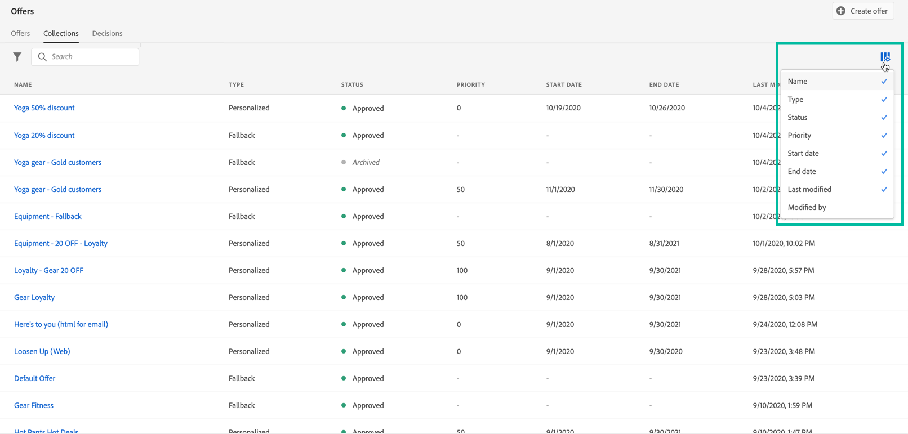
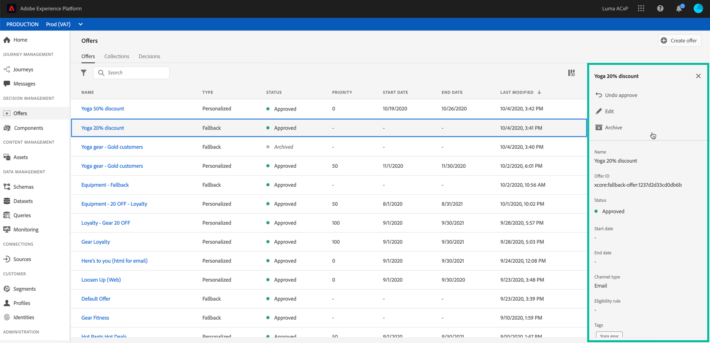
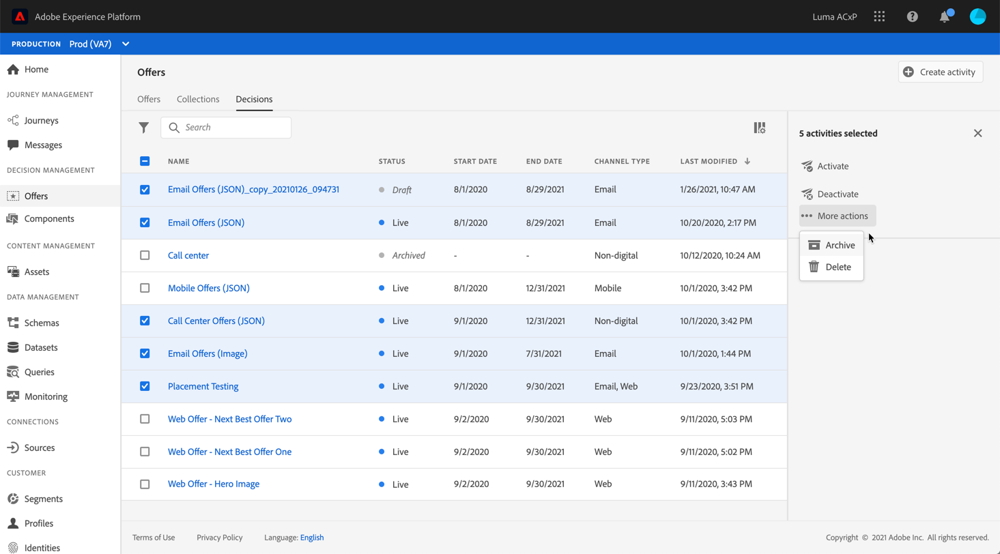

# Interface do usuário {#user-interface}

A Biblioteca de ofertas permite criar e gerenciar as inserções e ofertas em um único local, bem como acessar todas as decisões criadas (anteriormente conhecidas como atividades de oferta).

Use o menu **[!UICONTROL Offers]** para gerenciar ofertas personalizadas e substitutas, organizá-las em coleções e entregá-las criando decisões:

* **[!UICONTROL Offers]**: Acesse as ofertas personalizadas e substitutas ou crie novas. Consulte [Criação de uma oferta](../offer-library/creating-personalized-offers.md) e [Criação de uma oferta substituta](../offer-library/creating-fallback-offers.md).

* **[!UICONTROL Collections]**: crie e gerencie coleções de ofertas estáticas e dinâmicas. Consulte [Sobre coleções de ofertas](../offer-library/creating-collections.md).

* **[!UICONTROL Decisions]**: crie e gerencie decisões para entregar suas ofertas. Consulte [Criar decisões](../offer-activities/create-offer-activities.md).

Use o menu **[!UICONTROL Components]** para gerenciar os componentes necessários para criar ofertas:

* **[!UICONTROL Placements]**: crie e gerencie disposições onde suas ofertas serão exibidas. Consulte [Criação de inserções](../offer-library/creating-placements.md).

* **[!UICONTROL Tags]**: crie e gerencie tags para organizar e filtrar suas ofertas. Consulte [Criação de tags](../offer-library/creating-tags.md).

* **[!UICONTROL Rules]**: gerencie as condições em que suas ofertas são apresentadas. Consulte [Criação de uma regra de decisão](../offer-library/creating-decision-rules.md).

* **[!UICONTROL Rankings]**: crie e gerencie fórmulas de classificação para determinar qual oferta deve ser apresentada primeiro para uma determinada inserção. Consulte [Criação de fórmulas de classificação](../offer-library/create-ranking-formulas.md).

## Pesquisar e filtrar informações

Use a **barra de pesquisa** para localizar um item específico.

**Filtros** também podem ser acessados clicando no ícone de filtro no canto superior esquerdo da lista. Eles permitem filtrar os elementos exibidos de acordo com diferentes critérios. Você pode, por exemplo, filtrar as inserções que foram criadas para o canal de comunicação por email e o conteúdo do tipo imagem.

## Personalizar informações exibidas

As listas dos menus do Gerenciamento de decisão podem ser personalizadas usando o botão de configuração na parte superior direita das listas.

Essa personalização permite escolher as informações que serão exibidas de acordo com suas necessidades.

Observe que a personalização de colunas é salva para cada usuário.

## Painel de informações

Nas diferentes listas, selecione um elemento para exibir um painel de informações que permitirá recuperar informações e executar ações básicas no elemento.

As listas de ofertas e decisões agora permitem executar ações em massa em vários elementos. Para fazer isso, selecione as ofertas ou decisões desejadas e selecione a ação que deseja executar no painel de informações.

Observe que você também pode duplicar uma oferta existente ou decisões para criar uma cópia com o status **[!UICONTROL Draft]**. Isso pode ser executado no painel de informações ou em uma oferta ou na visualização detalhada de uma decisão.

## Ofertas e decisões alteram logs {#changes-logs}

A Biblioteca de ofertas permite visualizar todas as alterações feitas em uma oferta ou decisão. Para fazer isso, abra a oferta ou a decisão clicando no nome na lista e selecione a guia **[!UICONTROL Change log]**.

Todas as alterações feitas são exibidas nessa tela, bem como no nome do usuário que executou as alterações.

