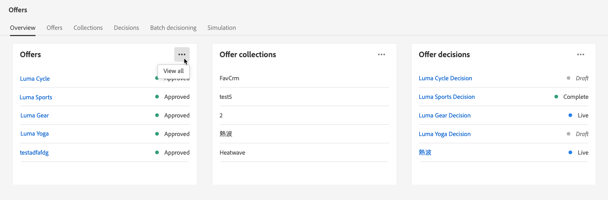

# Interface do usuário da biblioteca de ofertas {#user-interface}

A variável **[!UICONTROL Gerenciamento de decisão]** no painel esquerdo fornece dois menus que dão acesso aos recursos de gestão de decisões:

Use o **[!UICONTROL Ofertas]** menu para gerenciar e entregar suas ofertas:

* **[!UICONTROL Visão geral]**: Novo para [!DNL decision management]? Siga as etapas na tela para começar a configurar disposições, ofertas e coleções. Quando já estiver familiarizado com [!DNL decision management], obtenha uma visão geral das ofertas, coleções e decisões mais recentes. [Saiba mais](#overview)
* **[!UICONTROL Ofertas]**: crie e acesse suas ofertas personalizadas e substitutas. Saiba como criar [ofertas](../offer-library/creating-personalized-offers.md) e [ofertas substitutas](../offer-library/creating-fallback-offers.md)
* **[!UICONTROL Coleções]**: organize suas ofertas em coleções estáticas e dinâmicas. [Saiba mais](../offer-library/creating-collections.md)
* **[!UICONTROL Decisões]**: crie e gerencie decisões para entregar suas ofertas. [Saiba mais](../offer-activities/create-offer-activities.md)
* **[!UICONTROL Decisão em lote]**: forneça decisões de oferta a todos os perfis em um determinado público-alvo da Adobe Experience Platform. [Saiba mais](../batch-delivery.md)
* **[!UICONTROL Simulação]**: valide a lógica de decisão simulando quais ofertas serão entregues a um perfil de teste para uma determinada inserção. [Saiba mais](../offer-activities/simulation.md)

Use o **[!UICONTROL Componentes]** para criar e gerenciar os componentes necessários para criar ofertas e decisões:

* **[!UICONTROL Posicionamentos]**: crie e gerencie disposições onde suas ofertas serão exibidas. [Saiba mais](../offer-library/creating-placements.md)
* **[!UICONTROL Qualificadores de coleção]**: crie e gerencie qualificadores de coleção (anteriormente conhecidos como &quot;tags&quot;) para organizar e filtrar suas ofertas. [Saiba mais](../offer-library/creating-tags.md)
* **[!UICONTROL Regras]**: gerencie as condições em que suas ofertas são apresentadas. [Saiba mais](../offer-library/creating-decision-rules.md)
* **[!UICONTROL Classificação]**: crie e gerencie fórmulas de classificação para determinar qual oferta deve ser apresentada primeiro para uma determinada inserção. [Saiba mais](../ranking/create-ranking-formulas.md)

>[!NOTE]
>
>Se tiver problemas ao acessar a gestão de decisões ou alguns de seus recursos, verifique com um usuário Administrador se você recebeu os direitos necessários. Consulte [Conceder acesso à Gestão de decisões](starting-offer-decisioning.md#granting-acess-to-decision-management).

## Visão geral {#overview}

Quando você é novo no [!DNL decision management], o **[!UICONTROL Visão geral]** A guia orienta você sobre as etapas principais necessárias para começar a criar sua primeira decisão de oferta. Siga as etapas na tela para começar a criar inserções, ofertas e coleções. Quando terminar com essas primeiras etapas, você será solicitado a criar decisões de oferta.

>[!NOTE]
>
>As principais etapas para criar ofertas e usá-las em uma decisão são apresentadas em [nesta seção](../offer-library/key-steps.md).

Quando estiver mais familiarizado com [!DNL decision management] e você já tiver criado pelo menos uma decisão de oferta, a variável **[!UICONTROL Visão geral]** exibe as ofertas, as coleções e as decisões mais recentes.

Clique em uma oferta ou em uma decisão para acessar diretamente os detalhes do item selecionado.

Clique em **[!UICONTROL Exibir todos]** botão para acessar as listas de oferta, coleção ou decisão.

## Pesquisar e filtrar informações {#search-and-filter-information}

Use a **barra de pesquisa** para localizar um item específico.

**Filtros** também podem ser acessados clicando no ícone de filtro no canto superior esquerdo da lista. Eles permitem filtrar os elementos exibidos de acordo com diferentes critérios. Você pode, por exemplo, filtrar as inserções que foram criadas para o canal de comunicação por email e o conteúdo do tipo imagem.

## Personalizar informações exibidas {#customize-displayed-information}

As listas dos menus do Gerenciamento de decisão podem ser personalizadas usando o botão de configuração na parte superior direita das listas.

Essa personalização permite escolher as informações que serão exibidas de acordo com suas necessidades.

Observe que a personalização de colunas é salva para cada usuário.

## Painel de informações {#information-pane}

Nas diferentes listas, selecione um elemento para exibir um painel de informações que permitirá recuperar informações e executar ações básicas no elemento.

As listas de ofertas e decisões agora permitem executar ações em massa em vários elementos. Para fazer isso, selecione as ofertas ou decisões desejadas e selecione a ação que deseja executar no painel de informações.

Observe que você também pode duplicar uma oferta existente ou decisões para criar uma cópia com o **[!UICONTROL Rascunho]** status. Isso pode ser executado no painel de informações ou em uma oferta ou na visualização detalhada de uma decisão.

## Registros de alteração de ofertas e decisões {#changes-logs}

A Biblioteca de ofertas permite visualizar todas as alterações feitas em uma oferta ou decisão. Para fazer isso, abra a oferta ou a decisão clicando no nome na lista e selecione o **[!UICONTROL Log de alterações]** guia.

Todas as alterações feitas são exibidas nessa tela, bem como no nome do usuário que executou as alterações.

