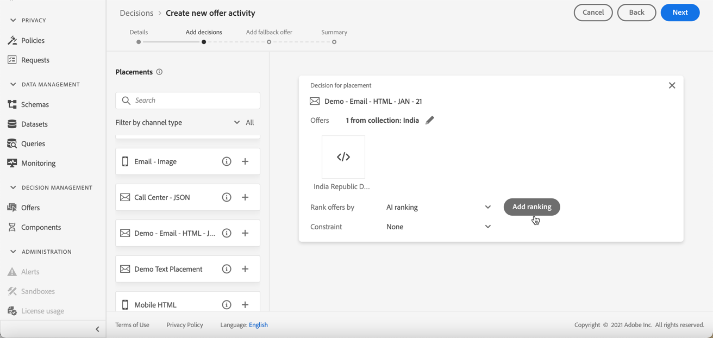

# Configurar seleção de ofertas em decisões {#offers-selection-in-activities}

Se várias ofertas estiverem qualificadas para uma determinada disposição, você poderá escolher o método que selecionará a melhor oferta para cada perfil ao configurar uma decisão (anteriormente conhecida como atividade de oferta). Você pode classificar ofertas por:
* Prioridade da oferta
* Fórmula de classificação
* [Classificação de AI](#use-ranking-strategy)  (no acesso antecipado somente para usuários selecionados)

## Prioridade da oferta {#about-offers-priority}

Por padrão, quando várias ofertas estão qualificadas para uma determinada disposição em uma decisão (anteriormente conhecida como atividade de oferta), as ofertas com a maior **prioridade** serão entregues primeiro aos clientes.

As pontuações de prioridade das ofertas são atribuídas ao criar uma oferta. Saiba como criar uma oferta personalizada em [esta seção](../offer-library/creating-personalized-offers.md).

## Fórmula de classificação {#assign-ranking-formula}

Além da prioridade da oferta, o Journey Optimizer permite criar **fórmulas de classificação**. Essas são fórmulas que determinam qual oferta deve ser apresentada primeiro para uma determinada disposição, em vez de considerar as pontuações de prioridade das ofertas.

Por exemplo, você pode aumentar a prioridade de todas as ofertas em que a data final seja daqui a menos de 24 horas, ou impulsionar ofertas da categoria &quot;em execução&quot; se o ponto de interesse do perfil estiver &quot;em execução&quot;.

Saiba como criar uma fórmula de classificação em [nesta seção](../offer-library/create-ranking-formulas.md).

Depois que uma fórmula de classificação é criada, é possível atribuí-la a uma disposição em uma decisão (anteriormente conhecida como atividade de oferta). Para fazer isso, siga as etapas abaixo:

1. Crie uma decisão ou edite uma existente. Consulte [Criar decisões](../offer-activities/create-offer-activities.md).

1. Adicione as disposições que conterão suas ofertas. Consulte [Criar disposições](../offer-library/creating-placements.md).

1. Para cada disposição, adicione uma coleção. Consulte [Criar coleções](../offer-library/creating-collections.md).

1. Escolha classificar as ofertas por **[!UICONTROL Ranking]** na lista suspensa e clique em **[!UICONTROL Add ranking]**.

   

1. Selecione a fórmula de classificação desejada e clique em **[!UICONTROL Select]**.

   

A fórmula de classificação agora está associada à disposição.

Se várias ofertas estiverem qualificadas para serem apresentadas nesta disposição, a decisão usará a fórmula de classificação para calcular qual oferta entregar primeiro.

## Classificação de IA {#use-ranking-strategy}

<!--If you are an [Adobe Experience Platform](https://experienceleague.adobe.com/docs/experience-platform/landing/home.html){target="_blank"} user leveraging the **Offer Decisioning** application service,-->You can also use an trained model system that automatically ranks offers to display for a given profile by selecting a ranking strategy. Learn how to create a ranking strategy in [this section](../offer-library/create-ranking-strategies.md).

>[!CAUTION]
>
>O uso da classificação de IA está disponível no momento somente para usuários selecionados.

Depois que uma estratégia de classificação tiver sido criada, é possível atribuí-la a uma disposição em uma decisão (anteriormente conhecida como atividade de oferta). Para fazer isso, siga as etapas abaixo:

1. Crie uma decisão ou edite uma existente. Consulte [Criar decisões](../offer-activities/create-offer-activities.md).

1. Adicione as disposições que conterão suas ofertas. Consulte [Criar disposições](../offer-library/creating-placements.md).

1. Para cada disposição, adicione uma coleção. Consulte [Criar coleções](../offer-library/creating-collections.md).

1. Escolha classificar ofertas por **[!UICONTROL AI ranking]** na lista suspensa.

   

1. Clique em **[!UICONTROL Add ranking]**.

   

1. Selecione a estratégia de classificação criada. Todos os detalhes da estratégia de classificação são exibidos.

   

1. Clique em **[!UICONTROL Select]**.

A estratégia de classificação agora está associada ao posicionamento.

Se várias ofertas forem elegíveis, o sistema de modelo treinado determinará qual oferta deve ser apresentada primeiro para uma determinada disposição.

<!--Result? Describe the impact for the user, i.e. what's the effect of selecting this ranking strategy for this collection/placement.-->

<!--Click **[!UICONTROL Next]** to confirm and save your decision.-->
