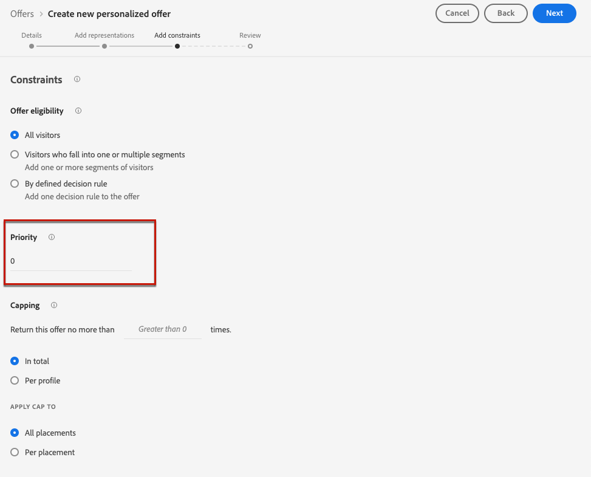

# Configurar seleção de ofertas em decisões {#offers-selection-in-decisions}

>[!TIP]
>
>O serviço de Decisão, o novo recurso de tomada de decisão do [!DNL Adobe Journey Optimizer], agora está disponível por meio da experiência baseada em código e dos canais de email. [Saiba mais](../../experience-decisioning/gs-experience-decisioning.md)

Se várias ofertas estiverem qualificadas para uma determinada inserção, você poderá escolher o método que selecionará a melhor oferta para cada perfil ao configurar uma decisão. Você pode classificar ofertas por:

* Prioridades de ofertas
* Fórmula de classificação
* [Classificação de IA](#use-ranking-strategy)

## Prioridades de ofertas {#offer-priority}

Por padrão, quando várias ofertas estão qualificadas para um determinado posicionamento em uma decisão, as ofertas com a **prioridade** mais alta serão entregues aos clientes primeiro.

As pontuações de prioridade de ofertas são atribuídas ao criar uma oferta. Saiba como criar uma oferta personalizada em [esta seção](../offer-library/creating-personalized-offers.md).

## Fórmula de classificação {#assign-ranking-formula}

Além da prioridade de oferta, o Journey Optimizer permite criar **fórmulas de classificação**. Essas fórmulas determinam qual oferta deve ser apresentada primeiro para determinada inserção, em vez de considerar as pontuações de prioridade das ofertas.

Por exemplo, você pode aumentar a prioridade de todas as ofertas em que a data de término for inferior a 24 horas a partir de agora ou impulsionar ofertas da categoria &quot;em execução&quot; se o ponto de interesse do perfil for &quot;em execução&quot;.

Saiba como criar uma fórmula de classificação em [esta seção](../ranking/create-ranking-formulas.md).

Depois que uma fórmula é criada, é possível atribuí-la a uma inserção em uma decisão. Para fazer isso, siga as etapas abaixo:

1. Crie uma decisão ou edite uma existente. Consulte [Criar decisões](../offer-activities/create-offer-activities.md).

1. Adicione os posicionamentos que conterão suas ofertas. Consulte [Criar inserções](../offer-library/creating-placements.md).

1. Para cada posicionamento, adicione uma coleção. Consulte [Criar coleções](../offer-library/creating-collections.md).

1. Selecione **[!UICONTROL Fórmula]** como o método de classificação e clique em **[!UICONTROL Adicionar classificação]**.

   

1. Selecione a fórmula desejada e clique em **[!UICONTROL Selecionar]**.

   

A fórmula de classificação agora está associada ao posicionamento.

Se várias ofertas forem elegíveis para serem apresentadas neste posicionamento, a decisão usará a fórmula selecionada para calcular qual oferta entregar primeiro.

## Classificação de IA {#use-ranking-strategy}

<!--If you are an [Adobe Experience Platform](https://experienceleague.adobe.com/docs/experience-platform/landing/home.html){target="_blank"} user leveraging the **Offer Decisioning** application service,-->

Você também pode usar um sistema de modelo treinado que classifica automaticamente as ofertas para exibição em determinado perfil ao selecionar um modelo de IA. Saiba como criar um modelo de IA em [esta seção](../ranking/create-ranking-strategies.md).

Depois que um modelo de IA é criado, é possível atribuí-lo a uma inserção em uma decisão. Para fazer isso, siga as etapas abaixo:

1. Crie uma decisão ou edite uma existente. Consulte [Criar decisões](../offer-activities/create-offer-activities.md).

1. Adicione os posicionamentos que conterão suas ofertas. Consulte [Criar inserções](../offer-library/creating-placements.md).

1. Para cada posicionamento, adicione uma coleção. Consulte [Criar coleções](../offer-library/creating-collections.md).

1. Escolha classificar as ofertas por **[!UICONTROL Classificação de IA]** na lista suspensa e clique em **[!UICONTROL Adicionar classificação]**.

   

1. Selecione o modelo de IA criado. Todos os detalhes do modelo são exibidos.

   

1. Clique em **[!UICONTROL Selecionar]**. O modelo de IA agora está associado à inserção.

Se várias ofertas forem qualificadas, o sistema de modelo treinado determinará qual oferta deve ser apresentada primeiro para uma determinada inserção.

