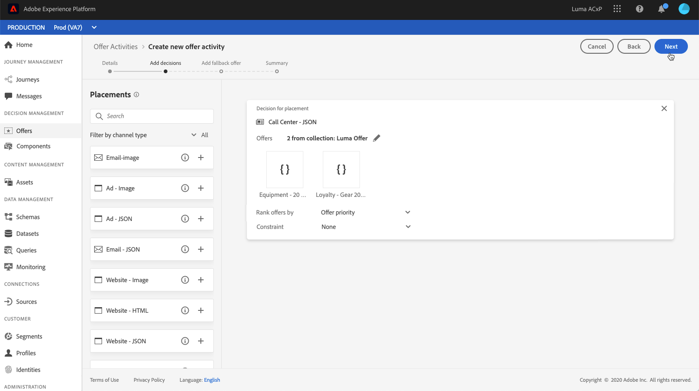

# Criar decisões {#create-offer-activities}

As decisões (anteriormente conhecidas como atividades de oferta) são contêineres para suas ofertas que aproveitarão o Mecanismo de decisão da oferta para escolher a melhor oferta a ser entregue, dependendo do target do delivery.

 [Descubra este recurso no vídeo](#video)

A lista de decisões pode ser acessada no menu **[!UICONTROL Offers]** / **[!UICONTROL Decisions]**. Os filtros estão disponíveis para ajudá-lo a recuperar decisões de acordo com seu status ou datas de início e término.

Antes de criar uma decisão, verifique se os componentes abaixo foram criados na Biblioteca de ofertas:

* [Posicionamentos](../offer-library/creating-placements.md),
* [Coleções](../offer-library/creating-collections.md),
* [Ofertas personalizadas](../offer-library/creating-personalized-offers.md),
* [Ofertas substitutas](../offer-library/creating-fallback-offers.md).

## Crie a decisão {#create-activity}

1. Acesse a lista de decisões e clique em **[!UICONTROL Create activity]**.

1. Especifique o nome da decisão, bem como a data e hora de início e término, e clique em **[!UICONTROL Next]**.

   

## Adicionar decisões {#add-decisions}

1. Arraste e solte uma disposição da lista para adicioná-la à decisão e clique em **[!UICONTROL Add collection]**.

   

1. Selecione a coleção que contém as ofertas a serem consideradas e clique em **[!UICONTROL Add]**.

   

1. As ofertas selecionadas são adicionadas à disposição. Neste exemplo, selecionamos duas ofertas que serão exibidas em uma disposição do tipo JSON destinada a apresentar ofertas em uma solução de central de chamadas.

   

1. Por padrão, se várias ofertas estiverem qualificadas para essa disposição, as ofertas com a pontuação de prioridade mais alta serão entregues ao cliente.

   Se quiser usar uma fórmula específica para escolher qual oferta elegível entregar, selecione uma fórmula de classificação na lista suspensa **[!UICONTROL Rank offers by]**. Para obter mais informações, consulte [esta seção](../offer-activities/configure-offer-selection.md).

1. O campo **[!UICONTROL Constraint]** restringe a seleção de ofertas para essa disposição. Essa restrição pode ser aplicada usando uma regra de decisão ou um ou vários segmentos do Adobe Experience Platform.

   Para restringir a seleção das ofertas aos membros de um segmento do Adobe Experience Platform, selecione **[!UICONTROL Segments]** e clique em **[!UICONTROL Add segments]**.

   

   Adicione um ou vários segmentos do painel esquerdo, combine-os usando os operadores lógicos **[!UICONTROL And]** / **[!UICONTROL Or]** e clique em **[!UICONTROL Select]** para confirmar.

   Para obter mais informações sobre como trabalhar com segmentos, consulte a [documentação do Serviço de segmentação](https://experienceleague.adobe.com/docs/experience-platform/segmentation/home.html).

   

   Se quiser adicionar uma restrição de seleção a essa disposição usando uma regra de decisão, selecione a opção **[!UICONTROL Decision rule]** e arraste a regra desejada do painel esquerdo para a área **[!UICONTROL Decision rule]**. Para obter mais informações sobre como criar uma regra de decisão, consulte [esta seção](../offer-library/creating-decision-rules.md).

   

## Adicionar uma oferta de fallback {#add-fallback}

Selecione a oferta de fallback que será apresentada como um último recurso para os clientes que não correspondem às regras e restrições de qualificação de ofertas e clique em **[!UICONTROL Next]**.

## Revisar e salvar a decisão {#review}

Se tudo estiver configurado corretamente e sua decisão estiver pronta para ser usada para apresentar ofertas aos clientes, clique em **[!UICONTROL Finish]** e selecione **[!UICONTROL Save and activate]**.

Você também pode salvar a decisão como rascunho, para editá-la e ativá-la posteriormente.

A decisão é exibida na lista com o status **[!UICONTROL Live]** ou **[!UICONTROL Draft]** , dependendo de você tê-la ativado ou não na etapa anterior.

Agora, ele está pronto para ser usado para fornecer ofertas aos clientes. Você pode selecioná-lo para exibir suas propriedades e editá-lo ou suprimi-lo.

Para obter mais informações sobre delivery de ofertas, consulte estas seções:

* [Adicionar ofertas personalizadas em mensagens](../../deliver-personalized-offers.md)
* [Fornecer ofertas usando APIs](../api-reference/decisions-api/deliver-offers.md)

>[!NOTE]
>
>Depois que uma decisão for criada, clique no nome na lista para acessar informações detalhadas e vizualizar todas as alterações feitas nela usando a guia **[!UICONTROL Change log]** (consulte [Offers and decisions changes log](../get-started/user-interface.md#changes-log)).

## Tutorial em vídeo {#video}

>[!NOTE]
>
>Este vídeo se aplica ao serviço de aplicativo do Offer Decisioning criado no Adobe Experience Platform. No entanto, fornece orientação genérica para usar a Oferta no contexto do Journey Optimizer.

>[!VIDEO](https://video.tv.adobe.com/v/329606?quality=12)
