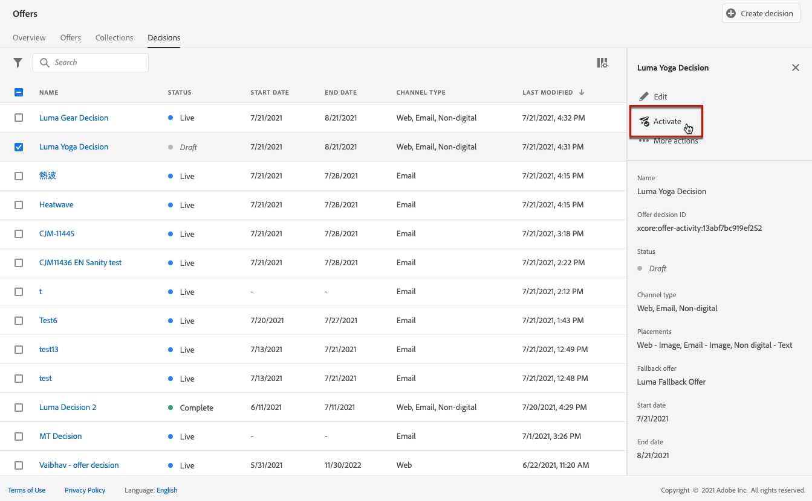
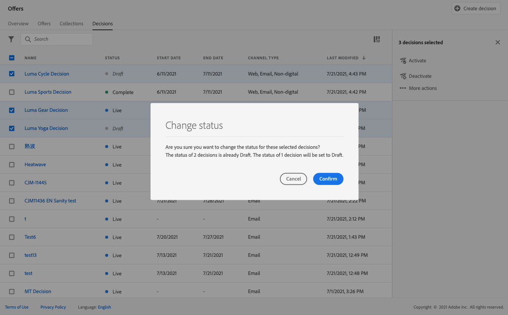

# Criar decisões {#create-offer-activities}

As decisões (anteriormente conhecidas como atividades de oferta) são contêineres para suas ofertas que aproveitarão o Mecanismo de decisão da oferta para escolher a melhor oferta a ser entregue, dependendo do target do delivery.

➡️ [Descubra este recurso no vídeo](#video)

A lista de decisões pode ser acessada no menu **[!UICONTROL Offers]** > **[!UICONTROL Decisions]** . Os filtros estão disponíveis para ajudá-lo a recuperar decisões de acordo com seu status ou datas de início e término.

Antes de criar uma decisão, verifique se os componentes abaixo foram criados na Biblioteca de ofertas:

* [Disposições](../offer-library/creating-placements.md)
* [Coleções](../offer-library/creating-collections.md)
* [Ofertas personalizadas](../offer-library/creating-personalized-offers.md)
* [Ofertas substitutas](../offer-library/creating-fallback-offers.md)

## Crie a decisão {#create-activity}

1. Acesse a lista de decisões e clique em **[!UICONTROL Create decision]**.

1. Especifique o nome da decisão.

1. Defina uma data e hora de início e término e clique em **[!UICONTROL Next]**.

   

## Adicionar escopos de decisão {#add-decision-scopes}

1. Arraste e solte uma disposição da lista para adicioná-la à decisão e clique em **[!UICONTROL Add collection]**.

   

   >[!NOTE]
   >
   >A mesma disposição pode ser selecionada várias vezes na decisão.

1. Selecione a coleção que contém as ofertas a serem consideradas e clique em **[!UICONTROL Add]**.

   

1. As ofertas selecionadas são adicionadas à disposição.

   Neste exemplo, selecionamos duas ofertas que serão exibidas em uma disposição do tipo JSON destinada a apresentar ofertas em uma solução de central de chamadas.

   

1. Por padrão, se várias ofertas estiverem qualificadas para essa disposição, as ofertas com a pontuação de prioridade mais alta serão entregues ao cliente.

   Se quiser usar uma fórmula específica ou uma estratégia de classificação para escolher qual oferta elegível entregar, selecione uma fórmula de classificação na lista suspensa **[!UICONTROL Rank offers by]**. Para obter mais informações, consulte [esta seção](../offer-activities/configure-offer-selection.md).

1. O campo **[!UICONTROL Constraint]** restringe a seleção de ofertas para essa disposição. Essa restrição pode ser aplicada usando uma **regra de decisão** ou um ou vários **segmentos Adobe Experience Platform**. Ambos são detalhados em [nesta seção](#segments-vs-decision-rules).

   * Para restringir a seleção das ofertas aos membros de um segmento do Adobe Experience Platform, selecione **[!UICONTROL Segments]** e clique em **[!UICONTROL Add segments]**.

      

      Adicione um ou vários segmentos do painel esquerdo, combine-os usando os operadores lógicos **[!UICONTROL And]** / **[!UICONTROL Or]** e clique em **[!UICONTROL Select]** para confirmar.

      

      Saiba mais sobre como trabalhar com segmentos em [esta seção](../../segment/about-segments.md).

   * Se quiser adicionar uma restrição de seleção a essa disposição usando uma regra de decisão, selecione a opção **[!UICONTROL Decision rule]** e arraste a regra desejada do painel esquerdo para a área **[!UICONTROL Decision rule]**.

      

      Saiba mais sobre como criar uma regra de decisão em [this section](../offer-library/creating-decision-rules.md).

### Uso de segmentos versus regras de decisão {#segments-vs-decision-rules}

<!--to move to create-offers?-->

Para aplicar uma restrição, você pode restringir a seleção de ofertas aos membros de um ou vários **segmentos do Adobe Experience Platform**, ou usar uma **regra de decisão**, ambas as soluções correspondentes a usos diferentes.

Basicamente, a saída de um segmento é uma lista de perfis, enquanto uma regra de decisão é uma função executada sob demanda em relação a um único perfil durante o processo de decisão. A diferença entre esses dois usos é detalhada abaixo.

* **Segmentos**

   Por um lado, segmentos são um grupo de perfis do Adobe Experience Platform que correspondem a uma determinada lógica com base em atributos de perfil e eventos de experiência. No entanto, o Gerenciamento de ofertas não recalcula o segmento, que pode não estar atualizado ao apresentar a oferta.

   Saiba mais sobre segmentos em [esta seção](../../segment/about-segments.md).

* **Regras de decisão**

   Por outro lado, uma regra de decisão se baseia nos dados disponíveis no Adobe Experience Platform e determina para quem uma oferta pode ser exibida. Uma vez selecionada em uma oferta ou decisão para uma determinada disposição, a regra é executada toda vez que uma decisão é tomada, o que garante que cada perfil obtenha a mais recente e a melhor oferta.

   Saiba mais sobre as regras de decisão em [esta seção](../offer-library/creating-decision-rules.md).

## Adicionar uma oferta de fallback {#add-fallback}

Selecione a oferta de fallback que será apresentada como um último recurso para os clientes que não correspondem às regras e restrições de qualificação de ofertas e clique em **[!UICONTROL Next]**.

## Revisar e salvar a decisão {#review}

Se tudo estiver configurado corretamente, um resumo das propriedades de decisão será exibido.

1. Certifique-se de que a decisão esteja pronta para ser usada para apresentar ofertas aos clientes.
1. Clique em **[!UICONTROL Finish]**.
1. Em seguida, selecione **[!UICONTROL Save and activate]**.

   

   Você também pode salvar a decisão como rascunho, para editá-la e ativá-la posteriormente.

A decisão é exibida na lista com o status **[!UICONTROL Live]** ou **[!UICONTROL Draft]**, dependendo de você tê-la ativado ou não na etapa anterior.

Agora, ele está pronto para ser usado para fornecer ofertas aos clientes.

## Lista de decisões {#decision-list}

Na lista de decisões, é possível selecionar a decisão de exibir suas propriedades. A partir daí você também pode editá-lo, alterar seu status (**Rascunho**, **Ao vivo**, **Concluído**, **Arquivado**), duplicar a decisão ou excluí-la.

Selecione o botão **[!UICONTROL Edit]** para voltar ao modo de edição de decisão, onde você pode modificar os [detalhes](#create-activity), [escopos de decisão](#add-decision-scopes) e [oferta de fallback](#add-fallback) da decisão.

Selecione uma decisão em tempo real e clique em **[!UICONTROL Deactivate]** para definir o status da decisão novamente como **[!UICONTROL Draft]**.

Para definir novamente o status como **[!UICONTROL Live]**, selecione o botão **[!UICONTROL Activate]** que é exibido agora.

O botão **[!UICONTROL More actions]** ativa as ações descritas abaixo.

* **[!UICONTROL Complete]**: define o status da decisão como  **[!UICONTROL Complete]**, o que significa que a decisão não pode mais ser chamada. Esta ação só está disponível para decisões ativadas. A decisão ainda está disponível na lista, mas não é possível definir seu status novamente para **[!UICONTROL Draft]** ou **[!UICONTROL Approved]**. Você só pode duplicá-la, excluí-la ou arquivá-la.

* **[!UICONTROL Duplicate]**: cria uma decisão com as mesmas propriedades, escopos de decisão e oferta de fallback. Por padrão, a nova decisão tem o status **[!UICONTROL Draft]** .

* **[!UICONTROL Delete]**: remove a decisão da lista.

   >[!CAUTION]
   >
   >A decisão e seu conteúdo não estarão mais acessíveis. Esta ação não pode ser desfeita.
   >
   >Se a decisão for usada em outro objeto, ela não poderá ser excluída.

* **[!UICONTROL Archive]**: define o status da decisão como  **[!UICONTROL Archived]**. A decisão ainda está disponível na lista, mas não é possível definir seu status novamente para **[!UICONTROL Draft]** ou **[!UICONTROL Approved]**. Você só pode duplicá-la ou excluí-la.

Você também pode excluir ou alterar o status de várias decisões ao mesmo tempo, marcando as caixas de seleção correspondentes.

Se quiser alterar o status de várias decisões com status diferentes, somente os status relevantes serão alterados.

Depois que uma decisão é criada, você pode clicar no nome na lista.

Isso permite acessar informações detalhadas dessa decisão. Selecione a guia **[!UICONTROL Change log]** para [monitorar todas as alterações](../get-started/user-interface.md#changes-log) que foram feitas na decisão.

## Tutorial em vídeo {#video}

>[!NOTE]
>
>Este vídeo se aplica ao serviço de aplicativo do Offer Decisioning criado no Adobe Experience Platform. No entanto, fornece orientação genérica para usar a Oferta no contexto do Journey Optimizer.

>[!VIDEO](https://video.tv.adobe.com/v/329606?quality=12)
