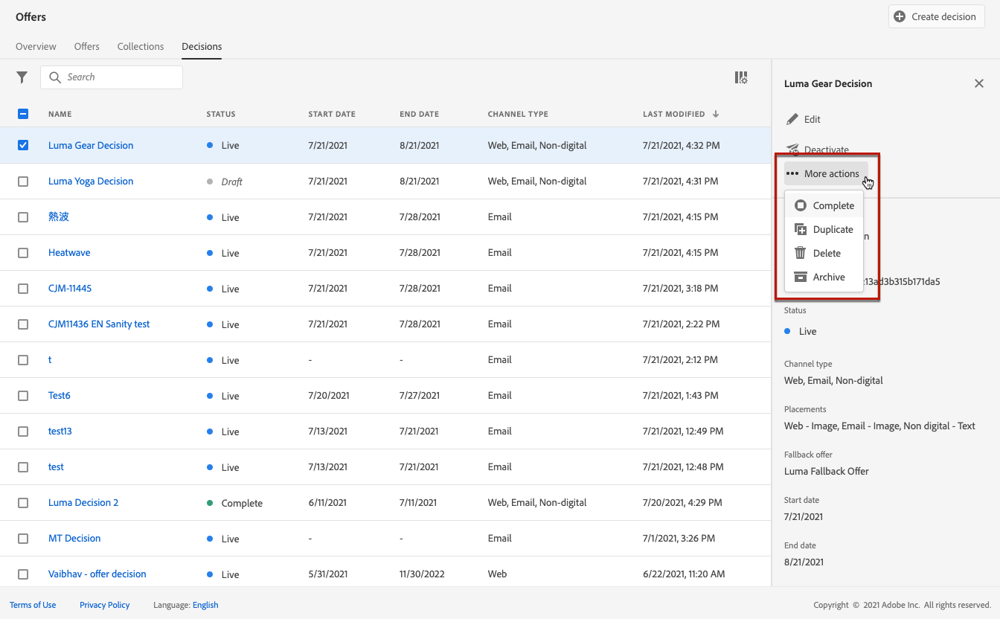

# Criar decisões {#create-offer-activities}

As decisões são contêineres para suas ofertas que aproveitarão o Mecanismo de decisão da oferta para escolher a melhor oferta a ser entregue, dependendo do target do delivery.

➡️ [Saiba como criar atividades de oferta neste vídeo](#video)

A lista de decisões pode ser consultada no **[!UICONTROL Offers]** menu > **[!UICONTROL Decisions]** guia . Os filtros estão disponíveis para ajudá-lo a recuperar decisões de acordo com seu status ou datas de início e término.

Antes de criar uma decisão, verifique se os componentes abaixo foram criados na Biblioteca de ofertas:

* [Disposições](../offer-library/creating-placements.md)
* [Coleções](../offer-library/creating-collections.md)
* [Ofertas personalizadas](../offer-library/creating-personalized-offers.md)
* [Ofertas substitutas](../offer-library/creating-fallback-offers.md)

## Crie a decisão {#create-activity}

1. Acesse a lista de decisões e clique em **[!UICONTROL Create decision]**.

1. Especifique o nome da decisão.

1. Defina uma data e hora de início e término, se necessário, e clique em **[!UICONTROL Next]**.

   

## Definir escopos de decisão {#add-decision-scopes}

1. Selecione uma disposição na lista suspensa. Ele será adicionado ao primeiro escopo de decisão na sua decisão.

   

1. Clique em **[!UICONTROL Add]** para selecionar os critérios de avaliação para esta disposição.

   

   Cada critério consiste em uma coleção de ofertas associada a uma restrição de qualificação e um método de classificação para determinar as ofertas a serem mostradas na disposição.

   >[!NOTE]
   >
   >É necessário, pelo menos, um critério de avaliação.

1. Selecione a coleção de ofertas que contém as ofertas a serem consideradas e clique em **[!UICONTROL Add]**.

   

   >[!NOTE]
   >
   >Você pode clicar no botão **[!UICONTROL Open offer collections]** para exibir a lista de coleções em uma nova guia, que permite navegar pelas coleções e ofertas que elas contêm.

   A coleção selecionada é adicionada ao critério.

   

1. Use o **[!UICONTROL Eligibility]** para restringir a seleção de ofertas para essa disposição.

   Essa restrição pode ser aplicada usando uma **regra de decisão** ou um ou vários **Segmentos Adobe Experience Platform**. Ambos estão detalhados em [esta seção](../offer-library/add-constraints.md#segments-vs-decision-rules).

   * Para restringir a seleção das ofertas aos membros de um segmento de Experience Platform, selecione **[!UICONTROL Segments]**, depois clique em **[!UICONTROL Add segments]**.

      

      Adicione um ou vários segmentos do painel esquerdo e combine-os usando o **[!UICONTROL And]** / **[!UICONTROL Or]** operadores lógicos.

      

      Saiba como trabalhar com segmentos em [esta seção](../../segment/about-segments.md).

   * Se quiser adicionar uma restrição de seleção a uma regra de decisão, use a variável **[!UICONTROL Decision rule]** e selecione a regra de sua escolha.

      

      Saiba como criar uma regra de decisão no [esta seção](../offer-library/creating-decision-rules.md).

1. Ao selecionar segmentos ou regras de decisão, é possível ver informações sobre os perfis qualificados estimados. Clique em **[!UICONTROL Refresh]** para atualizar os dados.

   >[!NOTE]
   >
   >As estimativas de perfil não estão disponíveis quando os parâmetros da regra incluem dados que não estão no perfil, como dados de contexto. Por exemplo, uma regra de elegibilidade que requer que o tempo atual seja ≥80 graus.

   

1. Defina o método de classificação que deseja usar para selecionar a melhor oferta para cada perfil.

   

   * Por padrão, se várias ofertas estiverem qualificadas para essa disposição, a oferta com a pontuação de prioridade mais alta será entregue ao cliente.

   * Se quiser usar uma fórmula específica para escolher qual oferta qualificada entregar, selecione **[!UICONTROL Ranking formula]**. Saiba como classificar ofertas em [esta seção](../offer-activities/configure-offer-selection.md).

1. Clique em **[!UICONTROL Add]** para definir mais critérios para a mesma disposição.

   

1. Ao adicionar vários critérios, eles serão avaliados em uma ordem específica. A primeira coleção que foi adicionada à sequência será avaliada primeiro e assim por diante.

   Para alterar a sequência padrão, você pode arrastar e soltar as coleções para reorganizá-las conforme desejado.

   

1. Você também pode avaliar vários critérios ao mesmo tempo. Para fazer isso, arraste e solte a coleção na parte superior de outra.

   

   Agora têm a mesma classificação e serão avaliadas ao mesmo tempo.

   

1. Para adicionar outra disposição para suas ofertas como parte dessa decisão, use o **[!UICONTROL New scope]** botão. Repita as etapas acima para cada escopo de decisão.

   

## Adicionar uma oferta de fallback {#add-fallback}

Depois de definir os escopos de decisão, defina a oferta de fallback que será apresentada como último recurso para os clientes que não correspondem às regras e restrições de qualificação de ofertas.

Para fazer isso, selecione-o na lista de ofertas de fallback disponíveis para as disposições definidas na decisão e clique em **[!UICONTROL Next]**.

>[!NOTE]
>
>Você pode clicar no botão **[!UICONTROL Open offer library]** para exibir a lista de ofertas em uma nova guia.

## Revisar e salvar a decisão {#review}

Se tudo estiver configurado corretamente, um resumo das propriedades de decisão será exibido.

1. Certifique-se de que a decisão esteja pronta para ser usada para apresentar ofertas aos clientes. Todos os escopos de decisão e a oferta de fallback que ela contém são exibidos.

   

1. Você pode expandir ou recolher cada disposição. Você pode visualizar as ofertas disponíveis, a qualificação e os detalhes de classificação para cada disposição. Também é possível exibir informações sobre os perfis qualificados estimados. Clique em **[!UICONTROL Refresh]** para atualizar os dados.

   

1. Clique em **[!UICONTROL Finish]**.
1. Selecione **[!UICONTROL Save and activate]**.

   

   Você também pode salvar a decisão como rascunho, para editá-la e ativá-la posteriormente.

A decisão é exibida na lista com a variável **[!UICONTROL Live]** ou **[!UICONTROL Draft]** , dependendo de você ter ativado ou não na etapa anterior.

Agora, ele está pronto para ser usado para fornecer ofertas aos clientes.

## Lista de decisões {#decision-list}

Na lista de decisões, é possível selecionar a decisão de exibir suas propriedades. A partir daí você também pode editá-lo, alterar seu status (**Rascunho**, **Ao vivo**, **Concluído**, **Arquivado**), duplique a decisão ou exclua-a.

Selecione o **[!UICONTROL Edit]** botão para voltar para o modo de edição de decisão, onde você pode modificar o [detalhes](#create-activity), [escopos de decisão](#add-decision-scopes) e [oferta de fallback](#add-fallback).

Selecione uma decisão ativa e clique em **[!UICONTROL Deactivate]** para definir o status da decisão novamente como **[!UICONTROL Draft]**.

Para definir novamente o status como **[!UICONTROL Live]**, selecione o **[!UICONTROL Activate]** botão que é exibido agora.

O **[!UICONTROL More actions]** ativa as ações descritas abaixo.

* **[!UICONTROL Complete]**: define o status da decisão como **[!UICONTROL Complete]**, o que significa que a decisão não pode mais ser chamada. Esta ação só está disponível para decisões ativadas. A decisão ainda está disponível na lista, mas não é possível definir seu status novamente como **[!UICONTROL Draft]** ou **[!UICONTROL Approved]**. Você só pode duplicá-la, excluí-la ou arquivá-la.

* **[!UICONTROL Duplicate]**: cria uma decisão com as mesmas propriedades, escopos de decisão e oferta de fallback. Por padrão, a nova decisão tem a variável **[!UICONTROL Draft]** status.

* **[!UICONTROL Delete]**: remove a decisão da lista.

   >[!CAUTION]
   >
   >A decisão e seu conteúdo não estarão mais acessíveis. Esta ação não pode ser desfeita.
   >
   >Se a decisão for usada em outro objeto, ela não poderá ser excluída.

* **[!UICONTROL Archive]**: define o status da decisão como **[!UICONTROL Archived]**. A decisão ainda está disponível na lista, mas não é possível definir seu status novamente como **[!UICONTROL Draft]** ou **[!UICONTROL Approved]**. Você só pode duplicá-la ou excluí-la.

Você também pode excluir ou alterar o status de várias decisões ao mesmo tempo, marcando as caixas de seleção correspondentes.

Se quiser alterar o status de várias decisões com status diferentes, somente os status relevantes serão alterados.

Depois que uma decisão é criada, você pode clicar no nome na lista.

Isso permite acessar informações detalhadas dessa decisão. Selecione o **[!UICONTROL Change log]** guia para [monitorar todas as alterações](../get-started/user-interface.md#changes-log) que tenham sido tomadas na decisão.

## Vídeo tutorial{#video}

Saiba como criar atividades de oferta no Offer Decisioning.

>[!VIDEO](https://video.tv.adobe.com/v/329606?quality=12)

