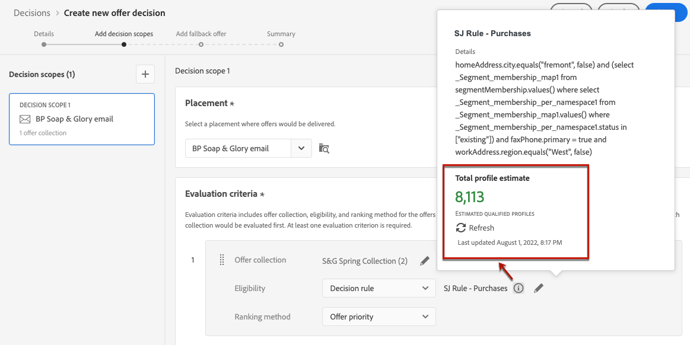

# Criar decisões {#create-offer-activities}

As decisões são containers para suas ofertas que aproveitarão o Mecanismo do Offer Decisioning para escolher a melhor oferta a ser entregue, dependendo do target da entrega.

➡️ [Saiba como criar atividades de oferta neste vídeo](#video)

A lista de decisões está acessível no **[!UICONTROL Ofertas]** menu > **[!UICONTROL Decisões]** guia. Os filtros estão disponíveis para ajudar você a recuperar decisões de acordo com seu status ou datas de início e término.

Antes de criar uma decisão, verifique se os componentes abaixo foram criados na Biblioteca de ofertas:

* [Disposições](../offer-library/creating-placements.md)
* [Coleções](../offer-library/creating-collections.md)
* [Ofertas personalizadas](../offer-library/creating-personalized-offers.md)
* [Ofertas substitutas](../offer-library/creating-fallback-offers.md)

## Criar a decisão {#create-activity}

1. Acesse a lista de decisões e clique em **[!UICONTROL Criar decisão]**.

1. Especifique o nome da decisão.

1. Defina uma data e hora de início e término, se necessário, e clique em **[!UICONTROL Próxima]**.

   

1. Para atribuir rótulos de uso de dados personalizados ou principais à decisão, selecione **[!UICONTROL Gerenciar acesso]**. [Saiba mais sobre o OLAC (Object Level Access Control)](../../administration/object-based-access.md)

## Definir escopos de decisão {#add-decision-scopes}

1. Selecione uma disposição na lista suspensa. Ele será adicionado ao escopo da primeira decisão na sua decisão.

   

1. Clique em **[!UICONTROL Adicionar]** para selecionar os critérios de avaliação para esta disposição.

   

   Cada critério consiste em uma coleção de ofertas associada a uma restrição de qualificação e um método de classificação para determinar as ofertas a serem mostradas no posicionamento.

   >[!NOTE]
   >
   >É necessário pelo menos um critério de avaliação.

1. Selecione a coleção de ofertas que contém as ofertas a serem consideradas e clique em **[!UICONTROL Adicionar]**.

   

   >[!NOTE]
   >
   >Você pode clicar no link **[!UICONTROL Abrir coleções de ofertas]** link para exibir a lista de coleções em uma nova guia, que permite procurar as coleções e as ofertas que elas contêm.

   A coleção selecionada é adicionada aos critérios.

   

1. Use o **[!UICONTROL Elegibilidade]** para restringir a seleção de ofertas para esta disposição.

   Essa restrição pode ser aplicada usando um **regra de decisão**, ou um ou vários **Segmentos do Adobe Experience Platform**. Ambos estão detalhados em [nesta seção](../offer-library/add-constraints.md#segments-vs-decision-rules).

   * Para restringir a seleção das ofertas aos membros de um segmento Experience Platform, selecione **[!UICONTROL Segmentos]** e, em seguida, clique em **[!UICONTROL Adicionar segmentos]**.

      

      Adicione um ou vários segmentos do painel esquerdo e combine-os usando o **[!UICONTROL E]** / **[!UICONTROL Ou]** operadores lógicos.

      

      Saiba como trabalhar com segmentos no [nesta seção](../../segment/about-segments.md).

   * Se quiser adicionar uma restrição de seleção com uma regra de decisão, use o **[!UICONTROL Regra de decisão]** e selecione a regra de sua escolha.

      

      Saiba como criar uma regra de decisão no [nesta seção](../offer-library/creating-decision-rules.md).

1. Ao selecionar segmentos ou regras de decisão, é possível ver informações sobre os perfis qualificados estimados. Clique em **[!UICONTROL Atualizar]** para atualizar dados.

   >[!NOTE]
   >
   >As estimativas de perfil não estão disponíveis quando os parâmetros da regra incluem dados que não estão no perfil, como dados de contexto. Por exemplo, uma regra de elegibilidade que exige que o tempo atual seja ≥ 80 graus.

   

1. Defina o método de classificação que deseja usar para selecionar a melhor oferta para cada perfil. [Saiba mais](../offer-activities/configure-offer-selection.md).

   

   * Por padrão, se várias ofertas forem qualificadas para essa inserção, a variável **[!UICONTROL Prioridade da oferta]** O método usa o valor definido nas ofertas: a oferta com a pontuação de prioridade mais alta será entregue ao usuário.

   * Se quiser usar uma pontuação calculada específica para escolher qual oferta qualificada fornecer, selecione **[!UICONTROL Fórmula]** ou **[!UICONTROL Modelo de IA]**. [Saiba mais](../offer-activities/configure-offer-selection.md).

1. Clique em **[!UICONTROL Adicionar]** para definir mais critérios para a mesma disposição.

   

1. Quando você adiciona vários critérios, eles são avaliados em uma ordem específica. A primeira coleção que foi adicionada à sequência será avaliada primeiro e assim por diante. [Saiba mais](#evaluation-criteria-order)

   Para alterar a sequência padrão, é possível arrastar e soltar as coleções para reorganizá-las conforme desejado.

   

1. Você também pode avaliar vários critérios ao mesmo tempo. Para fazer isso, arraste e solte a coleção sobre outra.

   

   Agora eles têm a mesma classificação e, portanto, serão avaliados ao mesmo tempo. [Saiba mais](#evaluation-criteria-order)

   

1. Para adicionar outro posicionamento para suas ofertas como parte desta decisão, use o **[!UICONTROL Novo escopo]** botão. Repita as etapas acima para cada escopo de decisão.

   

### Ordem dos critérios de avaliação {#evaluation-criteria-order}

Conforme descrito acima, um critério de avaliação consiste em uma coleção, restrições de elegibilidade e um método de classificação. Você pode definir a ordem sequencial desejada para que os critérios de avaliação sejam avaliados, mas também pode combinar vários critérios de avaliação para que eles sejam avaliados juntos e não separadamente.

Por exemplo, você tem duas coleções, uma no critério de avaliação A e outra no critério de avaliação B. A solicitação é para que duas ofertas sejam enviadas de volta. Digamos que existam duas ofertas elegíveis do critério de avaliação A e três ofertas elegíveis do critério de avaliação B.

* Se os dois critérios de avaliação forem **não combinado** e/ou em ordem sequencial (1 e 2), as duas principais ofertas elegíveis dos critérios de avaliação serão retornadas na primeira linha. Se não houver duas ofertas elegíveis para o primeiro critério de avaliação, o mecanismo de decisão seguirá para os próximos critérios de avaliação em sequência para encontrar quantas ofertas ainda são necessárias e, em última análise, retornará um fallback, se necessário.

   

* Se as duas coleções forem **avaliada ao mesmo tempo** No entanto, como há duas ofertas elegíveis do critério de avaliação A e três ofertas elegíveis do critério de avaliação B, as cinco ofertas serão empilhadas em conjunto com base no valor determinado pelos respectivos métodos de classificação. Duas ofertas são solicitadas, portanto, as duas principais ofertas qualificadas dessas cinco ofertas serão retornadas.

   

## Adicionar uma oferta substituta {#add-fallback}

Depois de definir os escopos de decisão, defina a oferta substituta que será apresentada como último recurso aos clientes que não correspondem às regras de elegibilidade e restrições da oferta.

Para fazer isso, selecione-o na lista de ofertas substitutas disponíveis para os posicionamentos definidos na decisão e clique em **[!UICONTROL Próxima]**.

>[!NOTE]
>
>Você pode clicar no link **[!UICONTROL Abrir biblioteca de ofertas]** para exibir a lista de ofertas em uma nova guia.

## Revisar e salvar a decisão {#review}

Se tudo estiver configurado corretamente, um resumo das propriedades de decisão será exibido.

1. Verifique se a decisão está pronta para ser usada para apresentar ofertas aos clientes. Todos os escopos de decisão e a oferta substituta que ele contém são exibidos.

   

1. É possível expandir ou recolher cada posicionamento. É possível visualizar as ofertas disponíveis, a qualificação e os detalhes de classificação para cada posicionamento. Também é possível exibir informações sobre os perfis qualificados estimados. Clique em **[!UICONTROL Atualizar]** para atualizar dados.

   

1. Clique em **[!UICONTROL Concluir]**.
1. Selecionar **[!UICONTROL Salvar e ativar]**.

   

   Você também pode salvar a decisão como rascunho para editá-la e ativá-la posteriormente.

A decisão é exibida na lista com a variável **[!UICONTROL Ao vivo]** ou **[!UICONTROL Rascunho]** Status, dependendo se você o ativou ou não na etapa anterior.

Agora ele está pronto para ser usado para fornecer ofertas aos clientes.

## Lista de decisões {#decision-list}

Na lista de decisões, é possível selecionar a decisão para exibir suas propriedades. Aqui, você também pode editá-lo e alterar seu status (**Rascunho**, **Ao vivo**, **Concluído**, **Arquivado**), duplicar a decisão ou excluí-la.

Selecione o **[!UICONTROL Editar]** botão para voltar para o modo de edição de decisão, no qual você pode modificar a lista de [detalhes](#create-activity), [escopos de decisão](#add-decision-scopes) e [oferta substituta](#add-fallback).

>[!IMPORTANT]
>
>Se forem feitas alterações em uma decisão de oferta que está sendo usada na mensagem de uma jornada, será necessário desfazer a publicação da jornada e republicá-la.  Isso garantirá que as alterações sejam incorporadas à mensagem da jornada e que ela seja consistente com as atualizações mais recentes.

Selecione uma decisão em tempo real e clique em **[!UICONTROL Desativar]** para retornar o status da decisão para **[!UICONTROL Rascunho]**.

Para definir novamente o status como **[!UICONTROL Ao vivo]**, selecione o **[!UICONTROL Ativar]** que agora é exibido.

A variável **[!UICONTROL Mais ações]** permite as ações descritas abaixo.

* **[!UICONTROL Concluído]**: define o status da decisão como **[!UICONTROL Concluído]**, o que significa que a decisão não pode mais ser chamada. Esta ação só está disponível para decisões ativadas. A decisão ainda está disponível na lista, mas você não pode definir seu status novamente como **[!UICONTROL Rascunho]** ou **[!UICONTROL Aprovado]**. Você só pode duplicá-lo, excluí-lo ou arquivá-lo.

* **[!UICONTROL Duplicar]**: cria uma decisão com as mesmas propriedades, escopos de decisão e oferta substituta. Por padrão, a nova decisão tem a **[!UICONTROL Rascunho]** status.

* **[!UICONTROL Excluir]**: remove a decisão da lista.

   >[!CAUTION]
   >
   >A decisão e seu conteúdo não estarão mais acessíveis. Esta ação não pode ser desfeita.
   >
   >Se a decisão for usada em outro objeto, ela não poderá ser excluída.

* **[!UICONTROL Arquivar]**: define o status da decisão como **[!UICONTROL Arquivado]**. A decisão ainda está disponível na lista, mas você não pode definir seu status novamente como **[!UICONTROL Rascunho]** ou **[!UICONTROL Aprovado]**. Você só pode duplicá-la ou excluí-la.

Você também pode excluir ou alterar o status de várias decisões ao mesmo tempo marcando as caixas de seleção correspondentes.

Se você quiser alterar o status de várias decisões com status diferentes, somente os status relevantes serão alterados.

Depois que uma decisão for criada, você poderá clicar no nome na lista.

Isso permite que você acesse informações detalhadas para essa decisão. Selecione o **[!UICONTROL Log de alterações]** guia para [monitorar todas as alterações](../get-started/user-interface.md#changes-log) que foram tomadas para a decisão.

## Vídeo explicativo{#video}

Saiba como criar atividades de oferta na gestão de decisões.

>[!VIDEO](https://video.tv.adobe.com/v/329606?quality=12)

