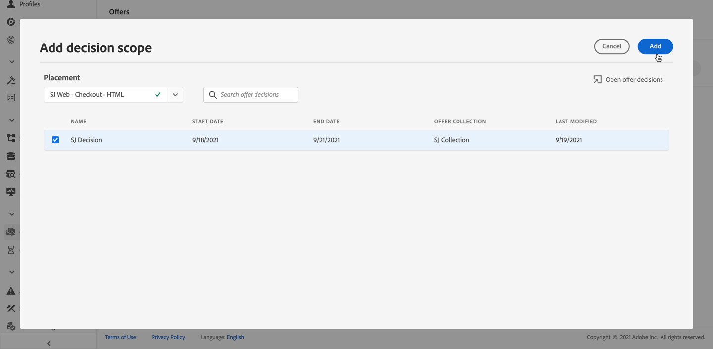
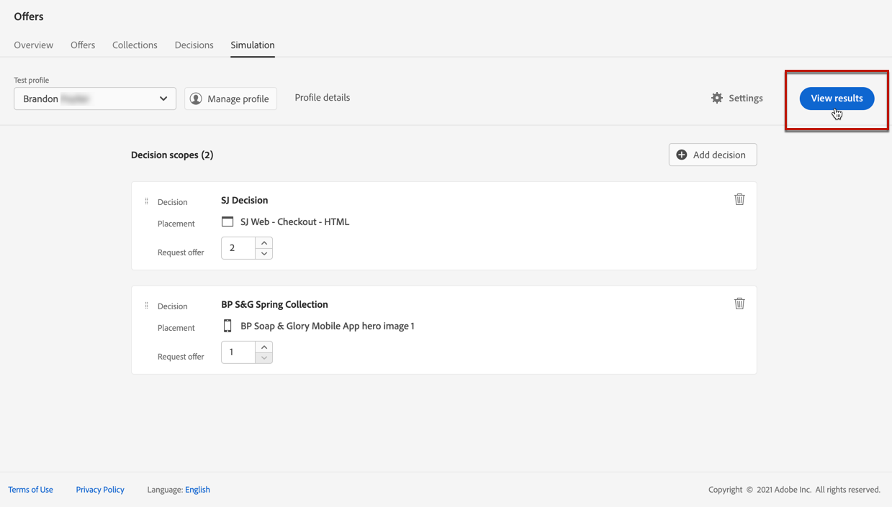
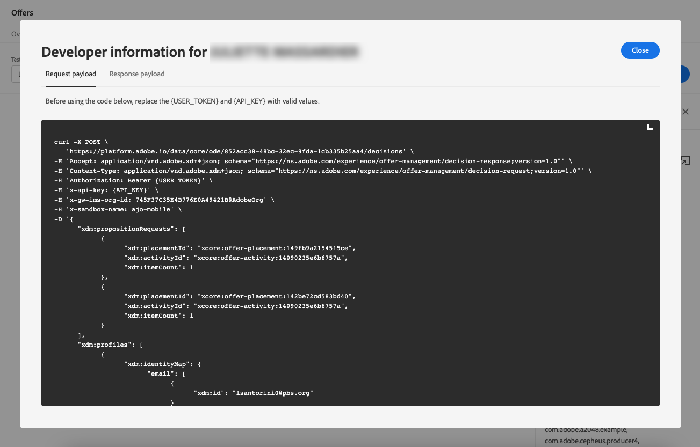

# Criar simulações {#create-simulations}

## Sobre a simulação {#about-simulation}

Para validar sua lógica de decisão, você pode simular quais ofertas serão entregues a um perfil de teste para uma determinada disposição.

<!--Simulation allows you to view the results of offer decisions as a selected profile.-->

Isso permite testar e refinar várias versões das ofertas sem afetar os recipients alvos.

>[!NOTE]
>
>Esse recurso simula uma única solicitação para o [!DNL Decisions] API. Saiba mais sobre [Fornecer ofertas usando a API de decisões](../api-reference/decisions-api/deliver-offers.md).

Para acessar esse recurso, selecione o **[!UICONTROL Simulation]** na guia do **[!UICONTROL Decision management]** > **[!UICONTROL Offers]** menu.

<!--
➡️ [Discover this feature in video](#video)
-->

## Selecionar perfis de teste {#select-test-profiles}

Primeiro, é necessário selecionar os perfis de teste que serão usados para simulação.

1. Clique em **[!UICONTROL Manage profile]**.

   

1. Selecione o namespace de identidade que deseja usar para identificar os perfis de teste. Neste exemplo, usaremos a variável **Email** namespace.

   >[!NOTE]
   >
   >Um namespace de identidade define o contexto de um identificador, como um endereço de email ou ID de CRM. Saiba mais sobre os namespaces de identidade da Adobe Experience Platform [nesta seção](../../start/get-started-identity.md){target=&quot;_blank&quot;}.

1. Insira o valor de identidade e clique em **[!UICONTROL View]** para listar os perfis disponíveis.

   

1. Adicione outros perfis se desejar testar dados de perfil diferentes e salve sua seleção.

   

1. Depois de adicionados, todos os perfis são listados na lista suspensa em **[!UICONTROL Test profile]**. Você pode alternar entre os perfis de teste salvos para exibir os resultados de cada perfil selecionado.

   

   >[!NOTE]
   >
   >Os perfis selecionados permanecerão listados como perfis de teste na **[!UICONTROL Simulation]** guia de sessão em sessão até que sejam removidos usando **[!UICONTROL Manage profile]**.

1. Você pode clicar no botão **[!UICONTROL Profile details]** link para exibir os dados de perfil selecionados.

<!--Learn more on [selecting test profiles](messages/preview.md#select-test-profiles)-->

## Adicionar escopos de decisão {#add-decision-scopes}

Em seguida, selecione as decisões de oferta que deseja simular nos perfis de teste.

1. Selecione **[!UICONTROL Add decision scope]**.

   

1. Selecione uma disposição na lista.

   

1. As decisões disponíveis são exibidas.

   * Você pode usar o campo de pesquisa para refinar a seleção.
   * Você pode clicar no botão **[!UICONTROL Open offer decisions]** para abrir a lista de todas as decisões criadas. Saiba mais sobre [decisões](create-offer-activities.md).

   Selecione a decisão de sua escolha e clique em **[!UICONTROL Add]**.

   

1. O escopo de decisão que você acabou de definir é exibido no espaço de trabalho principal.

   É possível ajustar o número de ofertas que deseja solicitar. Por exemplo, se você selecionar 2, as 2 melhores ofertas serão exibidas para esse escopo de decisão.

   

   >[!NOTE]
   >
   >Você pode solicitar até 30 ofertas.

1. Repita as etapas acima para adicionar quantas decisões forem necessárias.

   

   >[!NOTE]
   >
   >Mesmo que você defina vários escopos de decisão, apenas uma solicitação de API é simulada.

## Definir configurações de simulação {#define-simulation-settings}

Para editar as configurações padrão das simulações, siga as etapas abaixo.

1. Clique em **[!UICONTROL Settings]**.

   

1. No **[!UICONTROL Deduplication]** , é possível optar por permitir ofertas duplicadas entre decisões e/ou disposições. Isso significa que várias decisões/disposições podem receber a mesma oferta.

   

   >[!NOTE]
   >
   >Por padrão, todos os sinalizadores de Desduplicação são ativados para simulação, o que significa que o mecanismo de decisão permite duplicatas e, portanto, pode fazer a mesma apresentação em várias decisões/disposições. Saiba mais sobre o [!DNL Decisions] Propriedades da solicitação de API em [esta seção](../api-reference/decisions-api/deliver-offers.md).

1. No **[!UICONTROL Response format]** , você pode optar por incluir metadados na visualização de código. Marque a opção correspondente e selecione os metadados de sua escolha. Eles serão exibidos nas cargas de solicitação e resposta ao selecionar **[!UICONTROL View code]**. Saiba mais na [Exibir resultados da simulação](#simulation-results) seção.

   

   >[!NOTE]
   >
   >Ao ativar a opção , todos os itens são selecionados por padrão.

1. Clique em **[!UICONTROL Save]**.

>[!NOTE]
>
>Atualmente, para dados de simulação, é possível usar somente o **[!UICONTROL Hub]** API.

<!--
In the **[!UICONTROL API for simulation]** section, select the API you want to use: **[!UICONTROL Hub]** or **[!UICONTROL Edge]**.
Hub and Edge are two different end points for simulation data.

In the **[!UICONTROL Context data]** section, you can add as many elements as needed.

    >[!NOTE]
    >
    >This section is hidden if you select Edge API in the section above. Hub allows the use of Context data, Edge does not.

Context data allows the user to add contextual data that could affect the simulation score.
For instance, let's say the customer has an offer for a discount on ice cream. In the rules for that offer, it can have logic that would rank it higher when the temperature is above 80 degrees. In simulation, the user could add context data: temperature=65 and that offer would rank lower, of they could add temperature=95 and that would rank higher.
-->

## Exibir resultados da simulação {#simulation-results}

Depois de adicionar um escopo de decisão e selecionar um perfil de teste, você poderá visualizar os resultados.

1. Clique em **[!UICONTROL View results]**.

   

1. As melhores ofertas disponíveis são exibidas de acordo com o perfil selecionado para cada decisão.

   Selecione uma oferta para exibir seus detalhes.

   

1. Clique em **[!UICONTROL View code]** para exibir as cargas de solicitação e resposta. [Saiba mais](#view-code)

1. Selecione outro perfil na lista para exibir os resultados das decisões de oferta para um perfil de teste diferente.

1. Você pode adicionar, remover ou atualizar os escopos de decisão quantas vezes forem necessárias.

>[!NOTE]
>
>Sempre que alterar perfis ou atualizar escopos de decisão, será necessário atualizar os resultados usando o **[!UICONTROL View results]** botão.

## Exibir código {#view-code}

1. Use o **[!UICONTROL View code]** para exibir as cargas de solicitação e resposta.

   

   A exibição de código mostra as informações do desenvolvedor para o usuário atual. Por padrão, a variável **[!UICONTROL Response payload]** é exibida.

   

1. Clique em **[!UICONTROL Response payload]** ou **[!UICONTROL Request payload]** para navegar entre as duas guias.

   

1. Para usar a carga da solicitação fora de [!DNL Journey Optimizer] - para fins de solução de problemas, por exemplo, copie-o usando o **[!UICONTROL Copy to clipboard]** na parte superior da visualização de código.

   

   <!--You cannot copy the response payload. ACTUALLY YES YOU CAN > to confirm with PM/dev? -->

   >[!NOTE]
   >
   >Ao copiar as cargas de solicitação ou resposta em seu próprio código, substitua {USER_TOKEN} e {API_KEY} por valores válidos. Saiba como recuperar esses valores no [APIs do Adobe Experience Platform](https://experienceleague.adobe.com/docs/experience-platform/landing/platform-apis/api-authentication.html)Documentação {target=&quot;_blank&quot;}.

