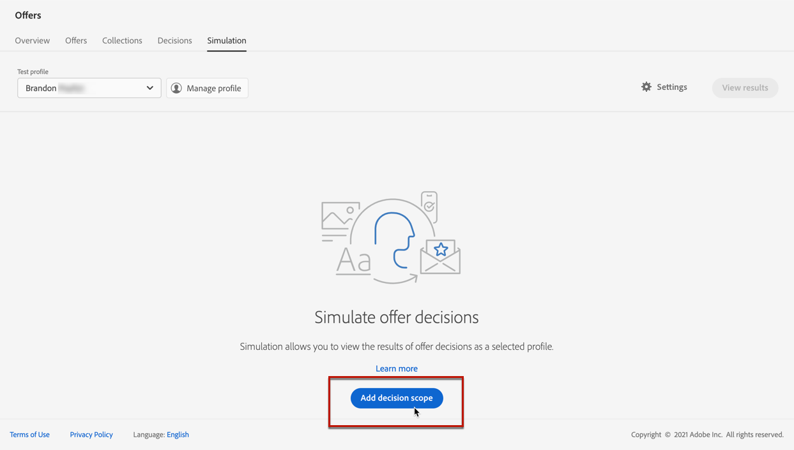
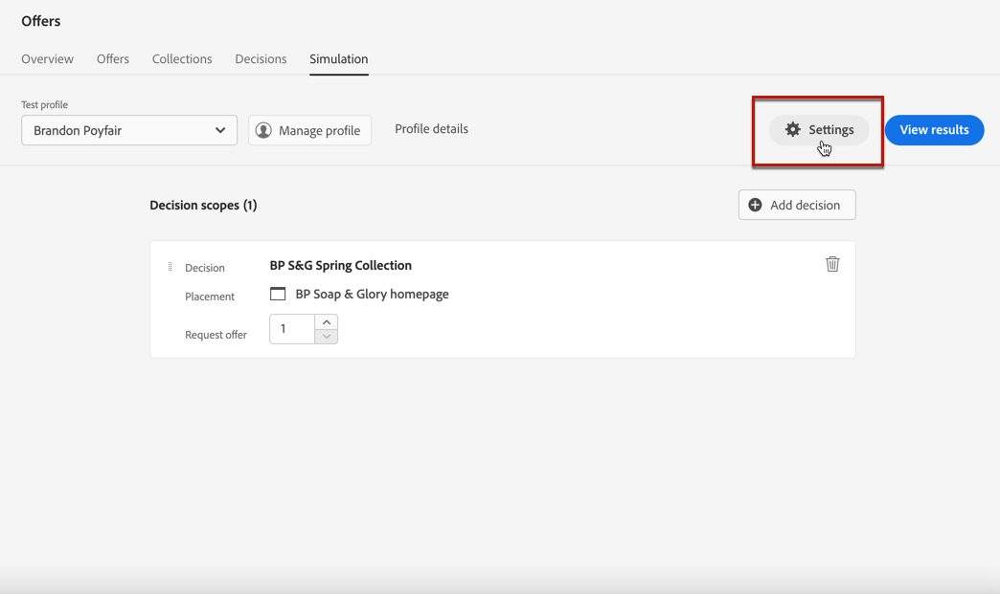
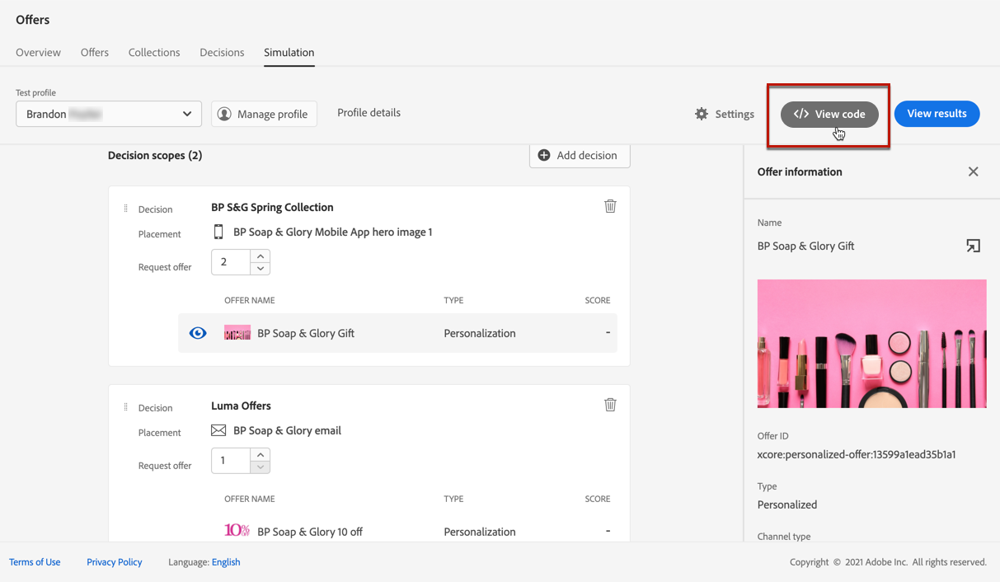

# Criar simulações {#create-simulations}

>[!CONTEXTUALHELP]
>id="ajo_decisioning_simulation"
>title="Simulação de decisões de ofertas"
>abstract="Uma simulação permite simular quais ofertas serão entregues a um perfil de teste para uma determinada inserção. Dessa forma, é possível testar e refinar várias versões de suas ofertas sem impacto nos destinatários direcionados."

## Sobre a simulação {#about-simulation}

Para validar a lógica de decisão, é possível simular quais ofertas serão entregues a um perfil de teste para uma determinada inserção.

<!--Simulation allows you to view the results of offer decisions as a selected profile.-->

Dessa forma, é possível testar e refinar várias versões de suas ofertas sem impacto nos destinatários direcionados.

>[!NOTE]
>
>Este recurso simula uma única solicitação para a API [!DNL Decisioning]. Saiba mais sobre [Fornecer ofertas usando a API de decisão](../api-reference/offer-delivery-api/decisioning-api.md).

Para acessar este recurso, selecione a guia **[!UICONTROL Simulação]** no menu **[!UICONTROL Gestão de decisões]** > **[!UICONTROL Ofertas]**.

>[!NOTE]
>
>Como a simulação não gera nenhum evento de decisão, a contagem [capping](../offer-library/creating-personalized-offers.md#capping) não é afetada.

<!--
➡️ [Discover this feature in video](#video)
-->

## Seleção de perfis de teste {#select-test-profiles}

>[!CONTEXTUALHELP]
>id="ajo_decisioning_simulation_test_profile"
>title="Adicionar perfis de teste"
>abstract="Você pode adicionar um perfil de teste selecionando um namespace de identidade e um valor de identidade correspondente. Você deve ter perfis de teste já disponíveis para usá-los na simulação."

Primeiro, é necessário selecionar os perfis de teste que você usará para simulação.

>[!CAUTION]
>
>Você deve ter perfis de teste disponíveis para simular quais ofertas serão entregues a eles. Saiba como [criar perfis de teste](../../audience/creating-test-profiles.md).

1. Clique em **[!UICONTROL Gerenciar perfil]**.

   

1. Selecione o namespace de identidade que deseja usar para identificar perfis de teste. Neste exemplo, usaremos o namespace **Email**.

   >[!NOTE]
   >
   >Um namespace de identidade define o contexto de um identificador, como um endereço de email ou ID de CRM. Saiba mais sobre os namespaces de identidade do Adobe Experience Platform [nesta seção](../../audience/get-started-identity.md){target="_blank"}.

1. Insira o valor da identidade e clique em **[!UICONTROL Exibir]** para listar os perfis disponíveis.

   

1. Adicione outros perfis se quiser testar dados de perfil diferentes e salve a seleção.

   

1. Depois de adicionado, todos os perfis são listados na lista suspensa em **[!UICONTROL Perfil de teste]**. Você pode alternar entre os perfis de teste salvos para exibir os resultados de cada perfil selecionado.

   

   >[!NOTE]
   >
   >Os perfis selecionados permanecerão listados como perfis de teste na guia **[!UICONTROL Simulação]** de sessão para sessão até serem removidos usando **[!UICONTROL Gerenciar perfil]**.

1. Você pode clicar no link **[!UICONTROL Detalhes do perfil]** para exibir os dados do perfil selecionado.

## Adicionar escopos de decisão {#add-decision-scopes}

Agora selecione as decisões de oferta que deseja simular nos perfis de teste.

1. Selecione **[!UICONTROL Adicionar escopo da decisão]**.

   

1. Selecione uma disposição na lista.

   

1. As decisões disponíveis são exibidas.

   * Você pode usar o campo de pesquisa para refinar a seleção.
   * Você pode clicar no link **[!UICONTROL Abrir decisões de oferta]** para abrir a lista de todas as decisões que você criou. Saiba mais sobre [decisões](create-offer-activities.md).

   Selecione a decisão de sua escolha e clique em **[!UICONTROL Adicionar]**.

   

1. O escopo de decisão recém-definido é exibido no espaço de trabalho principal.

   Você pode ajustar o número de ofertas que deseja solicitar. Por exemplo, se você selecionar 2, as 2 melhores ofertas serão exibidas para esse escopo de decisão.

   

   >[!NOTE]
   >
   >Você pode solicitar até 30 ofertas.

1. Repita as etapas acima para adicionar quantas decisões forem necessárias.

   

   >[!NOTE]
   >
   >Mesmo que você defina vários escopos de decisão, somente uma solicitação de API será simulada.

## Definir configurações da simulação {#define-simulation-settings}

Para editar as configurações padrão para suas simulações, siga as etapas abaixo.

1. Clique em **[!UICONTROL Configurações]**.

   

1. Na seção **[!UICONTROL Desduplicação]**, você pode optar por permitir ofertas duplicadas em decisões e/ou posicionamentos. Isso significa que várias decisões/posicionamentos podem receber a mesma oferta.

   

   >[!NOTE]
   >
   >Por padrão, todos os sinalizadores de Desduplicação são ativados para simulação, o que significa que o mecanismo de decisão permite duplicatas e, portanto, pode fazer a mesma proposta em várias decisões/posicionamentos. Saiba mais sobre as propriedades da solicitação de API [!DNL Decisioning] em [esta seção](../api-reference/offer-delivery-api/decisioning-api.md).

1. Na seção **[!UICONTROL Formato de resposta]**, você pode optar por incluir metadados na exibição de código. Marque a opção correspondente e selecione os metadados de sua escolha. Eles serão exibidos nas cargas de solicitação e resposta ao selecionar **[!UICONTROL Exibir código]**. Saiba mais na seção [Exibir resultados da simulação](#simulation-results).

   

   >[!NOTE]
   >
   >Ao ativar a opção, todos os itens são selecionados por padrão.

1. Clique em **[!UICONTROL Salvar]**.

>[!NOTE]
>
>Atualmente, para dados de simulação, você só pode usar a API **[!UICONTROL Hub]**.

<!--
In the **[!UICONTROL API for simulation]** section, select the API you want to use: **[!UICONTROL Hub]** or **[!UICONTROL Edge]**.
Hub and Edge are two different end points for simulation data.

In the **[!UICONTROL Context data]** section, you can add as many elements as needed.

    >[!NOTE]
    >
    >This section is hidden if you select Edge API in the section above. Hub allows the use of Context data, Edge does not.

Context data allows the user to add contextual data that could affect the simulation score.
For instance, let's say the customer has an offer for a discount on ice cream. In the rules for that offer, it can have logic that would rank it higher when the temperature is above 80 degrees. In simulation, the user could add context data: temperature=65 and that offer would rank lower, of they could add temperature=95 and that would rank higher.
-->

## Exibir resultados da simulação {#simulation-results}

Depois de adicionar um escopo de decisão e selecionar um perfil de teste, você pode visualizar os resultados.

1. Clique em **[!UICONTROL Exibir resultados]**.

   

1. As melhores ofertas disponíveis são exibidas de acordo com o perfil selecionado para cada decisão.

   Selecione uma oferta para exibir seus detalhes.

   

1. Clique em **[!UICONTROL Exibir código]** para exibir as cargas de solicitação e resposta. [Saiba mais](#view-code)

1. Selecione outro perfil na lista para exibir os resultados das decisões de oferta para um perfil de teste diferente.

1. Você pode adicionar, remover ou atualizar os escopos de decisão quantas vezes forem necessárias.

>[!NOTE]
>
>Sempre que você alterar perfis ou atualizar escopos de decisão, será necessário atualizar os resultados usando o botão **[!UICONTROL Exibir resultados]**.

## Exibir código {#view-code}

1. Use o botão **[!UICONTROL Exibir código]** para exibir as cargas de solicitação e resposta.

   

   A visualização de código mostra as informações do desenvolvedor para o usuário atual. Por padrão, a **[!UICONTROL Carga de resposta]** é exibida.

   

1. Clique em **[!UICONTROL Carga de resposta]** ou **[!UICONTROL Solicitar carga]** para navegar entre as duas guias.

   

1. Para usar a carga da solicitação fora de [!DNL Journey Optimizer] - para fins de solução de problemas, por exemplo, copie-a usando o botão **[!UICONTROL Copiar para a área de transferência]** na parte superior da exibição de código.

   

   <!--You cannot copy the response payload. ACTUALLY YES YOU CAN > to confirm with PM/dev? -->

   >[!NOTE]
   >
   >Ao copiar as cargas da solicitação ou resposta para seu próprio código, substitua {USER_TOKEN} e {API_KEY} por valores válidos. Saiba como recuperar esses valores na documentação das [APIs do Adobe Experience Platform](https://experienceleague.adobe.com/docs/experience-platform/landing/platform-apis/api-authentication.html?lang=pt-BR){target="_blank"}.

