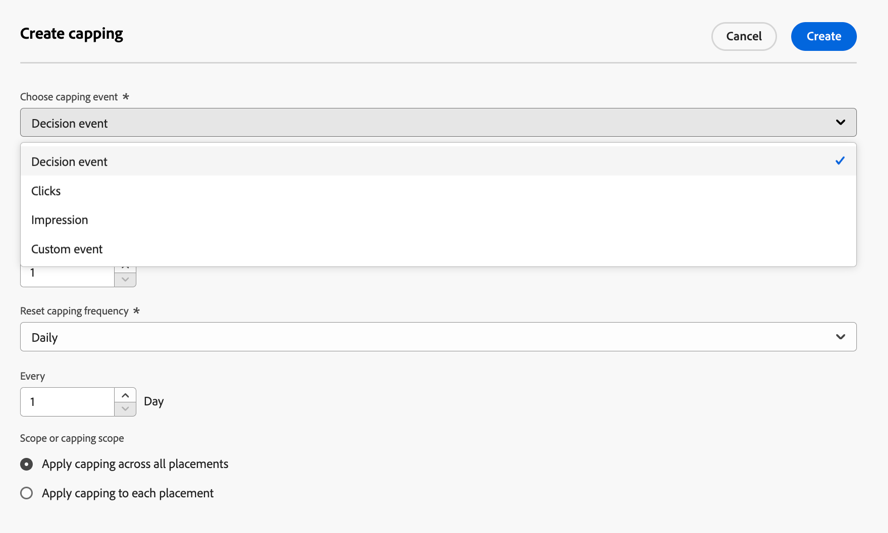
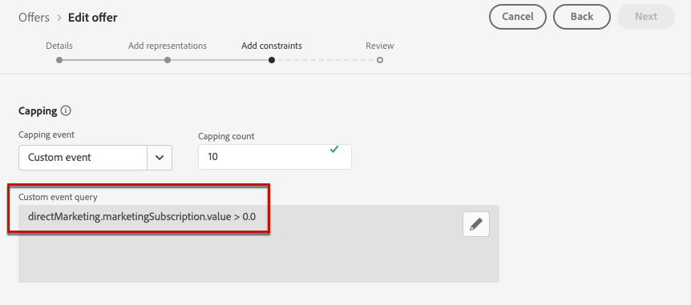

# Adicionar restrições a uma oferta {#add-constraints}

>[!CONTEXTUALHELP]
>id="od_offer_constraints"
>title="Sobre restrições de oferta"
>abstract="Com as restrições, é possível especificar como a oferta será priorizada e apresentada ao usuário em comparação com outras ofertas."

>[!CONTEXTUALHELP]
>id="ajo_decisioning_constraints"
>title="Sobre restrições de oferta"
>abstract="Com as restrições, é possível especificar como a oferta será priorizada e apresentada ao usuário em comparação com outras ofertas."

>[!CONTEXTUALHELP]
>id="od_offer_priority"
>title="Sobre a prioridade da oferta"
>abstract="Nesse campo, é possível especificar as configurações de prioridade da oferta. A prioridade é um número usado para classificar as ofertas que atendem a todas as restrições, como elegibilidade, datas e limite."

>[!CONTEXTUALHELP]
>id="ajo_decisioning_priority"
>title="Definir prioridade"
>abstract="A prioridade ajuda a definir a prioridade da oferta em comparação com outras caso o usuário se qualifique para mais de uma oferta. Quanto maior for a prioridade de uma oferta, maior será sua prioridade em comparação a outras ofertas."

Restrições permitem definir as condições em que uma oferta será exibida.

1. Configure a **[!UICONTROL Qualificação da oferta]**. [Saiba mais](#eligibility)

   

1. Defina a **[!UICONTROL Prioridade]** da oferta em comparação a outras se o usuário se qualificar para mais de uma oferta. Quanto maior for a prioridade de uma oferta, maior será sua prioridade em comparação a outras ofertas.

   

   >[!NOTE]
   >
   >A prioridade da oferta deve ser um valor inteiro (sem decimais).

1. Especifique o **[!UICONTROL Limite]** da oferta, o que significa o número de vezes que a oferta será apresentada. [Saiba mais](#capping)

   

1. Clique em **[!UICONTROL Avançar]** para confirmar todas as restrições definidas.

Por exemplo, se você definir as seguintes restrições:

* A oferta será considerada apenas para usuários que correspondam à regra de decisão &quot;Clientes de fidelidade Gold&quot;.
* A prioridade da oferta é definida como &quot;50&quot;, o que significa que a oferta será apresentada antes de ofertas com prioridade entre 1 e 49 e depois daquelas com prioridade de pelo menos 51.
* A oferta será apresentada apenas uma vez por mês por usuário em todos os posicionamentos.

## Elegibilidade {#eligibility}

>[!CONTEXTUALHELP]
>id="ajo_decisioning_eligibility"
>title="Definir elegibilidade"
>abstract="Por padrão, qualquer perfil estará qualificado para receber a oferta, mas você pode usar públicos-alvo ou regras de decisão para restringir a oferta a perfis específicos."

>[!CONTEXTUALHELP]
>id="od_offer_eligibility"
>title="Sobre a elegibilidade da oferta"
>abstract="Nesta seção, é possível usar regras de decisão para definir as pessoas elegíveis para receber a oferta."

<!--additional-url="https://video.tv.adobe.com/v/341377?captions=por_br" text="Watch demo video"-->

>[!CONTEXTUALHELP]
>id="ajo_decisioning_total_profile_estimate"
>title="Estimativa total de perfis"
>abstract="Ao selecionar públicos-alvo ou regras de decisão, é possível ver informações sobre os perfis qualificados estimados."

A seção **[!UICONTROL Qualificação da oferta]** permite restringir a oferta a perfis específicos que você define usando públicos ou regras de decisão.

>[!NOTE]
>
>Saiba mais sobre como usar **públicos-alvo** versus **regras de decisão** nesta [seção](#segments-vs-decision-rules).

* Por padrão, a opção **[!UICONTROL Todos os visitantes]** está selecionada, o que significa que qualquer perfil estará qualificado para receber a oferta.

  

* Você também pode limitar a apresentação da oferta aos membros de um ou vários [públicos-alvo da Adobe Experience Platform](../../audience/about-audiences.md).

  Para fazer isso, ative a opção **[!UICONTROL Visitors who fall into one or multiple audiences]**, adicione um ou vários públicos do painel esquerdo e combine-os usando os operadores lógicos **[!UICONTROL And]** / **[!UICONTROL Or]**.

  

* Se quiser associar uma [regra de decisão](../offer-library/creating-decision-rules.md) específica à oferta, selecione **[!UICONTROL Por regra de decisão definida]** e arraste a regra desejada do painel esquerdo para a área **[!UICONTROL Regra de decisão]**.

  

  >[!CAUTION]
  >
  >No momento, não há suporte no [!DNL Journey Optimizer] para ofertas baseadas em eventos. Se você criar uma regra de decisão baseada em um [evento](https://experienceleague.adobe.com/docs/experience-platform/segmentation/ui/segment-builder.html?lang=pt-BR#events){target="_blank"}, não poderá aproveitá-la em uma oferta.

Ao selecionar públicos ou regras de decisão, você pode ver informações sobre os perfis qualificados estimados. Clique em **[!UICONTROL Atualizar]** para atualizar os dados.

>[!NOTE]
>
>As estimativas de perfil não estão disponíveis quando os parâmetros da regra incluem dados que não estão no perfil, como dados de contexto. Por exemplo, uma regra de elegibilidade que exige que o tempo atual seja ≥ 80 graus.

### Uso de públicos-alvo versus regras de decisão {#segments-vs-decision-rules}

Para aplicar uma restrição, é possível restringir a seleção de ofertas aos membros de um ou vários **públicos-alvo da Adobe Experience Platform**, ou usar uma **regra de decisão**, ambas as soluções correspondentes a usos diferentes.

Basicamente, a saída de um público-alvo é uma lista de perfis, enquanto uma regra de decisão é uma função executada sob demanda em relação a um único perfil durante o processo de decisão. A diferença entre esses dois usos é detalhada abaixo.

* **Públicos-alvo**

  Por um lado, os públicos-alvo são um grupo de perfis do Adobe Experience Platform que correspondem a determinada lógica com base em atributos de perfil e eventos de experiência. No entanto, o Gerenciamento de ofertas não recalcula o público-alvo, que pode não estar atualizado ao apresentar a oferta.

  Saiba mais sobre públicos-alvo [nesta seção](../../audience/about-audiences.md).

* **Regras de decisão**

  Por outro lado, uma regra de decisão se baseia nos dados disponíveis no Adobe Experience Platform e determina para quem uma oferta pode ser exibida. Uma vez selecionada em uma oferta ou em uma decisão para um determinado posicionamento, a regra é executada sempre que uma decisão é tomada, o que garante que cada perfil receba a melhor e mais recente oferta.

  Saiba mais sobre regras de decisão em [esta seção](creating-decision-rules.md).

## Limite {#capping}

>[!CONTEXTUALHELP]
>id="od_offer_globalcap"
>title="Sobre o limite de oferta"
>abstract="Nesse campo, é possível especificar quantas vezes a oferta pode ser apresentada."

>[!CONTEXTUALHELP]
>id="ajo_decisioning_capping"
>title="Usar limite"
>abstract="Para evitar o excesso de solicitações aos clientes, use o limite para definir o número máximo de vezes que uma oferta pode ser apresentada. É possível criar até 10 regras de limitação para uma determinada oferta."
>additional-url="https://experienceleague.adobe.com/pt-br/docs/journey-optimizer/using/decisioning/offer-decisioning/managing-offers-in-the-offer-library/configure-offers/add-constraints#capping-change-date" text="Alterar datas pode afetar os limites"

O limite é usado como uma restrição para definir o número máximo de vezes que uma oferta pode ser apresentada. Limitar o número de vezes que os usuários obtêm ofertas específicas permite evitar o excesso de solicitações de seus clientes e, portanto, otimizar cada ponto de contato com a melhor oferta.

Você pode adicionar até 10 regras de limitação para uma determinada oferta. Para definir uma regra de limite, clique no botão **[!UICONTROL Criar limite]** e siga as etapas abaixo:

>[!CAUTION]
>
>Não é possível ativar ou desativar o limite de frequência para ofertas criadas anteriormente. Para fazer isso, é necessário criar uma nova oferta.

1. Defina qual **[!UICONTROL Evento de limite]** será considerado para aumentar o contador. [Saiba mais](#capping-event)

1. Escolha se deseja que o limite seja aplicado a todos os usuários ou a apenas um perfil. [Saiba mais](#capping-type)

1. Defina o número de vezes que a oferta poderá ser apresentada. [Saiba mais](#capping-count)

1. Defina a **[!UICONTROL Frequência]** para definir com que frequência a contagem de limite é redefinida. [Saiba mais](#frequency-capping)

1. Se você tiver definido várias [representações](add-representations.md) para sua oferta, especifique se deseja aplicar o limite **em todos os posicionamentos** ou **a cada posicionamento**. [Saiba mais](#placements)

1. Depois de salva e aprovada, se a oferta tiver sido apresentada o número de vezes que você especificou nesse campo de acordo com os critérios e o período definido, o delivery será interrompido.

O número de vezes que uma oferta é proposta é calculado no momento da preparação do email. Por exemplo, se você preparar um email com várias ofertas, esses números serão contados em relação ao limite máximo, independentemente de o email ser enviado ou não.

<!--If an email delivery is deleted or if the preparation is done again before being sent, the capping value for the offer is automatically updated.-->

>[!NOTE]
>
>Os contadores de limite serão redefinidos quando a oferta expirar ou 2 anos após a data de início da oferta, o que ocorrer primeiro. Saiba como definir a data de uma oferta em [esta seção](creating-personalized-offers.md#create-offer).

### Evento de limite {#capping-event}

>[!CONTEXTUALHELP]
>id="ajo_decisioning_frequency_capping_impression"
>title="impressão"
>abstract="O uso de impressões como eventos de limite está disponível somente para canais de entrada."

O campo **[!UICONTROL Escolher evento de limite]** permite definir qual evento será considerado para aumentar o contador:

* **[!UICONTROL Evento de decisão]** (valor padrão): número máximo de vezes que uma oferta pode ser apresentada.
* **[!UICONTROL Cliques]**: número máximo de vezes que a oferta pode ser clicada por um usuário.
* **[!UICONTROL Impressão]**: número máximo de vezes que a oferta pode ser exibida a um usuário.

  >[!NOTE]
  >
  >O uso de impressões como eventos de limite está disponível somente para **canais de entrada**.

* **[!UICONTROL Evento personalizado]**: você pode definir um evento personalizado que será usado para limitar o número de ofertas enviadas. Por exemplo, você pode limitar o número de resgates até que correspondam a 10.000 ou até que um determinado perfil tenha resgatado uma vez. Para fazer isso, use esquemas [Adobe Experience Platform XDM](https://experienceleague.adobe.com/docs/experience-platform/xdm/home.html?lang=pt-BR){target="_blank"} para criar uma regra de evento personalizada.

  <!--For example, you can cap on the number of redemptions so that the offer can be shown until redemptions equal 10,000. You can only select XDM ExperienceEvents. -->

  No exemplo abaixo, você deseja limitar o número de check-outs.

   1. Selecione **[!UICONTROL Evento personalizado]** na lista e use o botão **[!UICONTROL Adicionar evento personalizado]**.

   1. Use o construtor de **[!UICONTROL Criar regras de evento personalizadas]** para selecionar o evento relevante. Você pode escolher qualquer ação do usuário para a qual deseja limitar as ofertas.

      Aqui, escolha **[!UICONTROL Commerce]** > **[!UICONTROL Check-outs]** > **[!UICONTROL Valor]** e selecione **[!UICONTROL existe]** na lista suspensa.

      

   1. Depois que a regra é criada, ela é exibida no campo **[!UICONTROL Consulta de evento personalizada]**.

      

>[!CAUTION]
>
>Para todos os eventos de limite, exceto o evento de decisão, o feedback da gestão de decisões pode não ser coletado automaticamente, o que pode resultar no aumento incorreto do contador de limite. [Saiba mais](../data-collection/data-collection.md)
>
>Para garantir que cada evento de limite seja rastreado e contabilizado no contador de limite, verifique se o esquema usado para coletar eventos de experiência inclui o grupo de campos correto para esse evento. [Saiba mais](../data-collection/schema-requirement.md)

### Tipo de limite {#capping-type}

Você pode especificar se deseja que o limite seja aplicado a todos os usuários ou a um perfil específico:

* Selecione **[!UICONTROL No total]** para definir quantas vezes uma oferta pode ser proposta através do público-alvo combinado, ou seja, através de todos os usuários.

  Por exemplo, se você for um retailer eletrônico com um &quot;contrato de portaria de TV&quot;, desejará que a oferta seja retornada apenas 200 vezes em todos os perfis.

* Selecione **[!UICONTROL Por perfil]** para definir quantas vezes uma oferta pode ser proposta ao mesmo usuário.

  Por exemplo, se você for um banco com uma oferta de &quot;Cartão de crédito Platinum&quot;, não desejará que essa oferta seja exibida mais de 5 vezes por perfil. Na verdade, você acredita que, se o usuário tiver visto a oferta cinco vezes e não tiver atuado nela, ele terá uma chance maior de agir na próxima melhor oferta.

### Contagem de limites {#capping-count}

O campo **[!UICONTROL Limite de contagem limite]** permite especificar o número de vezes que a oferta pode ser apresentada.

>[!NOTE]
>
>O número deve ser um inteiro maior que 0.

Por exemplo, você definiu um evento de limite personalizado, como o número de check-outs que são considerados. Se você inserir 10 no campo **[!UICONTROL Limite de contagem de limite]**, nenhuma outra oferta será enviada após 10 check-outs.

### Limite de frequência {#frequency-capping}

>[!CONTEXTUALHELP]
>id="ajo_decisioning_frequency_capping"
>title="Definir a frequência limite"
>abstract="Você pode optar por redefinir o contador de limite de oferta diariamente, semanalmente ou mensalmente. Observe que, após publicar a oferta com o limite de frequência habilitado, não será possível alterar a frequência que foi definida."

O campo **[!UICONTROL Redefinir frequência de limite]** permite definir com que frequência a contagem de limite é redefinida. Para fazer isso, defina o período de tempo para a contagem (diariamente, semanalmente ou mensalmente) e insira o número de dias/semanas/meses de sua escolha. Por exemplo, se você deseja que a contagem de limite seja redefinida a cada 2 semanas, selecione **[!UICONTROL Semanalmente]** na lista suspensa correspondente e digite **2** no outro campo.

>[!NOTE]
>
>A redefinição do contador de limite de frequência ocorre às **12h UTC**, no dia definido ou no primeiro dia da semana/mês quando aplicável. O dia de início da semana é **domingo**. Qualquer duração escolhida não pode exceder **2 anos** (ou seja, o número correspondente de meses, semanas ou dias).
>
>Depois de publicar sua oferta, você não poderá alterar o período de tempo (mensal, semanal ou diário) selecionado para a frequência. Você ainda poderá editar o limite de frequência se a oferta tiver o status **[!UICONTROL Rascunho]** e nunca tiver sido publicada antes com o limite de frequência habilitado.

+++ **Leitura obrigatória: APIs de Limite de frequência e Gerenciamento de decisão**

O contador de limite de frequência é atualizado e está disponível em uma decisão da [API de decisão do Edge](../api-reference/offer-delivery-api/start-offer-delivery-apis.md#edge) em menos de 3 segundos.

Cada região do hub está associada a uma ou mais regiões de borda. As regras de limite de frequência são geradas e exportadas de cada região do hub para suas regiões de borda associadas. Sempre que uma decisão é tomada usando a API do Edge Decisioning, o sistema impõe as regras disponíveis na mesma região de borda:

* Se houver uma regra correspondente, o contador de limite de frequência do perfil será incrementado.
* Caso contrário, nenhum contador será criado para o perfil e a regra de limite de frequência não se aplica. Consequentemente, o perfil continuará a receber ofertas personalizadas mesmo se o limite for excedido.

Por exemplo, considere a região do hub da sua organização como *NLD2* e você está enviando uma solicitação de decisão da Europa (*IRL1* região de borda). Neste cenário, a solicitação de decisão incrementará o contador do perfil, pois as regras estão disponíveis na região (Irlanda) *IRL1*. No entanto, se a solicitação de decisão se originar de uma região como o Japão (*JPN3*), que não é uma região de borda vinculada à região de hub (Holanda) *NLD2*, nenhum contador será criado e as regras de limite de frequência não serão impostas.

>[!NOTE]
>
>Quando os contadores são propagados de borda a hub ou de hub a região de borda, um atraso de alguns minutos pode ser aplicado.

Para obter mais informações sobre quais regiões de hub e borda estão associadas à sua organização, entre em contato com o representante da Adobe.

Com as outras APIs, o contador de limite de frequência é atualizado da seguinte maneira:

* Em uma decisão da [API de decisão](../api-reference/offer-delivery-api/start-offer-delivery-apis.md#decisioning), o contador de limite de frequência pode ser atualizado com alguns minutos de atraso, dependendo do tráfego.

* Em uma decisão da [API de decisão em lote](../api-reference/offer-delivery-api/batch-decisioning-api.md), os instantâneos são usados onde o contador de limite de frequência permanece fixo. Enquanto o mesmo instantâneo for usado, o contador permanecerá inalterado.

+++

### Limite e disposições {#placements}

Se você tiver definido várias [representações](add-representations.md) para sua oferta, especifique se deseja aplicar o limite em todos os posicionamentos ou em cada posicionamento.

* **[!UICONTROL Aplicar limite em todos os posicionamentos]**: as contagens de limite totalizarão todas as decisões nos posicionamentos associados à oferta.

  Por exemplo, se uma oferta tiver um posicionamento de **Email** e uma posição de **Web** e você definir o limite como **2 por perfil em todos os posicionamentos**, cada perfil poderá receber a oferta até 2 vezes no total, independentemente da combinação de posicionamento.

* **[!UICONTROL Aplicar limite a cada posicionamento]**: as contagens de limite aplicarão as contagens de decisão para cada posicionamento separadamente.

  Por exemplo, se uma oferta tiver um posicionamento de **Email** e um posicionamento de **Web** e você definir o limite como **2 por perfil para cada posicionamento**, cada perfil poderá receber a oferta até 2 vezes para o posicionamento de email e outras 2 vezes para o posicionamento na Web.

### Impacto da alteração de datas no limite {#capping-change-date}

>[!CONTEXTUALHELP]
>id="ajo_decisioning_offer_change_date"
>title="Alterar datas pode afetar os limites"
>abstract="Se o limite for aplicado a essa oferta, ele poderá ser afetado quando você alterar a data inicial ou final."

Você deve continuar com cuidado ao alterar a data de uma oferta, pois isso pode ter impacto no limite se as seguintes condições forem atendidas:

* A oferta é [aprovada](#review).
* [Limite](#capping) já aplicado à oferta.
* O limite é definido por perfil.

>[!NOTE]
>
>Saiba como definir a data de uma oferta em [esta seção](creating-personalized-offers.md#create-offer).

O limite por perfil armazena as contagens de limite em cada perfil. Quando você altera as datas de início e término de uma oferta aprovada, a contagem de limite para alguns perfis pode ser afetada de acordo com os diferentes cenários descritos abaixo.

Estes são os cenários possíveis ao **alterar uma data de início de oferta**:

| Cenário: Se... | O que acontece: então... | Possível impacto na contagem de limite |
|--- |--- |--- |
| ... a data de início da oferta é atualizada antes que a data de início original da oferta tenha começado, | ... a contagem de limites começará na nova data de início. | Não |
| ... a nova data de início é anterior à data de término atual, | ... o limite continuará com uma nova data de início e a contagem de limite anterior para cada perfil continuará. | Não |
| ... a nova data de início é posterior à data de término atual, | ... o limite atual irá expirar e a nova contagem de limites começará novamente de 0 para todos os perfis na nova data de início. | Sim |

Estes são os cenários possíveis ao **estender uma data de término da oferta**:

| Cenário: Se... | O que acontece: então... | Possível impacto na contagem de limite |
|--- |--- |--- |
| ... uma solicitação de decisão ocorre antes da data de término da oferta original, | ... a contagem de limite será atualizada e a contagem de limite anterior para cada perfil continuará. | Não |
| ... não houver nenhuma solicitação de decisão antes da data final original, | ... a contagem de limite será redefinida na data final original para cada perfil. A nova contagem de limite será iniciada novamente a partir de 0 para qualquer nova solicitação de decisão que ocorra após a data final original. | Sim |

**Exemplo**

Digamos que você tenha uma oferta com uma data de início original definida como **Janeiro, 1**, expirando em **Janeiro, 31**.

1. Os perfis X, Y e Z são apresentados na oferta.
1. Em **janeiro, 10**, a data de término da oferta é alterada para **fevereiro, 15**.
1. **De 11 de janeiro a 31 de janeiro**, somente o perfil Z recebe a oferta.

   * Como uma solicitação de decisão ocorreu antes da data de término original **para o perfil Z**, a data de término da oferta pode ser estendida até **fevereiro, 15**.
   * No entanto, como nenhuma atividade ocorreu antes da data de término original para **perfis X e Y**, seus contadores expirarão e suas contagens de limite serão redefinidas como 0 em **janeiro, 31**.

