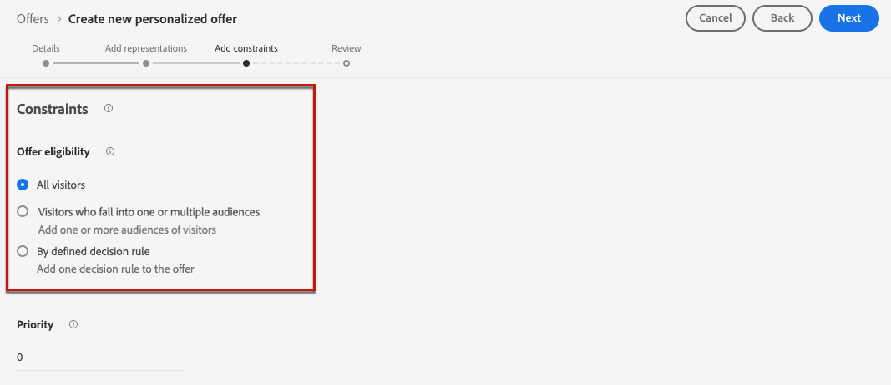
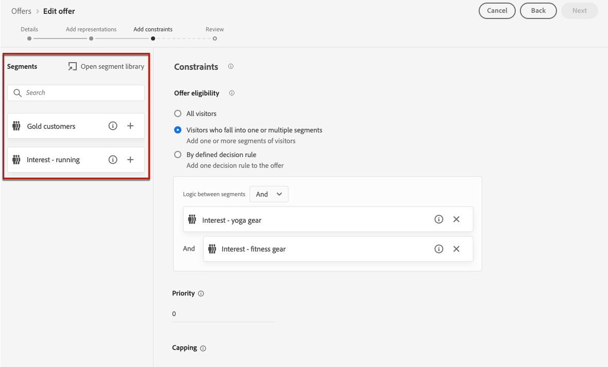
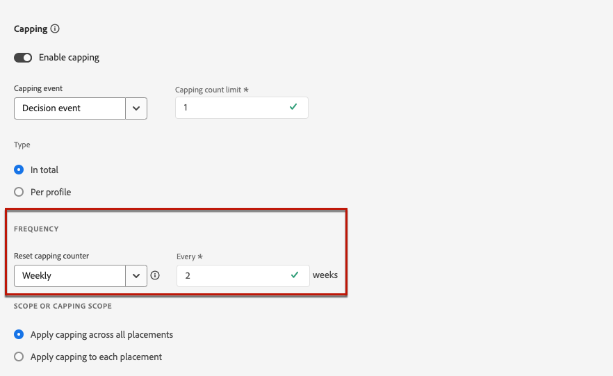

# Adicionar restrições a uma oferta {#add-constraints}

>[!CONTEXTUALHELP]
>id="od_offer_constraints"
>title="Sobre restrições de oferta"
>abstract="Com restrições, é possível especificar como a oferta é priorizada e apresentada ao usuário em comparação a outras ofertas."

>[!CONTEXTUALHELP]
>id="ajo_decisioning_constraints"
>title="Sobre restrições de oferta"
>abstract="Com restrições, é possível especificar como a oferta é priorizada e apresentada ao usuário em comparação a outras ofertas."

>[!CONTEXTUALHELP]
>id="od_offer_priority"
>title="Sobre a prioridade da oferta"
>abstract="Nesse campo, é possível especificar configurações de prioridade para a oferta. Prioridade é um número usado para classificar ofertas que atendem a todas as restrições, como qualificação, datas e limite."

>[!CONTEXTUALHELP]
>id="ajo_decisioning_priority"
>title="Definir prioridade"
>abstract="A prioridade ajuda a definir a prioridade da oferta em comparação com outras se o usuário se qualificar para mais de uma oferta. Quanto maior for a prioridade de uma oferta, maior será a prioridade em relação a outras ofertas."

As restrições permitem definir as condições em que uma oferta será exibida.

1. Configure o **[!UICONTROL Elegibilidade da oferta]**. [Saiba mais](#eligibility)

   

1. Defina as **[!UICONTROL Prioridade]** da oferta em comparação a outras se o usuário se qualificar para mais de uma oferta. Quanto maior for a prioridade de uma oferta, maior será a prioridade em relação a outras ofertas.

   

1. Especifique os **[!UICONTROL Limitação]**, o que significa o número de vezes que a oferta será apresentada. [Saiba mais](#capping)

   

1. Clique em **[!UICONTROL Próximo]** para confirmar todas as restrições definidas.

Por exemplo, se você definir as seguintes restrições:

* A oferta será considerada somente para usuários que correspondam à regra de decisão &quot;Clientes de fidelidade Gold&quot;.
* A prioridade da oferta é definida como &quot;50&quot;, o que significa que a oferta será apresentada antes de ofertas com prioridade entre 1 e 49 e depois das com prioridade de pelo menos 51.
* A oferta será apresentada somente uma vez por usuário em todas as disposições.

## Elegibilidade {#eligibility}

>[!CONTEXTUALHELP]
>id="ajo_decisioning_eligibility"
>title="Definir qualificação"
>abstract="Por padrão, qualquer perfil poderá receber a oferta, mas você poderá usar segmentos ou regras de decisão para restringir a oferta a perfis específicos."

>[!CONTEXTUALHELP]
>id="od_offer_eligibility"
>title="Sobre a qualificação para a oferta"
>abstract="Nesta seção, você pode usar as regras de decisão para determinar quais usuários estão qualificados para a oferta."
>additional-url="https://video.tv.adobe.com/v/329373" text="Assista ao vídeo de demonstração"

>[!CONTEXTUALHELP]
>id="ajo_decisioning_total_profile_estimate"
>title="Estimativa de perfil total"
>abstract="Ao selecionar segmentos ou regras de decisão, é possível ver informações sobre os perfis qualificados estimados."

O **[!UICONTROL Elegibilidade da oferta]** permite restringir a oferta a perfis específicos que você define usando segmentos ou regras de decisão.

>[!NOTE]
>
>Saiba mais sobre como usar **segmentos** versus **regras de decisão** em [esta seção](#segments-vs-decision-rules).

* Por padrão, a variável **[!UICONTROL Todos os visitantes]** estiver selecionada, o que significa que qualquer perfil será qualificado para receber a oferta.

   

* Também é possível limitar a apresentação da oferta aos membros de um ou vários [Segmentos Adobe Experience Platform](../../segment/about-segments.md).

   Para fazer isso, ative o **[!UICONTROL Visitantes que se enquadram em um ou vários segmentos]** , em seguida, adicione um ou vários segmentos do painel esquerdo e combine-os usando a **[!UICONTROL E]** / **[!UICONTROL Ou]** operadores lógicos.

   

* Se você quiser associar um [regra de decisão](../offer-library/creating-decision-rules.md) para a oferta, selecione **[!UICONTROL Por regra de decisão definida]**, em seguida, arraste a regra desejada do painel esquerdo para o **[!UICONTROL Regra de decisão]** área.

   

   >[!CAUTION]
   >
   >No momento, as ofertas baseadas em eventos não são compatíveis com o [!DNL Journey Optimizer]. Se você criar uma regra de decisão com base em um [evento](https://experienceleague.adobe.com/docs/experience-platform/segmentation/ui/segment-builder.html?lang=en#events){target=&quot;_blank&quot;}, você não poderá aproveitá-lo em uma oferta.

Ao selecionar segmentos ou regras de decisão, é possível ver informações sobre os perfis qualificados estimados. Clique em **[!UICONTROL Atualizar]** para atualizar os dados.

>[!NOTE]
>
>As estimativas de perfil não estão disponíveis quando os parâmetros da regra incluem dados que não estão no perfil, como dados de contexto. Por exemplo, uma regra de elegibilidade que requer que o tempo atual seja ≥80 graus.

### Uso de segmentos versus regras de decisão {#segments-vs-decision-rules}

Para aplicar uma restrição, é possível restringir a seleção de ofertas aos membros de um ou vários **Segmentos Adobe Experience Platform** ou você pode usar um **regra de decisão**, ambas as soluções correspondentes a diferentes usos.

Basicamente, a saída de um segmento é uma lista de perfis, enquanto uma regra de decisão é uma função executada sob demanda em relação a um único perfil durante o processo de decisão. A diferença entre esses dois usos é detalhada abaixo.

* **Segmentos**

   Por um lado, segmentos são um grupo de perfis do Adobe Experience Platform que correspondem a uma determinada lógica com base em atributos de perfil e eventos de experiência. No entanto, o Gerenciamento de ofertas não recalcula o segmento, que pode não estar atualizado ao apresentar a oferta.

   Saiba mais sobre segmentos em [esta seção](../../segment/about-segments.md).

* **Regras de decisão**

   Por outro lado, uma regra de decisão se baseia nos dados disponíveis no Adobe Experience Platform e determina para quem uma oferta pode ser exibida. Uma vez selecionada em uma oferta ou decisão para uma determinada disposição, a regra é executada toda vez que uma decisão é tomada, o que garante que cada perfil obtenha a mais recente e a melhor oferta.

   Saiba mais sobre as regras de decisão em [esta seção](creating-decision-rules.md).

## Limitação {#capping}

>[!CONTEXTUALHELP]
>id="od_offer_globalcap"
>title="Sobre o limite de oferta"
>abstract="Nesse campo, é possível especificar quantas vezes a oferta pode ser apresentada."

>[!CONTEXTUALHELP]
>id="ajo_decisioning_capping"
>title="Usar limitação"
>abstract="Para evitar o excesso de solicitações dos clientes, use o limite para definir o número máximo de vezes que uma oferta pode ser apresentada."

>[!CONTEXTUALHELP]
>id="ajo_decisioning_frequency_capping"
>title="Definir a frequência de limitação"
>abstract="Você pode optar por redefinir o contador de limite de oferta diariamente, semanalmente ou mensalmente."

O limite é usado como uma restrição para definir o número máximo de vezes que uma oferta pode ser apresentada.

Limitar o número de vezes que os usuários obtêm ofertas específicas permite evitar o excesso de solicitações dos clientes e, portanto, otimizar cada ponto de contato com a melhor oferta.

Para definir a limitação, siga as etapas abaixo.

1. Defina o número de vezes que a oferta pode ser apresentada.

   

   >[!NOTE]
   >
   >O número deve ser um número inteiro maior que 0.

1. Especifique se deseja que o limite seja aplicado em todos os usuários ou em um perfil específico:

   

   * Selecionar **[!UICONTROL Total]** para definir quantas vezes uma oferta pode ser proposta em todo o público-alvo combinado, ou seja, em todos os usuários.

      Por exemplo, se você for um varejista de eletrônica com um &quot;negócio de porta de TV&quot;, você deseja que a oferta seja retornada apenas 200 vezes em todos os perfis.

   * Selecionar **[!UICONTROL Por perfil]** para definir quantas vezes uma oferta pode ser proposta ao mesmo usuário.

      Por exemplo, se você for um banco com uma oferta de &quot;Cartão de crédito Platinum&quot;, não deseja que essa oferta seja exibida mais de 5 vezes por perfil. Na verdade, você acredita que, se o usuário tiver visto a oferta 5 vezes e não tiver agido, ele terá uma chance maior de agir na próxima melhor oferta.
   <!--
    Set the **[!UICONTROL Frequency]** to define how often the capping count is reset. To do so, define the time period for the counting (daily, weekly or monthly) and enter the number of days/weeks/months of your choice.
    
    >[!NOTE]
    >
    >The reset happens at 12am UTC, on the day that you defined or on the first day of the week/month when applicable. The week start day is Sunday.
    
    For example, if you want the capping count to be reset every 2 weeks, select **[!UICONTROL Weekly]** from the **[!UICONTROL Repeat]** drop-down list and type **2** in the other field. The reset will happen every other Sunday at 12pm UTC.
    -->

1. Se você tiver definido vários [representações](add-representations.md) para sua oferta, especifique se deseja aplicar o limite **[!UICONTROL Em todas as disposições]** ou **[!UICONTROL Para cada disposição]**.

   

   * **[!UICONTROL Em todas as disposições]**: as contagens de limitação totalizarão todas as decisões nas disposições associadas à oferta.

      Por exemplo, se uma oferta tiver uma **Email** posicionamento e uma **Web** posicionamento e você define o limite em **2 por perfil em todas as disposições**, cada perfil pode receber a oferta até 2 vezes no total, independentemente da combinação de disposições.

   * **[!UICONTROL Para cada disposição]**: as contagens de limitação aplicam as contagens de decisão para cada disposição separadamente.

      Por exemplo, se uma oferta tiver uma **Email** posicionamento e uma **Web** posicionamento e você define o limite em **2 por perfil para cada inserção**, cada perfil poderá receber até 2 vezes a oferta para o posicionamento do email e 2 vezes mais para a disposição da Web.

1. Depois de salvo e aprovada, se a oferta tiver sido apresentada, o número de vezes que você especificou neste campo de acordo com os critérios e o período definido, a entrega será interrompida.

O número de vezes que uma oferta é proposta é calculado no momento da preparação do email. Por exemplo, se você preparar um email com várias ofertas, esses números serão contados em relação ao limite máximo, independentemente de o email ser enviado ou não.

<!--If an email delivery is deleted or if the preparation is done again before being sent, the capping value for the offer is automatically updated.-->

>[!NOTE]
>
>O limite de contadores será redefinido quando a oferta expirar ou 2 anos após a data de início da oferta, o que ocorrer primeiro. Saiba como definir a data de uma oferta em [esta seção](creating-personalized-offers.md#create-offer).

### Impacto da alteração de datas no limite {#capping-change-date}

>[!CONTEXTUALHELP]
>id="ajo_decisioning_offer_change_date"
>title="Alterar datas pode afetar o limite"
>abstract="Se o limite for aplicado a essa oferta, ele poderá ser afetado quando você alterar a data de início ou de término."

Você deve continuar com cuidado ao alterar a data de uma oferta, pois isso pode ter impacto no limite se as seguintes condições forem atendidas:

* A oferta é [aprovado](#review).
* [Limitação](#capping) já está aplicada à oferta.
* A limitação é definida por perfil.

>[!NOTE]
>
>Saiba como definir a data de uma oferta em [esta seção](creating-personalized-offers.md#create-offer).

A limitação por perfil armazena as contagens de limitação em cada perfil. Quando você altera a data de início e de término de uma oferta aprovada, a contagem de limites para alguns perfis pode ser afetada de acordo com os diferentes cenários descritos abaixo.

Estes são os cenários possíveis quando **alteração de uma data de início de oferta**:

| Cenário: Se... | O que acontece: então.. | Possível impacto na contagem de limites |
|--- |--- |--- |
| ... a data de início da oferta é atualizada antes do início da data de início da oferta original, | ... a contagem máxima começará na nova data inicial. | Não |
| ... a nova data de início for anterior à data de término atual, | ... o limite continuará com uma nova data inicial e a contagem de limite anterior para cada perfil continuará. | Não |
| ... a nova data de início for posterior à data de término atual, | ... o limite atual expirará e a nova contagem de limites será iniciada novamente a partir de 0 para todos os perfis na nova data inicial. | Sim |

Estes são os cenários possíveis quando **extensão de uma data final de oferta**:

| Cenário: Se... | O que acontece: então.. | Possível impacto na contagem de limites |
|--- |--- |--- |
| ... uma solicitação de decisão ocorre antes da data de término da oferta original, | ... a contagem de limite será atualizada e a contagem de limite anterior para cada perfil continuará. | Não |
| ... nenhum pedido de decisão ocorrer antes da data de término original, | ... a contagem máxima será redefinida na data final original de cada perfil. A nova contagem de limite será reiniciada a partir de 0 para qualquer nova solicitação de decisão que ocorrerá após a data final original. | Sim |

**Exemplo**

Digamos que você tenha uma oferta com uma data inicial original definida como **Janeiro, 1**, que expira em **Janeiro, 31**.

1. Os perfis X, Y e Z são apresentados na oferta.
1. Ligado **Janeiro, 10**, a data de término da oferta é alterada para **15 de fevereiro**.
1. **De 11 de janeiro a 31 de janeiro**, somente o perfil Z é apresentado na oferta.

   * Porque uma solicitação de decisão ocorreu antes da data de término original **para o perfil Z**, a data de término da oferta pode ser estendida para **15 de fevereiro**.
   * No entanto, como nenhuma atividade ocorreu antes da data de término original para **perfis X e Y**, seus contadores expirarão e suas contagens de limite serão redefinidas para 0 em **Janeiro, 31**.

