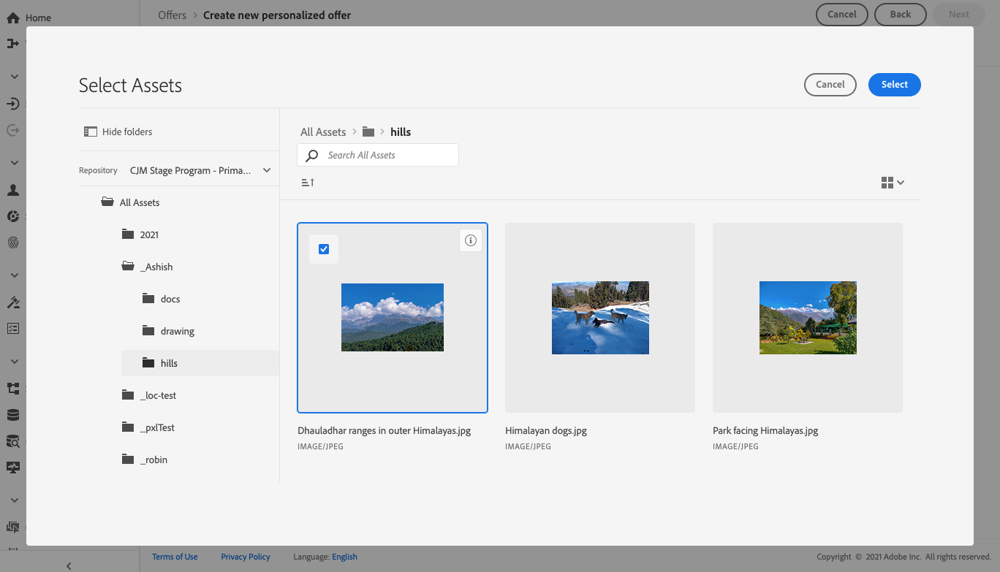

# Adicionar representações a uma oferta {#add-representations}

>[!CONTEXTUALHELP]
>id="ajo_decisioning_representation"
>title="Representações"
>abstract="Adicione representações para definir onde a oferta será exibida na mensagem. Quanto mais representações uma oferta tiver, mais oportunidades haverá para usar a oferta em diferentes contextos de posicionamento."

Uma oferta pode ser exibida em diferentes locais em uma mensagem: em um banner superior com uma imagem, como texto em um parágrafo, como um bloco de HTML, etc. Quanto mais representações uma oferta tiver, mais oportunidades haverá para usar a oferta em diferentes contextos de posicionamento.

## Configurar as representações da oferta {#representations}

Para adicionar uma ou várias representações à sua oferta e configurá-las, siga as etapas abaixo.

1. Para a primeira representação, comece selecionando o **[!UICONTROL Channel]** que será usado.

   

   >[!NOTE]
   >
   >Somente as disposições disponíveis para o canal selecionado são exibidas na **[!UICONTROL Placement]** lista suspensa.

1. Selecione uma disposição na lista.

   Também é possível usar o botão próximo ao **[!UICONTROL Placement]** lista suspensa para navegar por todas as disposições.

   

   Lá, ainda é possível filtrar as disposições de acordo com seu canal e/ou tipo de conteúdo. Escolha uma disposição e clique em **[!UICONTROL Select]**.

   

1. Adicione conteúdo à sua representação. Saiba mais sobre como [esta seção](#content).

1. Ao adicionar conteúdo, como uma imagem ou URL, é possível especificar um **[!UICONTROL Destination link]**: os usuários que clicarem na oferta serão direcionados para a página correspondente.

   

1. Finalmente, selecione o idioma escolhido para ajudar a identificar e gerenciar o que será exibido aos usuários.

1. Para adicionar outra representação, use o **[!UICONTROL Add representation]** e adicione quantas representações forem necessárias.

   

1. Depois de adicionar todas as suas representações, selecione **[!UICONTROL Next]**.

## Definir conteúdo para suas representações {#content}

É possível adicionar diferentes tipos de conteúdo a uma representação.

>[!NOTE]
>
>Somente o conteúdo correspondente ao tipo de conteúdo da disposição está disponível para uso.

### Adicionar imagens {#images}

Se a disposição selecionada for do tipo imagem, você poderá adicionar conteúdo proveniente da variável **Adobe Experience Cloud Asset** , um repositório centralizado dos ativos fornecidos por [!DNL Adobe Experience Manager Assets Essentials].

>[!NOTE]
>
> Para trabalhar com [Adobe Experience Manager Assets Essentials](https://experienceleague.adobe.com/docs/experience-manager-assets-essentials/help/introduction.html?lang=en){target=&quot;_blank&quot;}, é necessário implantar [!DNL Assets Essentials] para sua organização e certifique-se de que os usuários façam parte da **Usuários do cliente do Assets Essentials** ou/e **Usuários do Assets Essentials** Perfis de produto. Saiba mais sobre [esta página](https://experienceleague.adobe.com/docs/experience-manager-assets-essentials/help/deploy-administer.html){target=&quot;_blank&quot;}.

1. Escolha a opção **[!UICONTROL Asset library]**.

1. Selecione **[!UICONTROL Browse]**.

   

1. Navegue pelos ativos para selecionar a imagem de sua escolha

1. Clique em **[!UICONTROL Select]**.

   

### Adicionar URLs {#urls}

Para adicionar conteúdo de um local público externo, selecione **[!UICONTROL URL]**, em seguida, insira o endereço de URL do conteúdo a ser adicionado.

### Adicionar texto personalizado {#custom-text}

Você também pode inserir conteúdo do tipo texto ao selecionar uma disposição compatível.

1. Selecione a opção **[!UICONTROL Custom]** e clique em **[!UICONTROL Add content]**.

   

   >[!NOTE]
   >
   >Essa opção não está disponível para disposições do tipo imagem.

1. Digite o texto que será exibido na oferta.

   

   É possível personalizar o conteúdo usando o Editor de expressão. Saiba mais sobre [personalização](../../personalization/personalize.md#use-expression-editor).

   

   >[!NOTE]
   >
   >Somente a variável **[!UICONTROL Profile attributes]**, **[!UICONTROL Segment memberships]** e **[!UICONTROL Helper functions]** As fontes estão disponíveis para o Gerenciamento de decisões.
