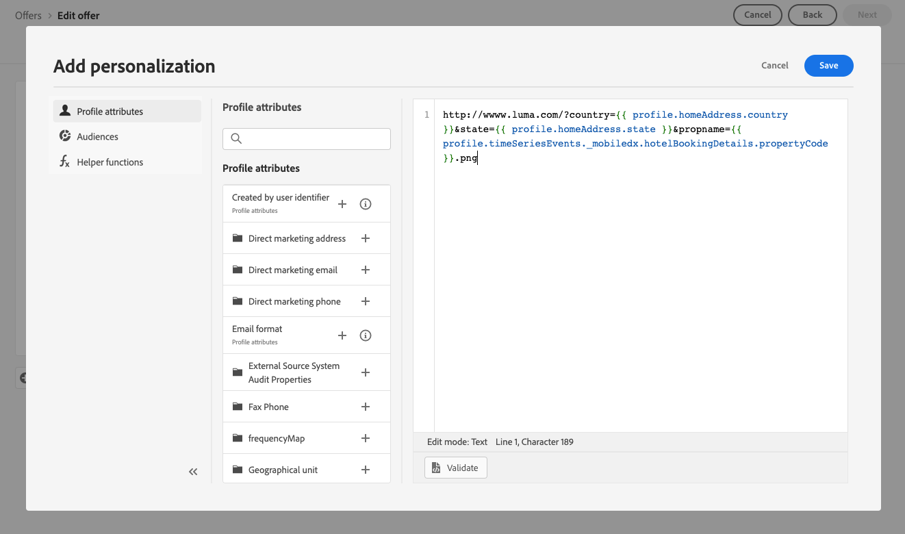

# Adicionar representações a uma oferta {#add-representations}

>[!CONTEXTUALHELP]
>id="ajo_decisioning_representation"
>title="Representações"
>abstract="Adicione representações para definir onde sua oferta será exibida na mensagem. Quanto mais representações uma oferta tiver, mais oportunidades existem para usá-la em diferentes contextos de posicionamento."

Uma oferta pode ser exibida em diferentes locais em uma mensagem: em um banner superior com uma imagem, como texto em um parágrafo, como um bloco HTML etc. Quanto mais representações uma oferta tiver, mais oportunidades existem para usá-la em diferentes contextos de posicionamento.

## Configurar as representações da oferta {#representations}

Para adicionar uma ou várias representações à sua oferta e configurá-las, siga as etapas abaixo.

1. Para a primeira representação, comece selecionando o **[!UICONTROL Canal]** que será usado.

   

   >[!NOTE]
   >
   >Somente os posicionamentos disponíveis para o canal selecionado são exibidos no **[!UICONTROL Posicionamento]** lista suspensa.

1. Selecione uma disposição na lista.

   Também é possível usar o botão ao lado do botão **[!UICONTROL Posicionamento]** para procurar todos os posicionamentos.

   

   Ainda é possível filtrar os posicionamentos de acordo com o canal e/ou tipo de conteúdo. Escolha um posicionamento e clique em **[!UICONTROL Selecionar]**.

   

1. Adicione conteúdo à sua representação. Saiba mais em [nesta seção](#content).

1. Ao adicionar conteúdo, como uma imagem ou URL, você pode especificar um **[!UICONTROL Link de destino]**: os usuários que clicarem na oferta serão direcionados para a página correspondente.

   

1. Por fim, selecione o idioma de sua escolha para ajudar a identificar e gerenciar o que exibir para os usuários.

1. Para adicionar outra representação, use o **[!UICONTROL Adicionar representação]** e adicione quantas representações forem necessárias.

   

1. Depois de adicionar todas as representações, selecione **[!UICONTROL Próxima]**.

## Definir o conteúdo para suas representações {#content}

É possível adicionar diferentes tipos de conteúdo a uma representação.

>[!NOTE]
>
>Somente o conteúdo correspondente ao tipo de conteúdo da disposição está disponível para uso.

### Adicionar imagens {#images}

Se a disposição selecionada for do tipo imagem, é possível adicionar conteúdo proveniente da **Ativo do Adobe Experience Cloud** biblioteca, um repositório centralizado de ativos fornecidos pelo [!DNL Adobe Experience Manager Assets].

>[!NOTE]
>
> Para trabalhar com [Adobe Experience Manager Assets Essentials](https://experienceleague.adobe.com/docs/experience-manager-assets-essentials/help/introduction.html){target="_blank"}, é necessário implantar [!DNL Assets Essentials] para sua organização e verifique se os usuários fazem parte da **Usuários consumidores do Assets Essentials** ou/e **Usuários do Assets Essentials** Perfis de produto. Saiba mais sobre [esta página](https://experienceleague.adobe.com/docs/experience-manager-assets-essentials/help/get-started-admins/deploy-administer.html){target="_blank"}.

1. Escolha o **[!UICONTROL Biblioteca de ativos]** opção.

1. Selecionar **[!UICONTROL Procurar]**.

   

1. Navegue pelos ativos para selecionar a imagem de sua escolha

1. Clique em **[!UICONTROL Selecionar]**.

   

### Adicionar arquivos HTML ou JSON {#html-json}

Se a disposição selecionada for do tipo HTML, você também poderá adicionar conteúdo HTML ou JSON proveniente da [Biblioteca de ativos do Adobe Experience Cloud](https://experienceleague.adobe.com/docs/experience-manager-assets-essentials/help/introduction.html){target="_blank"}).

Por exemplo, você criou um template de email de HTML no [Adobe Experience Manager](https://experienceleague.adobe.com/docs/experience-manager.html){target="_blank"} e quiser usar esse arquivo para o conteúdo da oferta. Em vez de criar um novo arquivo, você pode simplesmente fazer upload do modelo na **Biblioteca de ativos** para poder reutilizá-lo nas representações da oferta.

Para reutilizar o conteúdo em uma representação, navegue pelo **Biblioteca de ativos** conforme descrito em [nesta seção](#images) e selecione o arquivo HTML ou JSON de sua escolha.


### Adicionar URLs {#urls}

Para adicionar conteúdo de um local público externo, selecione **[!UICONTROL URL]**, em seguida, digite o endereço do URL do conteúdo a ser adicionado.

Você pode personalizar URLs usando o editor de personalização. Saiba mais sobre [personalização](../../personalization/personalize.md#use-expression-editor).


Por exemplo, você deseja personalizar a imagem mostrada como uma oferta. Você quer que os usuários que favorecem as férias da cidade vejam o horizonte de Nova York e os usuários que favorecem as férias da praia para ver o Havaí costa norte.

Use o editor de personalização para recuperar atributos de Perfil armazenados no Adobe Experience Platform usando esquemas de união. [Saiba mais](https://experienceleague.adobe.com/docs/experience-platform/profile/union-schemas/union-schemas-overview.html){target="_blank"}



Se você especificar um **[!UICONTROL Link de destino]**, você também pode personalizar o URL para o qual os usuários que clicam na oferta serão direcionados.

### Adicionar texto personalizado {#custom-text}

Você também pode inserir conteúdo do tipo texto ao selecionar um posicionamento compatível.

1. Selecione o **[!UICONTROL Personalizado]** e clique em **[!UICONTROL Adicionar conteúdo]**.

   

   >[!NOTE]
   >
   >Essa opção não está disponível para inserções do tipo imagem.

1. Digite o texto que será exibido na oferta.

   

   Você pode personalizar o conteúdo usando o editor de personalização. Saiba mais sobre [personalização](../../personalization/personalize.md#use-expression-editor).

   

   >[!NOTE]
   >
   >Somente o **[!UICONTROL Atributos do perfil]**, **[!UICONTROL Públicos-alvo]** e **[!UICONTROL Funções auxiliares]** As fontes de estão disponíveis para a Gestão de decisões.

## Personalizar representações com base nos dados de contexto{#context-data}

Quando dados de contexto são transmitidos na variável [Edge decisioning](../api-reference/offer-delivery-api/edge-decisioning-api.md) chamada, você pode aproveitar esses dados para personalizar representações dinamicamente. Por exemplo, você pode adaptar a representação de uma oferta com base em fatores em tempo real, como as condições meteorológicas atuais no momento em que a decisão é tomada.

Para fazer isso, incorpore a variável dos dados de contexto diretamente no conteúdo de representação usando o `profile.timeSeriesEvents.` namespace.

Este é um exemplo de sintaxe usado para personalizar a representação de uma oferta com base nos sistemas operacionais dos usuários:

```
 iosandroid 
```

A solicitação de decisão do Edge correspondente, incluindo os dados de contexto, é a seguinte:

```
{
    "body": {
        "xdm": {
            "identityMap": {
                "Email": [
                    {
                        "id": "xyz@abc.com"
                    }
                ]
            },
            "device": {
                "model": "Apple"
            }
        },
        "extra": {
            "query": {
                "decisionScopes": [
                    "eyJ4ZG06..."
                ]
            }
        }
    }
}
```
