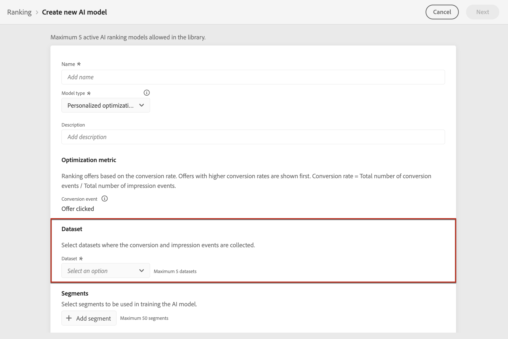

# Criar modelos de IA {#ai-rankings}

## Criar uma estratégia de classificação {#create-ranking-strategy}

Para criar uma estratégia de classificação, siga as etapas abaixo:

1. Acesse o **[!UICONTROL Components]** , em seguida, selecione o **[!UICONTROL AI rankings]** guia .

   

   Todas as estratégias de classificação criadas até agora são listadas.

1. Clique no botão **[!UICONTROL Create strategy]**.

1. Preencha os seguintes campos:

   

   * **[!UICONTROL Name]**: Nome exclusivo que deve ser fornecido.

   * **[!UICONTROL Model type]**: Atualmente em [!DNL Journey Optimizer] o único tipo de modelo suportado é **[!UICONTROL Auto-optimization]**. [Saiba mais](ai-ranking.md#auto-optimization)

   * **[!UICONTROL Optimization metric]**

      Essa opção permite que os profissionais de marketing escolham como o modelo aprendizado por máquina deve ser construído e treinado: com base nas ofertas exibidas, as ofertas clicaram em email e/ou as ofertas clicaram na Web.

      >[!NOTE]
      >
      >Você pode selecionar todos os tipos de métricas, se necessário.

      Há dois tipos de métricas de otimização:
      * **[!UICONTROL Impression]**: Os eventos de impressão atuais correspondem a todas as ofertas exibidas.
      * **[!UICONTROL Conversion]**: Os eventos de conversão correspondem a todas as ofertas que resultam em cliques por email ou pela Web.

      Todos os eventos de impressão e/ou conversão selecionados serão capturados automaticamente usando o SDK da Web ou o SDK móvel fornecido. Saiba mais sobre isso em [Visão geral do SDK da Web da Adobe Experience Platform](https://experienceleague.adobe.com/docs/experience-platform/edge/home.html?lang=pt-BR).

   * **[!UICONTROL Dataset ID]**: Para conversão, você precisa fornecer um conjunto de dados em que os eventos são coletados, selecionando-o na lista suspensa. Saiba como criar esse conjunto de dados em [esta seção](#create-dataset). <!--This dataset needs to be associated with a schema that must have the **[!UICONTROL Proposition Interactions]** field group (previously known as mixin) associated with it.-->

   

   >[!CAUTION]
   >
   >Somente os conjuntos de dados criados a partir de esquemas associados ao **[!UICONTROL Experience Event - Proposition Interactions]** grupo de campos (anteriormente conhecido como mixin) são exibidos na lista suspensa.

1. Salve e ative a estratégia de classificação.

   

Agora ele está pronto para ser usado em uma decisão para classificar ofertas elegíveis para uma disposição. Saiba mais [nesta seção](../offer-activities/configure-offer-selection.md#use-ranking-strategy).<!--TBC?-->

## Criar um conjunto de dados para coletar eventos {#create-dataset}

É necessário criar um conjunto de dados em que os eventos de conversão sejam coletados. Comece criando o schema que será usado em seu conjunto de dados:

1. No **[!UICONTROL Data Management]** selecione **[!UICONTROL Schema]**, acesse o **[!UICONTROL Browse]** e clique em **[!UICONTROL Create schema]**.

   

1. Choose **[!UICONTROL XDM ExperienceEvent]**.

   

   >[!NOTE]
   >
   >    Saiba mais sobre esquemas XDM e grupos de campos no [Documentação de visão geral do sistema XDM](https://experienceleague.adobe.com/docs/experience-platform/xdm/home.html?lang=pt-BR).


1. No **[!UICONTROL Search]** , digite &quot;interação de proposta&quot; e selecione o **[!UICONTROL Experience Event - Proposition Interactions]** grupo de campos.

   

   >[!CAUTION]
   >
   >    O esquema que será usado em seu conjunto de dados deve ter a variável **[!UICONTROL Experience Event - Proposition Interactions]** grupo de campos associado a ele. Caso contrário, você não poderá usá-lo em sua estratégia de classificação.

1. Clique em **[!UICONTROL Add field groups]**.

   

   >[!NOTE]
   >O grupo de campos era anteriormente conhecido como mixin.

1. Digite um nome e salve o esquema.<!--How do you edit the fields in this new schema? Examples?-->

>[!NOTE]
>
>    Saiba mais sobre como criar schemas no [Noções básicas da composição do schema](https://experienceleague.adobe.com/docs/experience-platform/xdm/schema/composition.html?lang=en#understanding-schemas).

Agora você está pronto para criar um conjunto de dados usando esse esquema. Para fazer isso, siga as etapas abaixo:

1. No **[!UICONTROL Data Management]** selecione **[!UICONTROL Datasets]**, acesse o **[!UICONTROL Browse]** e clique em **[!UICONTROL Create dataset]**.

   

1. Selecione **[!UICONTROL Create dataset from schema]**.

   

1. Selecione o schema que você acabou de criar na lista.

   

1. Clique em **[!UICONTROL Next]**.

1. Forneça um nome exclusivo para o conjunto de dados na **[!UICONTROL Name]** e clique em **[!UICONTROL Finish]**.

   

O conjunto de dados agora está pronto para ser selecionado para coletar dados de evento quando [criar uma estratégia de classificação](#create-ranking-strategy).

## Requisitos do schema de ofertas {#schema-requirements}

Nesse ponto, você deve ter:

* criou a estratégia de classificação,
* definiu qual tipo de evento você deseja capturar - oferta exibida (impressão) e/ou oferta clicada (conversão),
* e em qual conjunto de dados você deseja coletar os dados do evento.

Agora, cada vez que uma oferta é exibida e/ou clicada, você deseja que o evento correspondente seja capturado automaticamente pela variável **[!UICONTROL Experience Event - Proposition Interactions]** grupo de campos que usa a variável [Adobe Experience Platform Web SDK](https://experienceleague.adobe.com/docs/experience-platform/edge/web-sdk-faq.html#what-is-adobe-experience-platform-web-sdk%3F){target=&quot;_blank&quot;} ou SDK do Mobile.

Para poder enviar tipos de evento (oferta exibida ou oferta clicada), você deve definir o valor correto para cada tipo de evento em um evento de experiência enviado para o Adobe Experience Platform. Abaixo estão os requisitos de esquema que você precisa implementar no código JavaScript:

### Cenário exibido da oferta

**Tipo de evento:** `decisioning.propositionDisplay`
**Fonte:** Web.sdk/Alloy.js (`sendEvent command -> xdm : {eventType, interactionMixin}`) ou a ingestão por lotes
+++**Carga de exemplo:**

```
{
    "@id": "a7864a96-1eac-4934-ab44-54ad037b4f2b",
    "xdm:timestamp": "2020-09-26T15:52:25+00:00",
    "xdm:eventType": "decisioning.propositionDisplay",
    "https://ns.adobe.com/experience/decisioning/propositions":
    [
        {
            "xdm:items":
            [
                {
                    "xdm:id": "personalized-offer:f67bab756ed6ee4",
                },
                {
                    "xdm:id": "personalized-offer:f67bab756ed6ee5",
                }
            ],
            "xdm:id": "3cc33a7e-13ca-4b19-b25d-c816eff9a70a", //decision event id - taken from experience event for “nextBestOffer”
            "xdm:scope": "scope:12cfc3fa94281acb", //decision scope id - taken from experience event for “nextBestOffer”
        }
    ]
}
```

+++

### Cenário de oferta clicada

**Tipo de evento:** `decisioning.propositionInteract`
**Fonte:** Web.sdk/Alloy.js (`sendEvent command -> xdm : {eventType, interactionMixin}`) ou a ingestão por lotes
+++**Carga de exemplo:**

```
{
    "@id": "a7864a96-1eac-4934-ab44-54ad037b4f2b",
    "xdm:timestamp": "2020-09-26T15:52:25+00:00",
    "xdm:eventType": "decisioning.propositionInteract",
    "https://ns.adobe.com/experience/decisioning/propositions":
    [
        {
            "xdm:items":
            [
                {
                    "xdm:id": "personalized-offer:f67bab756ed6ee4"
                },
                {
                    "xdm:id": "personalized-offer:f67bab756ed6ee5"
                },
            ],
            "xdm:id": "3cc33a7e-13ca-4b19-b25d-c816eff9a70a", //decision event id
            "xdm:scope": "scope:12cfc3fa94281acb", //decision scope id
        }
    ]
}
```

+++

<!--
## Using a ranking strategy {#using-ranking}

To use the ranking strategy you created above, follow the steps below:

Once a ranking strategy has been created, you can assign it to a placement in a decision. For more on this, see [Configure offers selection in decisions](../offer-activities/configure-offer-selection.md).

1. Create a decision.
1. Add a placement.
1. Add a collection.
1. Choose to rank offers by AI ranking (select it from the drop-down list).
1. Click Add ranking.
1. Select the ranking strategy that you created. All the details of the ranking strategy are displayed.
1. Click Next to confirm.
1. Save your decision.

It is now ready to be used in a decision to rank eligible offers for a placement (see [Configure offers selection in decisions](../offer-activities/configure-offer-selection.md)).
-->

