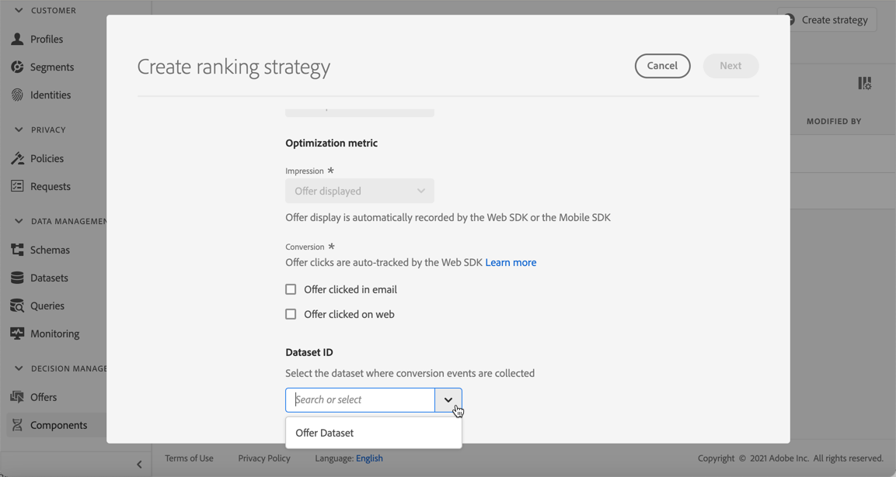

# Classificações de IA {#ai-rankings}

## Introdução às classificações de IA

<!--If you are an [Adobe Experience Platform](https://experienceleague.adobe.com/docs/experience-platform/landing/home.html){target="_blank"} user leveraging the **Offer Decisioning** application service,-->You can use an trained model system that ranks offers to display for a given profile.

>[!CAUTION]
>
>O uso da classificação de IA está disponível no momento somente para usuários selecionados.

Este recurso permite que você crie **estratégias de classificação diferentes** com base em suas metas de negócios. Usando essas diferentes estratégias baseadas em objetivos em uma decisão (anteriormente conhecida como atividade de oferta), o sistema de modelo treinado ajudará você a entender como as diferentes estratégias de classificação estão afetando suas metas.

Por exemplo, você pode selecionar uma estratégia de classificação para o canal de email e outra para o canal de push. Para cada canal, o sistema de modelo treinado aproveitará vários pontos de dados para determinar qual oferta deve ser apresentada primeiro para uma determinada disposição, em vez de considerar as pontuações de prioridade das ofertas ou uma [fórmula de classificação](create-ranking-formulas.md).

<!--This feature is not enabled by default. To be able to use it, reach out to your Adobe contact.-->

Depois que uma estratégia de classificação tiver sido criada, atribua-a a uma disposição em uma decisão. Saiba mais em [Configurar seleção de ofertas em decisões](../offer-activities/configure-offer-selection.md).

## Criar uma estratégia de classificação {#create-ranking-strategy}

Para criar uma estratégia de classificação, siga as etapas abaixo:

1. Acesse o menu **[!UICONTROL Components]** e selecione a guia **[!UICONTROL AI rankings]**.

   

   Todas as estratégias de classificação criadas até agora são listadas.

1. Clique no botão **[!UICONTROL Create strategy]**.

1. Preencha os seguintes campos:

   

   * **[!UICONTROL Name]**: Nome exclusivo que deve ser fornecido.

   * **[!UICONTROL Model type]**: Atualmente, o único tipo de modelo compatível é  **[!UICONTROL Auto-optimization]**.<!--More will be supported in the future so the drop-down list will be enabled.-->

   * **[!UICONTROL Optimization metric]**

      Essa opção permite que os profissionais de marketing escolham como o modelo aprendizado por máquina deve ser construído e treinado: com base nas ofertas exibidas, as ofertas clicaram em email e/ou as ofertas clicaram na Web.

      >[!NOTE]
      >
      >Você pode selecionar todos os tipos de métricas, se necessário.

      Há dois tipos de métricas de otimização:
      * **[!UICONTROL Impression]**: Os eventos de impressão atuais correspondem a todas as ofertas exibidas.
      * **[!UICONTROL Conversion]**: Os eventos de conversão correspondem a todas as ofertas que resultam em cliques por email ou pela Web.

      Todos os eventos de impressão e/ou conversão selecionados serão capturados automaticamente usando o SDK da Web ou o SDK móvel fornecido. Saiba mais em [Visão geral do SDK da Web da Adobe Experience Platform](https://experienceleague.adobe.com/docs/experience-platform/edge/home.html?lang=pt-BR).

   * **[!UICONTROL Dataset ID]**: Para conversão, você precisa fornecer um conjunto de dados em que os eventos são coletados, selecionando-o na lista suspensa. Saiba como criar esse conjunto de dados em [esta seção](#create-dataset). <!--This dataset needs to be associated with a schema that must have the **[!UICONTROL Proposition Interactions]** field group (previously known as mixin) associated with it.-->

   

   >[!CAUTION]
   >
   >Somente os conjuntos de dados criados a partir de esquemas associados ao grupo de campos **[!UICONTROL Experience Event - Proposition Interactions]** (anteriormente conhecido como mixin) são exibidos na lista suspensa.

1. Salve e ative a estratégia de classificação.

   

Agora ele está pronto para ser usado em uma decisão para classificar ofertas elegíveis para uma disposição. Saiba mais [nesta seção](../offer-activities/configure-offer-selection.md#use-ranking-strategy).<!--TBC?-->

## Criar um conjunto de dados para coletar eventos {#create-dataset}

É necessário criar um conjunto de dados em que os eventos de conversão sejam coletados. Comece criando o schema que será usado em seu conjunto de dados:

1. No menu **[!UICONTROL Data Management]**, selecione **[!UICONTROL Schema]**, vá para a guia **[!UICONTROL Browse]** e clique em **[!UICONTROL Create schema]**.

   

1. Escolha **[!UICONTROL XDM ExperienceEvent]**.

   

   >[!NOTE]
   >
   >    Saiba mais sobre esquemas XDM e grupos de campos na [documentação de visão geral do Sistema XDM](https://experienceleague.adobe.com/docs/experience-platform/xdm/home.html?lang=pt-BR).

1. No campo **[!UICONTROL Search]**, digite &quot;interação de proposta&quot; e selecione o grupo de campos **[!UICONTROL Experience Event - Proposition Interactions]**.

   

   >[!CAUTION]
   >
   >    O esquema que será usado em seu conjunto de dados deve ter o grupo de campos **[!UICONTROL Experience Event - Proposition Interactions]** associado a ele. Caso contrário, você não poderá usá-lo em sua estratégia de classificação.

1. Clique em **[!UICONTROL Add field groups]**.

   

   >[!NOTE]
   >O grupo de campos era anteriormente conhecido como mixin.

1. Digite um nome e salve o esquema.<!--How do you edit the fields in this new schema? Examples?-->

>[!NOTE]
>
>    Saiba mais sobre como criar schemas em [Noções básicas da composição do schema](https://experienceleague.adobe.com/docs/experience-platform/xdm/schema/composition.html?lang=en#understanding-schemas).

Agora você está pronto para criar um conjunto de dados usando esse esquema. Para fazer isso, siga as etapas abaixo:

1. No menu **[!UICONTROL Data Management]**, selecione **[!UICONTROL Datasets]**, vá para a guia **[!UICONTROL Browse]** e clique em **[!UICONTROL Create dataset]**.

   

1. Selecione **[!UICONTROL Create dataset from schema]**.

   

1. Selecione o schema que você acabou de criar na lista.

   

1. Clique em **[!UICONTROL Next]**.

1. Forneça um nome exclusivo para o conjunto de dados no campo **[!UICONTROL Name]** e clique em **[!UICONTROL Finish]**.

   

O conjunto de dados agora está pronto para ser selecionado para coletar eventos de conversão quando [criar uma estratégia de classificação](#create-ranking-strategy).

<!--## Using a ranking strategy {#using-ranking}

To use the ranking strategy you created above, follow the steps below:

Once a ranking strategy has been created, you can assign it to a placement in a decision (previously known as offer activity). For more on this, see [Configure offers selection in decisions](../offer-activities/configure-offer-selection.md).

1. Create a decision.
1. Add a placement.
1. Add a collection.
1. Choose to rank offers by AI ranking (select it from the drop-down list).
1. Click Add ranking.
1. Select the ranking strategy that you created. All the details of the ranking strategy are displayed.
1. Click Next to confirm.
1. Save your decision.

It is now ready to be used in a decision to rank eligible offers for a placement (see [Configure offers selection in decisions](../offer-activities/configure-offer-selection.md)).-->

