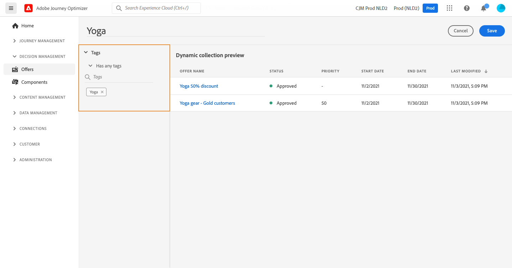
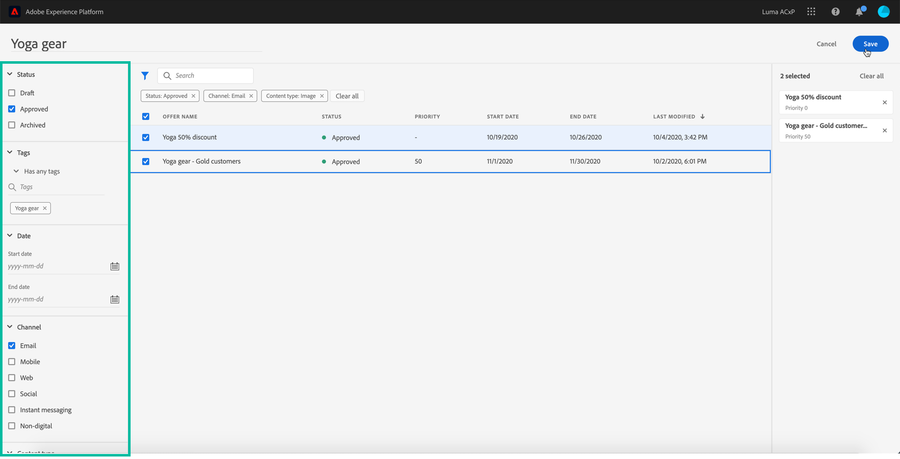
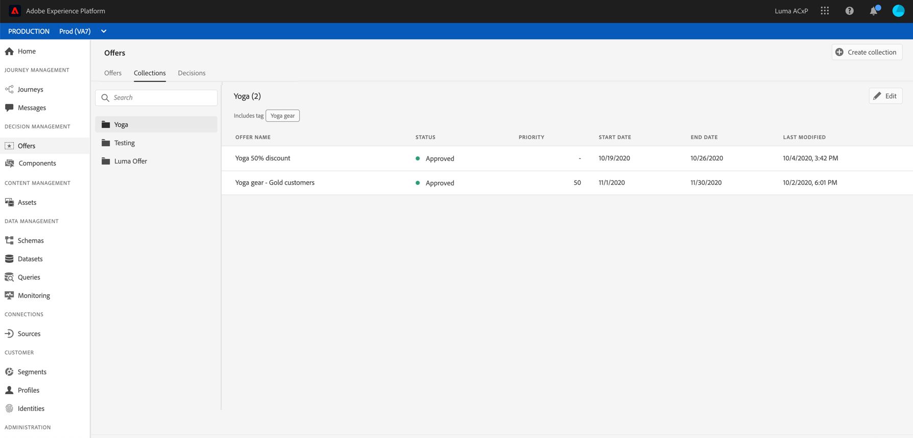

# Criar coleções {#create-collections}

>[!TIP]
>
>O serviço de Decisão, o novo recurso de tomada de decisão do [!DNL Adobe Journey Optimizer], agora está disponível por meio da experiência baseada em código e dos canais de email. [Saiba mais](../../experience-decisioning/gs-experience-decisioning.md)

>[!CONTEXTUALHELP]
>id="ajo_decisioning_decision_collection"
>title="Sobre coleções de ofertas"
>abstract="Com as coleções de ofertas, você pode organizar as ofertas, reagrupando-as em categorias de sua escolha."

>[!CONTEXTUALHELP]
>id="ajo_decisioning_collection_dynamic"
>title="Coleção dinâmica"
>abstract="Use qualificadores de coleção para criar uma coleção de ofertas dinâmica."

>[!CONTEXTUALHELP]
>id="ajo_decisioning_collection_static"
>title="Coleção estática"
>abstract="Selecione e agrupe ofertas manualmente, usando critérios como status, qualificadores de coleção, data e canal."

>[!CONTEXTUALHELP]
>id="ajo_decisioning_collection_static_select"
>title="Visualização de coleções estáticas"
>abstract="As coleções estáticas são criadas por meio da seleção manual de ofertas individuais para incluir na coleção. A coleção só pode ser atualizada por meio da adição manual de ofertas."

>[!CONTEXTUALHELP]
>id="ajo_decisioning_collection_dynamic_select"
>title="Visualização de coleções dinâmicas"
>abstract="As coleções dinâmicas reúnem ofertas com base em qualificadores de coleção. Essas coleções são atualizadas automaticamente. Por exemplo, se você criar uma nova oferta com o qualificador de coleção “esportes”, ela será adicionada automaticamente à coleção correspondente."

As coleções permitem organizar as ofertas reagrupando-as em categorias de sua escolha. Por exemplo, é possível criar uma coleção &quot;sport&quot; que conterá apenas ofertas relacionadas a esportes.

➡️ [Conheça este recurso no vídeo](#video)

A lista de coleções de ofertas está acessível no menu **[!UICONTROL Ofertas]**.

Você pode criar dois tipos de coleções:

* **Coleções dinâmicas** são coleções de ofertas baseadas em qualificadores de coleção (anteriormente conhecidas como &quot;marcas&quot;). Essas coleções são atualizadas automaticamente. Por exemplo, se uma nova oferta for criada com o qualificador de coleção selecionado, ela será adicionada automaticamente à coleção.

* **Coleções estáticas** são coleções criadas por meio da seleção manual de ofertas individuais a serem incluídas na Coleção. A coleção só pode ser atualizada por meio da adição manual de ofertas.

Para criar uma coleção, siga estas etapas:

1. Vá para a guia **[!UICONTROL Coleções]** e clique em **[!UICONTROL Criar coleção]**.

1. Especifique o nome e o tipo da coleção a ser criada.

   

1. Para criar uma coleção dinâmica, use o painel esquerdo para selecionar o qualificador da coleção das ofertas a serem adicionadas à coleção e clique em **[!UICONTROL Salvar]**. Todas as ofertas com o qualificador de coleção selecionado serão salvas na coleção.

   Para obter mais informações sobre a criação de qualificadores de coleção, consulte [Criar qualificadores de coleção](../offer-library/creating-tags.md).

   

1. Para criar uma coleção estática, use o painel esquerdo para filtrar a lista de ofertas (status, qualificador de coleção, data, canal, tipo de conteúdo) e selecione as ofertas a serem adicionadas à coleção.

   

   >[!NOTE]
   >
   >As coleções estáticas não são atualizadas automaticamente. Para adicionar ofertas a uma coleção estática, é necessário editá-la e adicioná-las manualmente.

1. Para atribuir rótulos de uso de dados principais ou personalizados a uma coleção estática, selecione **[!UICONTROL Gerenciar acesso]**. [Saiba mais sobre o OLAC (Controle de Acesso em Nível de Objeto)](../../administration/object-based-access.md)

   >[!NOTE]
   >
   >O uso de OLAC não está disponível para coleções dinâmicas. Ele deve ser gerenciado no nível da oferta. Consequentemente, é possível que você não veja nenhuma oferta em uma coleção dinâmica se não tiver acesso a nenhuma dessas ofertas.

1. Depois que a coleção é criada, ela é exibida na lista. Você pode selecioná-la para editá-la ou excluí-la.

   

## Vídeo tutorial {#video}

>[!VIDEO](https://video.tv.adobe.com/v/329376?quality=12)

