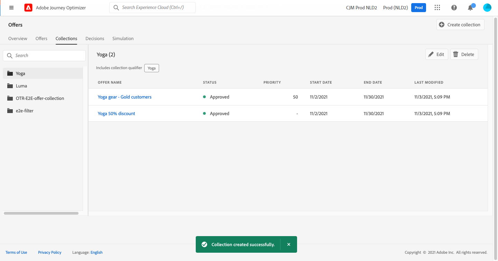

# Criar coleções {#create-collections}

>[!CONTEXTUALHELP]
>id="ajo_decisioning_decision_collection"
>title="Sobre coleções de ofertas"
>abstract="Com as coleções de ofertas, você pode organizar as ofertas, reagrupando-as em categorias de sua escolha."

As coleções permitem organizar as ofertas, reagrupando-as em categorias de sua escolha. Você pode, por exemplo, criar uma coleção &quot;esportiva&quot; que conterá somente ofertas relacionadas ao esporte.

➡️ [Descubra este recurso no vídeo](#video)

A lista de coleções de ofertas pode ser acessada na variável **[!UICONTROL Offers]** menu.

Você pode criar dois tipos de coleções:

* **Coleções dinâmicas** são coleções de ofertas com base em tags. Essas coleções são atualizadas automaticamente. Por exemplo, se uma nova oferta for criada com a tag selecionada, ela será automaticamente adicionada à coleção.

* **Coleções estáticas** são coleções criadas ao selecionar manualmente ofertas individuais para incluir na coleção. A coleção só pode ser atualizada manualmente adicionando mais ofertas a ela.

Para criar uma coleção, siga estas etapas:

1. Vá para o **[!UICONTROL Collections]** e, em seguida, clique em **[!UICONTROL Create collection]**.

1. Especifique o nome e o tipo de coleção a ser criada.

   

1. Para criar uma coleção dinâmica, use o painel esquerdo para selecionar a tag das ofertas a serem adicionadas à coleção e clique em **[!UICONTROL Save]**. Todas as ofertas com a tag selecionada serão salvas na coleção.

   Para obter mais informações sobre a criação de tags, consulte [Criar tags](../offer-library/creating-tags.md).

   

1. Para criar uma coleção estática, use o painel esquerdo para filtrar a lista de ofertas (status, tag, data, canal, tipo de conteúdo) e selecione as ofertas para adicionar à coleção.

   

   >[!NOTE]
   >
   >As coleções estáticas não são atualizadas automaticamente. Para adicionar ofertas a uma coleção estática, é necessário editá-la e adicioná-la manualmente.

1. Depois que a coleção é criada, ela é exibida na lista. Você pode selecioná-lo para editá-lo ou excluí-lo.

   

## Vídeo tutorial {#video}

>[!VIDEO](https://video.tv.adobe.com/v/329376?quality=12)

