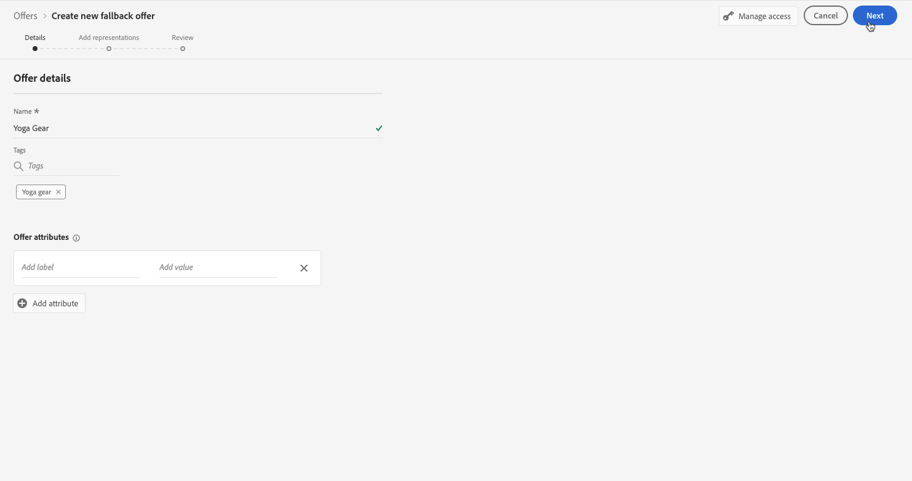
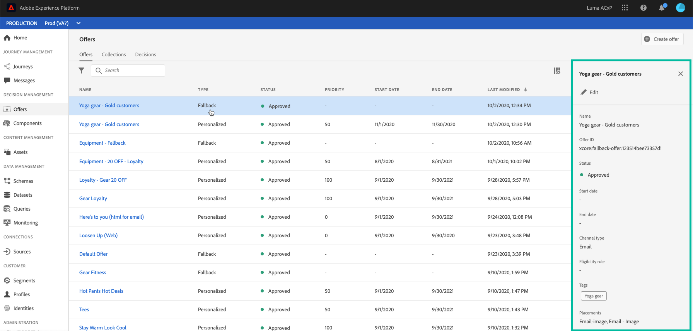

# Criar ofertas substitutas {#create-fallback-offers}

A oferta de fallback é enviada aos clientes se eles não estiverem qualificados para outras ofertas. As etapas para criar uma oferta de fallback consistem em criar uma ou várias representações, como ao criar uma oferta.

➡️ [Descubra este recurso no vídeo](#video)

A lista de ofertas de fallback pode ser acessada na **[!UICONTROL Offers]** menu.

Para criar uma oferta de fallback, siga estas etapas:

>[!NOTE]
>
>Observe que, ao contrário das ofertas personalizadas, as ofertas de fallback não têm regras de elegibilidade e parâmetros de restrição, pois são apresentadas aos clientes como últimos recursos sem condição.

1. Clique em **[!UICONTROL Create offer]**, em seguida selecione **[!UICONTROL Fallback offer]**.

   

1. Especifique o nome da oferta de fallback. Também é possível associar uma ou várias tags existentes a elas, permitindo pesquisar e organizar a Biblioteca de ofertas com mais facilidade.

   

1. Crie uma ou várias representações para a oferta de fallback. Para fazer isso, arraste e solte disposições do painel esquerdo, como ao criar uma oferta personalizada. Consulte [Criar ofertas personalizadas](../offer-library/creating-personalized-offers.md).

   

1. Depois que as representações da oferta de fallback forem adicionadas, um resumo será exibido. Se tudo estiver configurado corretamente e a oferta de fallback estiver pronta para ser apresentada aos clientes, clique em **[!UICONTROL Finish]**, em seguida selecione **[!UICONTROL Save and approve]**.

   Você também pode salvar a oferta de fallback como rascunho, para editá-la e aprová-la posteriormente.

   

1. A oferta de fallback é exibida na lista com a variável **[!UICONTROL Live]** ou **[!UICONTROL Draft]** , dependendo de você ter aprovado ou não na etapa anterior.

   Agora ele está pronto para ser entregue aos clientes. Você pode selecioná-lo para exibir suas propriedades e editá-lo. <!-- no suppression? -->

   

## Tutorial em vídeo {#video}

>[!NOTE]
>
>Este vídeo se aplica ao serviço de aplicativo do Offer Decisioning criado no Adobe Experience Platform. No entanto, fornece orientação genérica para usar a Oferta no contexto do Journey Optimizer.

>[!VIDEO](https://video.tv.adobe.com/v/329383?quality=12)
