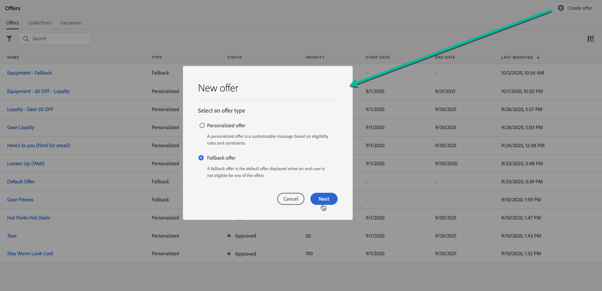

# Criar ofertas substitutas {#create-fallback-offers}

>[!TIP]
>
>O serviço de Decisão, o novo recurso de tomada de decisão do [!DNL Adobe Journey Optimizer], agora está disponível por meio da experiência baseada em código e dos canais de email. [Saiba mais](../../experience-decisioning/gs-experience-decisioning.md)

>[!CONTEXTUALHELP]
>id="ajo_decisioning_new_fallback"
>title="Oferta de fallback"
>abstract="Uma oferta substituta é a oferta padrão exibida quando um usuário final não é elegível para nenhuma oferta personalizada."

>[!CONTEXTUALHELP]
>id="ajo_decisioning_fallback_offer_details "
>title="Detalhes da oferta substituta"
>abstract="Especifique o nome da oferta substituta. Você também pode associar um ou vários qualificadores de coleção existentes a ele, permitindo pesquisar e organizar a Biblioteca de ofertas com mais facilidade."

A oferta substituta é enviada aos clientes se eles não estiverem qualificados para outras ofertas. As etapas para criar uma oferta substituta consistem na criação de uma ou várias representações, como ao criar uma oferta.

➡️ [Conheça este recurso no vídeo](#video)

A lista de ofertas substitutas está acessível no menu **[!UICONTROL Ofertas]**.

Para criar uma oferta substituta, siga estas etapas:

>[!NOTE]
>
>Observe que, diferentemente das ofertas personalizadas, as ofertas substitutas não têm regras de qualificação e parâmetros de restrição, pois são apresentadas aos clientes como últimos recursos sem condição.

1. Clique em **[!UICONTROL Criar oferta]** e selecione **[!UICONTROL Oferta substituta]**.

   

1. Especifique o nome da oferta substituta. Você também pode associar um ou vários qualificadores de coleção existentes (anteriormente conhecidos como &quot;tags&quot;) a eles, permitindo pesquisar e organizar a Biblioteca de ofertas com mais facilidade.

   

1. Para atribuir rótulos de uso de dados personalizados ou principais à oferta, selecione **[!UICONTROL Gerenciar acesso]**. [Saiba mais sobre o OLAC (Controle de Acesso em Nível de Objeto)](../../administration/object-based-access.md)

1. Crie uma ou várias representações para a oferta substituta. Para fazer isso, arraste e solte disposições do painel esquerdo, como ao criar uma oferta personalizada. Consulte [Criar ofertas personalizadas](../offer-library/creating-personalized-offers.md).

   

   >[!CAUTION]
   >
   >As ofertas substitutas devem conter todas as representações usadas em uma [decisão](../offer-activities/create-offer-activities.md). Por exemplo, se você tiver cinco ofertas em uma decisão e cada uma delas tiver uma representação diferente, cinco representações deverão ser incluídas na oferta substituta.

1. Depois que as representações da oferta substituta forem adicionadas, um resumo será exibido. Se tudo estiver configurado corretamente e sua oferta substituta estiver pronta para ser apresentada aos clientes, clique em **[!UICONTROL Concluir]** e selecione **[!UICONTROL Salvar e aprovar]**.

   Você também pode salvar a oferta substituta como rascunho para editá-la e aprová-la posteriormente.

   

1. A oferta substituta é exibida na lista com o status **[!UICONTROL Ativo]** ou **[!UICONTROL Rascunho]**, dependendo se você a aprovou ou não na etapa anterior.

   Agora ele está pronto para ser entregue aos clientes. Você pode selecioná-la para exibir suas propriedades e editá-la. <!-- no suppression? -->

   

## Vídeo tutorial {#video}

>[!VIDEO](https://video.tv.adobe.com/v/329383?quality=12)

