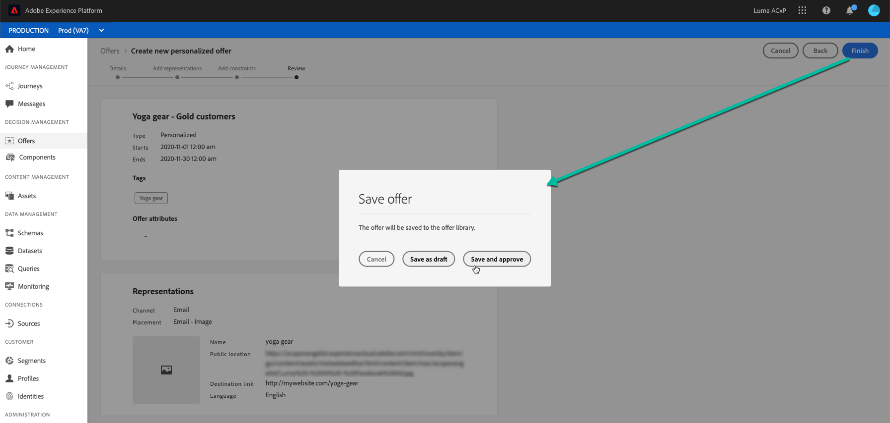

# Criar ofertas personalizadas {#create-personalized-offers}

Antes de criar uma oferta, verifique se você criou:

* A **placement** em que a oferta será exibida. Consulte [Criar disposições](../offer-library/creating-placements.md)
* Se quiser adicionar uma condição de qualificação: a **regra de decisão** que definirá a condição sob a qual a oferta será apresentada. Consulte [Criar regras de decisão](../offer-library/creating-decision-rules.md).
* Um ou vários **tags** que você pode querer associar à oferta. Consulte [Criar tags](../offer-library/creating-tags.md).

➡️ [Descubra este recurso no vídeo](#video)

A lista de ofertas personalizadas pode ser acessada na variável **[!UICONTROL Offers]** menu.

## Criar uma oferta {#create-offer}

>[!CONTEXTUALHELP]
>id="od_offer_attributes"
>title="Sobre atributos de oferta"
>abstract="Com atributos de oferta, é possível associar pares de valores chave à oferta para fins de análise e geração de relatórios."

>[!CONTEXTUALHELP]
>id="ajo_decisioning_offer_attributes"
>title="Atributos da oferta"
>abstract="Com atributos de oferta, é possível associar pares de valores chave à oferta para fins de análise e geração de relatórios."

Para criar um **oferta** siga estas etapas:

1. Clique em **[!UICONTROL Create offer]**, em seguida selecione **[!UICONTROL Personalized offer]**.

   

1. Especifique o nome da oferta, bem como sua data e hora de início e término. Fora dessas datas, a oferta não será selecionada pelo mecanismo do Decisioning.

   

   >[!CAUTION]
   >
   >A atualização das datas de início/término pode afetar o limite. [Saiba mais](add-constraints.md#capping-change-date)

1. Também é possível associar uma ou várias **[!UICONTROL tags]** à oferta, permitindo pesquisar e organizar a Biblioteca de ofertas com mais facilidade. [Saiba mais](creating-tags.md).

1. O **[!UICONTROL Offer attributes]** Essa seção permite associar pares de valores chave à oferta para fins de relatório e análise.

1. Adicione representações para definir onde a oferta será exibida na mensagem. [Saiba mais](add-representations.md)

   

1. Adicione restrições para definir as condições da oferta a ser exibida. [Saiba mais](add-constraints.md)

   

1. Revise e salve a oferta. [Saiba mais](#review)

## Revisar a oferta {#review}

Depois que as regras e restrições de qualificação tiverem sido definidas, um resumo das propriedades da oferta será exibido.

1. Verifique se tudo está configurado corretamente.

1. Quando sua oferta estiver pronta para ser apresentada aos usuários, clique em **[!UICONTROL Finish]**.

1. Selecione **[!UICONTROL Save and approve]**.

   

   Também é possível salvar a oferta como rascunho, para editá-la e aprová-la posteriormente.

A oferta é exibida na lista com a variável **[!UICONTROL Approved]** ou **[!UICONTROL Draft]** , dependendo de você ter aprovado ou não na etapa anterior.

Agora ele está pronto para ser entregue aos usuários.

## Gerenciar ofertas {#offer-list}

Na lista de ofertas, é possível selecionar a oferta para exibir suas propriedades. Você também pode editá-la, alterar seu status (**Rascunho**, **Aprovado**, **Arquivado**), duplique a oferta ou exclua-a.

Selecione o **[!UICONTROL Edit]** botão para voltar para o modo de edição da oferta, onde você pode modificar o [detalhes](#create-offer), [representações](#representations), bem como editar o [regras e restrições de qualificação](#eligibility).

Selecione uma oferta aprovada e clique em **[!UICONTROL Undo approve]** para definir o status da oferta novamente como **[!UICONTROL Draft]**.

Para definir novamente o status como **[!UICONTROL Approved]**, selecione o botão correspondente que é exibido.

O **[!UICONTROL More actions]** ativa as ações descritas abaixo.

* **[!UICONTROL Duplicate]**: cria uma oferta com as mesmas propriedades, representações, regras de elegibilidade e restrições. Por padrão, a nova oferta tem a variável **[!UICONTROL Draft]** status.
* **[!UICONTROL Delete]**: remove a oferta da lista.

   >[!CAUTION]
   >
   >A oferta e seu conteúdo não estarão mais acessíveis. Esta ação não pode ser desfeita.
   >
   >Se a oferta for usada em uma coleção ou decisão, ela não poderá ser excluída. Você deve remover a oferta de qualquer objeto primeiro.

* **[!UICONTROL Archive]**: define o status da oferta como **[!UICONTROL Archived]**. A oferta ainda está disponível na lista, mas não é possível definir seu status novamente como **[!UICONTROL Draft]** ou **[!UICONTROL Approved]**. Você só pode duplicá-la ou excluí-la.

Também é possível excluir ou alterar o status de várias ofertas ao mesmo tempo, marcando as caixas de seleção correspondentes.

Se quiser alterar o status de várias ofertas com status diferentes, somente os status relevantes serão alterados.

Depois que uma oferta for criada, clique no nome na lista.

Isso permite acessar informações detalhadas dessa oferta. Selecione o **[!UICONTROL Change log]** guia para [monitorar todas as alterações](../get-started/user-interface.md#monitoring-changes) que foram feitas à oferta.

## Tutorial em vídeo {#video}

>[!VIDEO](https://video.tv.adobe.com/v/329375?quality=12)
