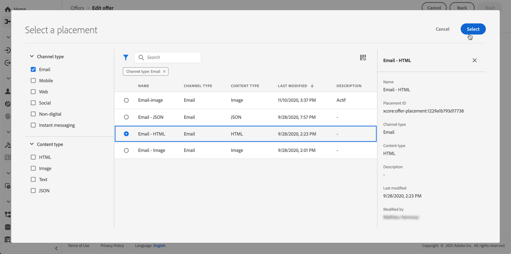

# Criar ofertas personalizadas {#create-personalized-offers}

Antes de criar uma oferta, verifique se você criou:

* A **placement** em que a oferta será exibida. Consulte [Criar disposições](../offer-library/creating-placements.md)
* Se quiser adicionar uma condição de qualificação: a **regra de decisão** que definirá a condição sob a qual a oferta será apresentada. Consulte [Criar regras de decisão](../offer-library/creating-decision-rules.md).
* Um ou vários **tags** que você pode querer associar à oferta. Consulte [Criar tags](../offer-library/creating-tags.md).

➡️ [Descubra este recurso no vídeo](#video)

A lista de ofertas personalizadas pode ser acessada na variável **[!UICONTROL Offers]** menu.

## Criar a oferta {#create-offer}

Para criar um **oferta** siga estas etapas:

1. Clique em **[!UICONTROL Create offer]**, em seguida selecione **[!UICONTROL Personalized offer]**.

   

1. Especifique o nome da oferta, bem como sua data e hora de início e término. Também é possível associar uma ou várias tags existentes à oferta, permitindo pesquisar e organizar a Biblioteca de ofertas com mais facilidade.

   

   >[!NOTE]
   >
   >O **[!UICONTROL Offer attributes]** Essa seção permite associar pares de valores chave à oferta para fins de relatório e análise.

## Configurar as representações da oferta {#representations}

Uma oferta pode ser exibida em diferentes locais em uma mensagem: em um banner superior com uma imagem, como texto em um parágrafo, como um bloco de HTML, etc. Quanto mais representações uma oferta tiver, mais oportunidades haverá para usar a oferta em diferentes contextos de posicionamento.

Para adicionar uma ou várias representações à sua oferta e configurá-las, siga as etapas abaixo.

1. Para a primeira representação, comece selecionando o **[!UICONTROL Channel]** que será usado.

   

   >[!NOTE]
   >
   >Somente as disposições disponíveis para o canal selecionado são exibidas na **[!UICONTROL Placement]** lista suspensa.

1. Selecione uma disposição na lista.

   Também é possível usar o botão próximo ao **[!UICONTROL Placement]** lista suspensa para navegar por todas as disposições.

   

   Lá, ainda é possível filtrar as disposições de acordo com seu canal e/ou tipo de conteúdo. Escolha uma disposição e clique em **[!UICONTROL Select]**.

   

1. Adicione conteúdo à sua representação. Saiba mais sobre como [esta seção](#content).

1. Ao adicionar conteúdo, como uma imagem ou URL, é possível especificar um **[!UICONTROL Destination link]**: os usuários que clicarem na oferta serão direcionados para a página correspondente.

   

1. Finalmente, selecione o idioma escolhido para ajudar a identificar e gerenciar o que será exibido aos usuários.

1. Para adicionar outra representação, use o **[!UICONTROL Add representation]** e adicione quantas representações forem necessárias.

   

1. Depois de adicionar todas as suas representações, selecione **[!UICONTROL Next]**.

## Definir conteúdo para suas representações {#content}

É possível adicionar diferentes tipos de conteúdo a uma representação.

>[!NOTE]
>
>Somente o conteúdo correspondente ao tipo de conteúdo da disposição está disponível para uso.

### Adicionar imagens {#images}

Se a disposição selecionada for do tipo imagem, você poderá adicionar conteúdo proveniente da variável **Adobe Experience Cloud Asset** , um repositório centralizado dos ativos fornecidos por [!DNL Adobe Experience Manager Assets Essentials].

>[!NOTE]
>
> Para trabalhar com [Adobe Experience Manager Assets Essentials](https://experienceleague.adobe.com/docs/experience-manager-assets-essentials/help/introduction.html?lang=en){target=&quot;_blank&quot;}, é necessário implantar [!DNL Assets Essentials] para sua organização e certifique-se de que os usuários façam parte da **Usuários do cliente do Assets Essentials** ou/e **Usuários do Assets Essentials** Perfis de produto. Saiba mais sobre [esta página](https://experienceleague.adobe.com/docs/experience-manager-assets-essentials/help/deploy-administer.html){target=&quot;_blank&quot;}.

1. Escolha a opção **[!UICONTROL Asset library]**.

1. Selecione **[!UICONTROL Browse]**.

   

1. Navegue pelos ativos para selecionar a imagem de sua escolha

1. Clique em **[!UICONTROL Select]**.

   

### Adicionar URLs {#urls}

Para adicionar conteúdo de um local público externo, selecione **[!UICONTROL URL]**, em seguida, insira o endereço de URL do conteúdo a ser adicionado.

### Adicionar texto personalizado {#custom-text}

Você também pode inserir conteúdo do tipo texto ao selecionar uma disposição compatível.

1. Selecione a opção **[!UICONTROL Custom]** e clique em **[!UICONTROL Add content]**.

   

   >[!NOTE]
   >
   >Essa opção não está disponível para disposições do tipo imagem.

1. Digite o texto que será exibido na oferta.

   

   É possível personalizar o conteúdo usando o Editor de expressão. Saiba mais sobre [personalização](../../personalization/personalize.md#use-expression-editor).

   

   >[!NOTE]
   >
   >Somente a variável **[!UICONTROL Profile attributes]**, **[!UICONTROL Segment memberships]** e **[!UICONTROL Helper functions]** As fontes estão disponíveis para o Gerenciamento de decisões.

## Adicionar regras e restrições de qualificação {#eligibility}

As regras e restrições de elegibilidade permitem definir as condições em que uma oferta será exibida.

1. Configure o **[!UICONTROL Offer eligibility]**.

   * Por padrão, a variável **[!UICONTROL All visitors]** a opção de regra de decisão é selecionada, o que significa que qualquer perfil será qualificado para ser apresentado à oferta.

   * É possível limitar a apresentação da oferta aos membros de um ou vários segmentos do Adobe Experience Platform. Para fazer isso, ative o **[!UICONTROL Visitors who fall into one or multiple segments]** , em seguida, adicione um ou vários segmentos do painel esquerdo e combine-os usando a **[!UICONTROL And]** / **[!UICONTROL Or]** operadores lógicos.

      Para obter mais informações sobre como trabalhar com segmentos, consulte [esta página](../../segment/about-segments.md).

      

   * Se desejar associar uma regra de decisão específica à oferta, selecione **[!UICONTROL By defined decision rule]**, em seguida, arraste a regra desejada do painel esquerdo para o **[!UICONTROL Decision rule]** área. Para obter mais informações sobre como criar uma regra de decisão, consulte [esta seção](../offer-library/creating-decision-rules.md).

      

      >[!CAUTION]
      >
      >No momento, as ofertas baseadas em eventos não são compatíveis com o [!DNL Journey Optimizer]. Se você criar uma regra de decisão com base em um [evento](https://experienceleague.adobe.com/docs/experience-platform/segmentation/ui/segment-builder.html?lang=en#events){target=&quot;_blank&quot;}, você não poderá aproveitá-lo em uma oferta.
   Saiba mais sobre como usar segmentos versus regras de decisão no [esta seção](../offer-activities/create-offer-activities.md#segments-vs-decision-rules).

1. Defina as **[!UICONTROL Priority]** da oferta em comparação a outras se o usuário se qualificar para mais de uma oferta. Quanto maior for a prioridade de uma oferta, maior será a prioridade em relação a outras ofertas.

1. Especifique os **[!UICONTROL Capping]**, o que significa o número de vezes que a oferta será apresentada no total em todos os usuários. Se a oferta tiver sido entregue a todos os usuários o número de vezes que você especificou neste campo, a entrega será interrompida.

   >[!NOTE]
   >
   >O número de vezes que uma oferta é proposta é calculado no momento da preparação do email. Por exemplo, se você preparar um email com várias ofertas, esses números serão contados em relação ao limite máximo, independentemente de o email ser enviado ou não.
   >
   >Se um delivery de email for excluído ou se a preparação for feita novamente antes de ser enviada, o valor limite da oferta será atualizado automaticamente.

   

   No exemplo acima:

   * A prioridade da oferta é definida como &quot;50&quot;, o que significa que a oferta será apresentada antes de ofertas com prioridade entre 1 e 49 e depois das com prioridade de pelo menos 51.
   * A oferta será considerada somente para usuários que correspondam à regra de decisão &quot;Clientes de fidelidade Gold&quot;.
   * A oferta será apresentada somente uma vez por usuário.

## Revisar a oferta {#review}

Depois que as regras e restrições de qualificação tiverem sido definidas, um resumo das propriedades da oferta será exibido.

1. Verifique se tudo está configurado corretamente.

1. Quando sua oferta estiver pronta para ser apresentada aos usuários, clique em **[!UICONTROL Finish]**.

1. Selecione **[!UICONTROL Save and approve]**.

   

   Também é possível salvar a oferta como rascunho, para editá-la e aprová-la posteriormente.

A oferta é exibida na lista com a variável **[!UICONTROL Approved]** ou **[!UICONTROL Draft]** , dependendo de você ter aprovado ou não na etapa anterior.

Agora ele está pronto para ser entregue aos usuários.

## Lista de ofertas {#offer-list}

Na lista de ofertas, é possível selecionar a oferta para exibir suas propriedades. Você também pode editá-la, alterar seu status (**Rascunho**, **Aprovado**, **Arquivado**), duplique a oferta ou exclua-a.

Selecione o **[!UICONTROL Edit]** botão para voltar para o modo de edição da oferta, onde você pode modificar o [detalhes](#create-offer), [representações](#representations), bem como editar o [regras e restrições de qualificação](#eligibility).

Selecione uma oferta aprovada e clique em **[!UICONTROL Undo approve]** para definir o status da oferta novamente como **[!UICONTROL Draft]**.

Para definir novamente o status como **[!UICONTROL Approved]**, selecione o botão correspondente que é exibido.

O **[!UICONTROL More actions]** ativa as ações descritas abaixo.

* **[!UICONTROL Duplicate]**: cria uma oferta com as mesmas propriedades, representações, regras de elegibilidade e restrições. Por padrão, a nova oferta tem a variável **[!UICONTROL Draft]** status.
* **[!UICONTROL Delete]**: remove a oferta da lista.

   >[!CAUTION]
   >
   >A oferta e seu conteúdo não estarão mais acessíveis. Esta ação não pode ser desfeita.
   >
   >Se a oferta for usada em uma coleção ou decisão, ela não poderá ser excluída. Você deve remover a oferta de qualquer objeto primeiro.

* **[!UICONTROL Archive]**: define o status da oferta como **[!UICONTROL Archived]**. A oferta ainda está disponível na lista, mas não é possível definir seu status novamente como **[!UICONTROL Draft]** ou **[!UICONTROL Approved]**. Você só pode duplicá-la ou excluí-la.

Também é possível excluir ou alterar o status de várias ofertas ao mesmo tempo, marcando as caixas de seleção correspondentes.

Se quiser alterar o status de várias ofertas com status diferentes, somente os status relevantes serão alterados.

Depois que uma oferta for criada, clique no nome na lista.

Isso permite acessar informações detalhadas dessa oferta. Selecione o **[!UICONTROL Change log]** guia para [monitorar todas as alterações](../get-started/user-interface.md#monitoring-changes) que foram feitas à oferta.

## Tutorial em vídeo {#video}

>[!NOTE]
>
>Este vídeo se aplica ao serviço de aplicativo do Offer Decisioning criado no Adobe Experience Platform. No entanto, fornece orientação genérica para usar a Oferta no contexto do Journey Optimizer.

>[!VIDEO](https://video.tv.adobe.com/v/329375?quality=12)
