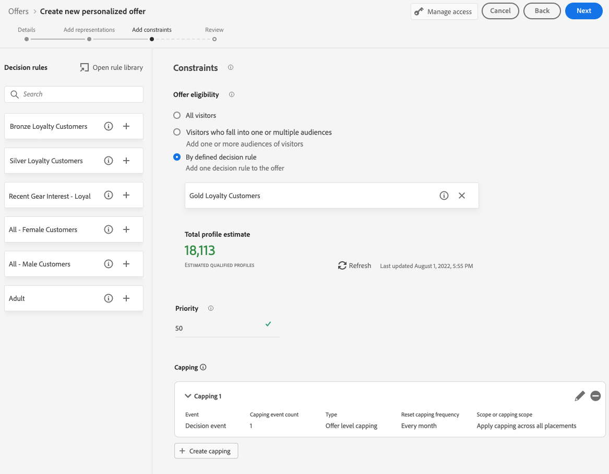
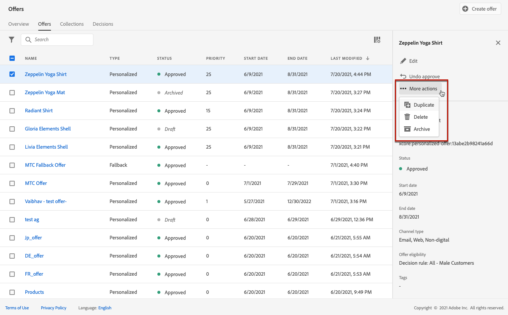

# Criar ofertas personalizadas {#create-personalized-offers}

Antes de criar uma oferta, verifique se você criou:

* Um **posicionamento** no qual a oferta será exibida. Consulte [Criar inserções](../offer-library/creating-placements.md)
* Se você quiser adicionar uma condição de qualificação: uma **regra de decisão** que definirá a condição sob a qual a oferta será apresentada. Consulte [Criar regras de decisão](../offer-library/creating-decision-rules.md).
* Um ou vários **qualificadores de coleção** (anteriormente conhecidos como &quot;tags&quot;) que você pode associar à oferta. Consulte [Criar qualificadores de coleção](../offer-library/creating-tags.md).

➡️ [Descubra este recurso no vídeo](#video)

A lista de ofertas personalizadas está acessível no menu **[!UICONTROL Ofertas]**.

## Criar uma oferta {#create-offer}

>[!CONTEXTUALHELP]
>id="od_offer_attributes"
>title="Sobre atributos de oferta"
>abstract="Com atributos de oferta, é possível associar pares de valores chave à oferta para fins de análise e geração de relatórios."

>[!CONTEXTUALHELP]
>id="ajo_decisioning_offer_attributes"
>title="Atributos de oferta"
>abstract="Com atributos de oferta, é possível associar pares de valores chave à oferta para fins de análise e geração de relatórios."

Para criar uma **oferta**, siga estas etapas:

1. Clique em **[!UICONTROL Criar oferta]** e selecione **[!UICONTROL Oferta personalizada]**.

   

1. Especifique o nome da oferta, bem como a data e a hora de início e término. Fora dessas datas, a oferta não será selecionada pelo mecanismo de decisão.

   >[!NOTE]
   >
   >Ao selecionar horas, o fuso horário atual é considerado.

   

   >[!CAUTION]
   >
   >A atualização das datas de início/término pode afetar o limite. [Saiba mais](add-constraints.md#capping-change-date)

1. Você também pode associar um ou vários **[!UICONTROL qualificadores de coleção]** existentes à oferta, permitindo pesquisar e organizar a Biblioteca de Ofertas com mais facilidade. [Saiba mais](creating-tags.md).

1. A seção **[!UICONTROL Atributos da oferta]** permite associar pares de valores chave à oferta para fins de relatório e análise.

1. Para atribuir rótulos de uso de dados personalizados ou principais à oferta, selecione **[!UICONTROL Gerenciar acesso]**. [Saiba mais sobre OLAC (Controle de Acesso em Nível de Objeto)](../../administration/object-based-access.md)

   

1. Adicione representações para definir onde a oferta será exibida na mensagem. [Saiba mais](add-representations.md)

   

   >[!CAUTION]
   >
   >O tamanho de uma oferta incluindo todas as suas representações não pode exceder 300 KB.

1. Adicione restrições para definir as condições para que a oferta seja exibida. [Saiba mais](add-constraints.md)

   >[!NOTE]
   >
   >Ao selecionar públicos ou regras de decisão, você pode ver informações sobre os perfis qualificados estimados. Clique em **[!UICONTROL Atualizar]** para atualizar os dados.
   >
   >Observe que as estimativas de perfil não estão disponíveis quando os parâmetros da regra incluem dados que não estão no perfil, como dados de contexto. Por exemplo, uma regra de elegibilidade que exige que o tempo atual seja ≥ 80 graus.

   

1. Revise e salve a oferta. [Saiba mais](#review)

## Revisar a oferta {#review}

Depois que as regras de elegibilidade e as restrições forem definidas, um resumo das propriedades da oferta será exibido.

1. Verifique se tudo está configurado corretamente.

1. Você pode exibir informações sobre os perfis qualificados estimados. Clique em **[!UICONTROL Atualizar]** para atualizar os dados.

   

1. Quando sua oferta estiver pronta para ser apresentada aos usuários, clique em **[!UICONTROL Concluir]**.

1. Selecione **[!UICONTROL Salvar e aprovar]**.

   

   Também é possível salvar a oferta como rascunho para editá-la e aprová-la posteriormente.

A oferta é exibida na lista com o status **[!UICONTROL Aprovado]** ou **[!UICONTROL Rascunho]**, dependendo se você a aprovou ou não na etapa anterior.

Agora ele está pronto para ser entregue aos usuários.

## Gerenciar ofertas {#offer-list}

Na lista de ofertas, você pode selecionar a oferta para exibir suas propriedades. Você também pode editá-la, alterar seu status (**Rascunho**, **Aprovado**, **Arquivado**), duplicar a oferta ou excluí-la.

Selecione o botão **[!UICONTROL Editar]** para voltar para o modo de edição de oferta, no qual você pode modificar os [detalhes](#create-offer), [representações](#representations) da oferta, bem como editar as [regras de qualificação e restrições](#eligibility).

Selecione uma oferta aprovada e clique em **[!UICONTROL Desfazer aprovação]** para retornar o status da oferta para **[!UICONTROL Rascunho]**.

Para definir novamente o status como **[!UICONTROL Aprovado]**, selecione o botão correspondente que agora é exibido.

O botão **[!UICONTROL Mais ações]** habilita as ações descritas abaixo.

* **[!UICONTROL Duplicar]**: cria uma oferta com as mesmas propriedades, representações, regras de qualificação e restrições. Por padrão, a nova oferta tem o status **[!UICONTROL Rascunho]**.
* **[!UICONTROL Excluir]**: remove a oferta da lista.

  >[!CAUTION]
  >
  >A oferta e seu conteúdo não estarão mais acessíveis. Essa ação não pode ser desfeita.
  >
  >Se a oferta for usada em uma coleção ou em uma decisão, ela não poderá ser excluída. Você deve remover a oferta de qualquer objeto primeiro.

* **[!UICONTROL Arquivar]**: define o status da oferta como **[!UICONTROL Arquivado]**. A oferta ainda está disponível na lista, mas não é possível definir seu status novamente como **[!UICONTROL Rascunho]** ou **[!UICONTROL Aprovado]**. Você só pode duplicá-la ou excluí-la.

Também é possível excluir ou alterar o status de várias ofertas ao mesmo tempo marcando as caixas de seleção correspondentes.

Se quiser alterar o status de várias ofertas com status diferentes, somente os status relevantes serão alterados.

Depois que uma oferta é criada, você pode clicar no nome na lista.

Isso permite que você acesse informações detalhadas dessa oferta. Selecione a guia **[!UICONTROL Log de alterações]** para [monitorar todas as alterações](../get-started/user-interface.md#monitoring-changes) feitas na oferta.

## Tutorial em vídeo {#video}

>[!VIDEO](https://video.tv.adobe.com/v/329375?quality=12)
