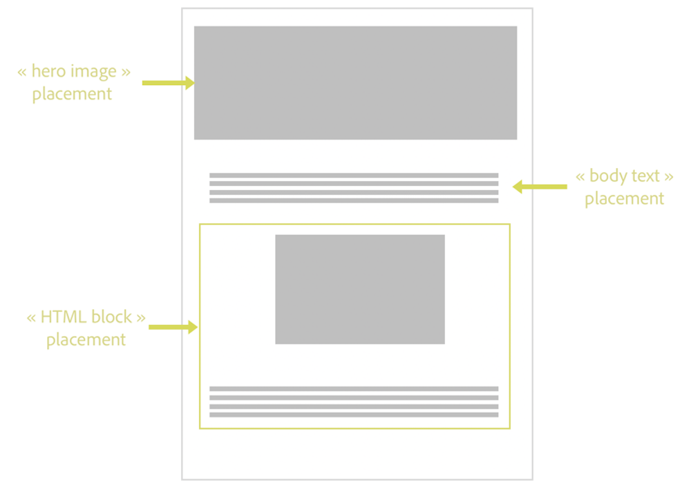

# Criar posicionamentos {#create-placements}

>[!CONTEXTUALHELP]
>id="ajo_decisioning_placement"
>title="Disposição"
>abstract="Um posicionamento é um container usado para exibir ofertas. Isso ajuda a garantir que o conteúdo de oferta correto seja exibido no local certo na mensagem. Os posicionamentos são criados no menu “Componentes”."

Uma disposição ajuda a garantir que o conteúdo de oferta correto seja exibido no local certo dentro da mensagem. Ao adicionar conteúdo a uma oferta, você será solicitado a selecionar uma disposição na qual o conteúdo possa ser exibido.

➡️ [Saiba como criar disposições neste vídeo](#video)

No exemplo abaixo, há três disposições, correspondentes a diferentes tipos de conteúdo (imagem, texto, HTML).

A lista de disposições pode ser acessada na seção **[!UICONTROL Componentes]** menu. Os filtros estão disponíveis para ajudá-lo a recuperar disposições de acordo com um canal ou conteúdo específico.

Para criar uma disposição, siga estas etapas:

1. Clique em **[!UICONTROL Criar inserção]**.

   

1. Defina as propriedades da disposição:

   * **[!UICONTROL Nome]**: O nome da disposição. Defina um nome significativo para recuperá-lo com mais facilidade.
   * **[!UICONTROL Tipo de canal]**: O canal para o qual a disposição será usada.
   * **[!UICONTROL Tipo de conteúdo]**: O tipo de conteúdo que a disposição poderá exibir: Texto, HTML, Link de imagem ou JSON.
   * **[!UICONTROL Descrição]**: Uma descrição da disposição (opcional).

   

1. O **[!UICONTROL Configurações da solicitação]** e **[!UICONTROL Formato de resposta]** as seções fornecem parâmetros adicionais:

   * **[!UICONTROL Permitir duplicatas em disposições]**: Controle se a mesma oferta pode ser proposta várias vezes em diferentes disposições. Se estiver habilitado, o sistema considerará a mesma oferta para várias disposições. Por padrão, o parâmetro é definido como false.

      Se essa opção estiver definida como false para qualquer disposição em uma solicitação de decisão, todas as disposições na solicitação herdarão a configuração &quot;false&quot;.

   * **[!UICONTROL Solicitar oferta]**: Por padrão, uma oferta do escopo de decisão é retornada para cada perfil. É possível ajustar o número de ofertas retornadas usando essa opção. Por exemplo, se você selecionar 2, as 2 melhores ofertas serão exibidas para o escopo de decisão selecionado.

   * **[!UICONTROL Incluir conteúdo]** / **[!UICONTROL Incluir metadados]**: especifique se o conteúdo e os metadados da oferta devem ser retornados na resposta da API. É possível incluir todos os metadados ou campos específicos somente. Por padrão, Incluir valor de metadados é definido como true.
   Esses parâmetros também podem ser definidos diretamente na solicitação da API, se você estiver trabalhando com o [API de decisão](https://experienceleague.adobe.com/docs/journey-optimizer/using/offer-decisioning/api-reference/offer-delivery-api/decisioning-api.html). No entanto, configurá-los na interface do usuário pode ajudá-lo a economizar tempo, pois não será necessário transmiti-los em cada solicitação da API. Observe que se você configurar os parâmetros na interface do usuário e na solicitação da API, os valores da solicitação da API prevalecerão sobre os valores da interface.

   >[!NOTE]
   >
   >Se você estiver trabalhando com a variável [API do Edge Decisioning](https://experienceleague.adobe.com/docs/journey-optimizer/using/offer-decisioning/api-reference/offer-delivery-api/edge-decisioning-api.html?), não é possível definir esses parâmetros na solicitação. Você precisa defini-los nessa tela.
   >
   >Se você estiver trabalhando com a variável [API de decisão em lote](../api-reference/offer-delivery-api/batch-decisioning-api.md), você pode definir esses parâmetros nessa tela ou na solicitação da API. Se houver uma incompatibilidade de valores de parâmetro entre a tela e a solicitação de APi, os valores da solicitação serão usados.

1. Clique em **[!UICONTROL Salvar]** para confirmar.

1. Depois que a disposição é criada, ela é exibida na lista de disposições. Você pode selecioná-lo para exibir suas propriedades e editá-lo.

   

## Vídeo tutorial{#video}

Saiba como criar disposições no gerenciamento de decisões.

>[!VIDEO](https://video.tv.adobe.com/v/329372?quality=12)

