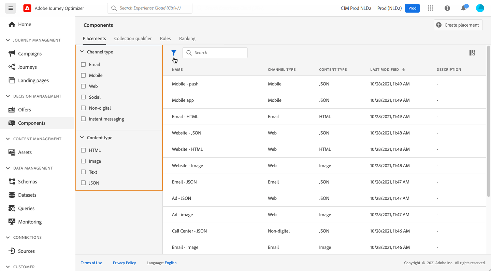

# Criar posicionamentos {#create-placements}

>[!CONTEXTUALHELP]
>id="ajo_decisioning_placement"
>title="Disposição"
>abstract="Um posicionamento é um contêiner usado para mostrar ofertas. Isso ajuda a garantir que o conteúdo de oferta correto seja exibido no local certo dentro da mensagem. As disposições são criadas no menu &quot;Componentes&quot;."

Uma disposição ajuda a garantir que o conteúdo de oferta correto seja exibido no local certo dentro da mensagem. Ao adicionar conteúdo a uma oferta, você será solicitado a selecionar uma disposição na qual o conteúdo possa ser exibido.

➡️ [Saiba como criar disposições neste vídeo](#video)

No exemplo abaixo, há três disposições, correspondentes a diferentes tipos de conteúdo (imagem, texto, HTML).

A lista de disposições pode ser acessada na seção **[!UICONTROL Components]** menu. Os filtros estão disponíveis para ajudá-lo a recuperar disposições de acordo com um canal ou conteúdo específico.

Para criar uma disposição, siga estas etapas:

1. Clique em **[!UICONTROL Create placement]**.

   

1. Defina as propriedades da disposição:

   * **[!UICONTROL Name]**: O nome da disposição. Defina um nome significativo para recuperá-lo com mais facilidade.
   * **[!UICONTROL Channel type]**: O canal para o qual a disposição será usada.
   * **[!UICONTROL Content type]**: O tipo de conteúdo que a disposição poderá exibir: Texto, HTML, Link de imagem ou JSON.
   * **[!UICONTROL Description]**: Uma descrição da disposição (opcional).

   

1. Clique em **[!UICONTROL Save]** para confirmar.

1. Depois que a disposição é criada, ela é exibida na lista de disposições. Você pode selecioná-lo para exibir suas propriedades e editá-lo.

   

## Vídeo tutorial{#video}

Saiba como criar inserções no Offer Decisioning.

>[!VIDEO](https://video.tv.adobe.com/v/329372?quality=12)

