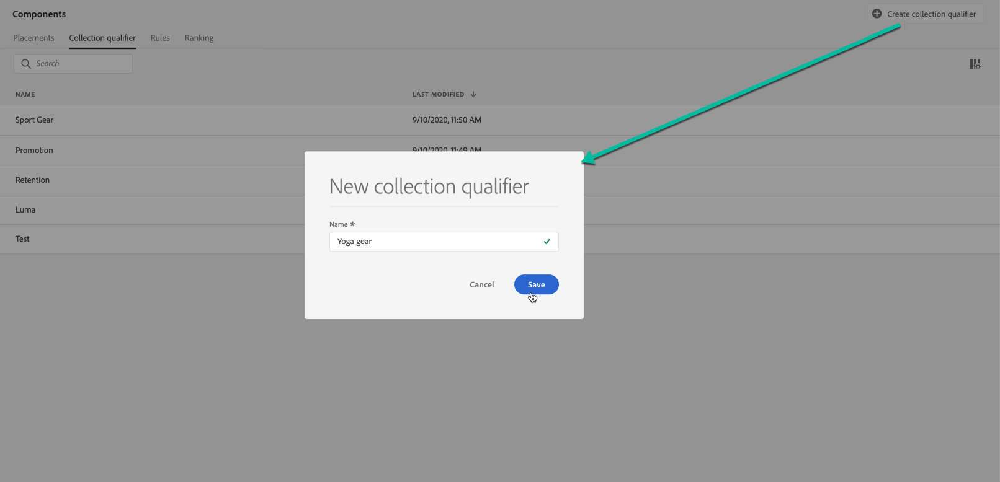

# Criar tags {#create-tags}

>[!CONTEXTUALHELP]
>id="ajo_decisioning_offer_tags"
>title="Tags"
>abstract="Associe uma ou várias tags à oferta para manter a Biblioteca de ofertas organizada e localizar ofertas com mais facilidade. As tags são criadas no menu &quot;Componente&quot;."

A associação de tags às suas ofertas facilita a organização dessas tags. Por exemplo, você pode rotular as ofertas de Black Friday com a tag &quot;Black Friday&quot;. Em seguida, você pode usar a funcionalidade de pesquisa na Biblioteca de ofertas para localizar facilmente todas as ofertas com essa tag.

Tags também podem ser usadas para agrupar ofertas em coleções de ofertas. Consulte [Criar coleções](../offer-library/creating-collections.md).

➡️ [Descubra este recurso no vídeo](#video)

A lista de tags criadas pode ser acessada na **[!UICONTROL Components]** menu.

Para criar uma tag, siga estas etapas:

1. Vá para o **[!UICONTROL Tags]** e, em seguida, clique em **[!UICONTROL Create tag]**.

1. Especifique o nome da tag e clique em **[!UICONTROL Save]**.

   

1. Depois que a tag for criada, ela será exibida na lista. Você pode selecioná-lo para exibir suas propriedades e editá-lo ou suprimi-lo.

   

## Vídeo tutorial {#video}

>[!VIDEO](https://video.tv.adobe.com/v/329374?quality=12)
