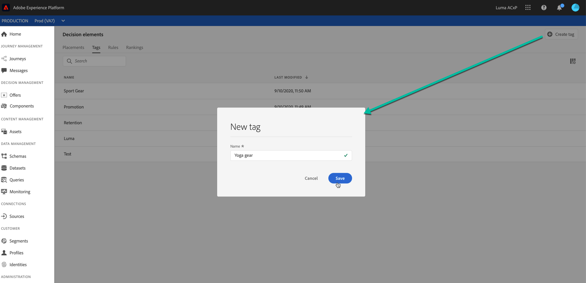

# Criar tags {#creating-tags}

A associação de tags às suas ofertas facilita a organização dessas tags. Por exemplo, você pode rotular as ofertas de Black Friday com a tag &quot;Black Friday&quot;. Em seguida, você pode usar a funcionalidade de pesquisa na Biblioteca de ofertas para localizar facilmente todas as ofertas com essa tag.

Tags também podem ser usadas para agrupar ofertas em coleções de ofertas. Consulte [Criar coleções](../offer-library/creating-collections.md).

 [Descubra este recurso no vídeo](#video)

A lista de tags criadas pode ser acessada no menu **[!UICONTROL Components]**.

Para criar uma tag, siga estas etapas:

1. Vá para a guia **[!UICONTROL Tags]** e clique em **[!UICONTROL Create tag]**.

1. Especifique o nome da tag e clique em **[!UICONTROL Save]**.

   

1. Depois que a tag for criada, ela será exibida na lista. Você pode selecioná-lo para exibir suas propriedades e editá-lo ou suprimi-lo.

   

## Tutoriais em vídeo {#video}

>[!NOTE]
>
>Este vídeo se aplica ao serviço de aplicativo do Offer Decisioning criado no Adobe Experience Platform. No entanto, fornece orientação genérica para usar a Oferta no contexto do Journey Optimizer.

>[!VIDEO](https://video.tv.adobe.com/v/329374?quality=12)
