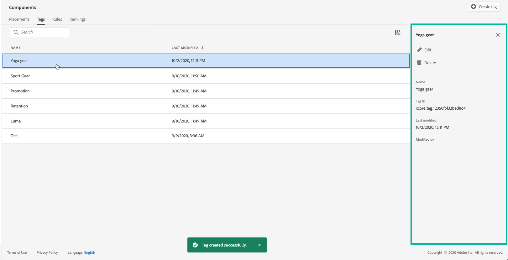

# Criar qualificadores de coleção {#create-tags}

>[!TIP]
>
>O serviço de Decisão, o novo recurso de tomada de decisão do [!DNL Adobe Journey Optimizer], agora está disponível por meio da experiência baseada em código e dos canais de email. [Saiba mais](../../experience-decisioning/gs-experience-decisioning.md)

>[!CONTEXTUALHELP]
>id="ajo_decisioning_offer_tags"
>title="Qualificadores de coleção"
>abstract="Associe um ou vários qualificadores de coleção à oferta para manter a Biblioteca de ofertas organizada e localizar ofertas com mais facilidade. Os qualificadores de coleção são criados no menu “Componente”."

Associar qualificadores de coleção (anteriormente conhecidos como &quot;tags&quot;) às suas ofertas facilita a organização. Por exemplo, você pode rotular as ofertas de Black Friday com o qualificador de coleção &quot;Black Friday&quot;. Em seguida, você pode usar a funcionalidade de pesquisa na Biblioteca de ofertas para localizar facilmente todas as ofertas com esse qualificador de coleção.

Os qualificadores de coleção também podem ser usados para agrupar ofertas em coleções de ofertas. Consulte [Criar coleções](../offer-library/creating-collections.md).

➡️ [Conheça este recurso no vídeo](#video)

A lista de qualificadores de coleção criados está acessível no menu **[!UICONTROL Componentes]**.

Para criar um qualificador de coleta, siga estas etapas:

1. Vá para a guia **[!UICONTROL Qualificadores da coleção]** e clique em **[!UICONTROL Criar qualificador da coleção]**.

1. Especifique o nome do qualificador de coleção e clique em **[!UICONTROL Salvar]**.

   

1. Depois que o qualificador de coleta é criado, ele é exibido na lista. Você pode selecioná-lo para exibir suas propriedades e editá-lo ou suprimi-lo.

   

## Vídeo tutorial {#video}

>[!VIDEO](https://video.tv.adobe.com/v/341376?captions=por_br&quality=12)
