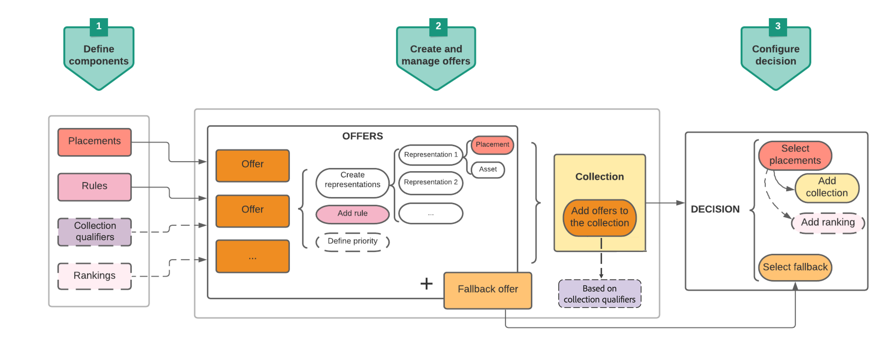

# Etapas principais para criar e gerenciar ofertas {#key-steps-to-manage-offers}

As principais etapas para criar, configurar e gerenciar ofertas, bem como usá-las em uma decisão, são apresentadas abaixo.

Para obter um exemplo completo mostrando como configurar ofertas, usá-las em uma decisão e aproveitar esta decisão em um email, confira [esta página](../offers-e2e.md).

## Criar componentes {#create-components}

Antes de começar a criar ofertas, você deve definir vários componentes que usará em suas ofertas.

1. [Crie inserções](creating-placements.md), que são contêineres que serão usados para exibir suas ofertas. Por exemplo, é possível criar uma disposição que será dedicada às ofertas somente no formato de imagem e situada na parte superior das mensagens.

1. [Crie regras de decisão](creating-decision-rules.md) que especificarão as condições em que as ofertas serão apresentadas.

1. [Criar qualificadores de coleção](creating-tags.md) (anteriormente conhecidos como &quot;marcas&quot;) que você associará às ofertas, permitindo que você os organize e pesquise facilmente na biblioteca.

1. Se quiser definir regras que determinem qual oferta deve ser apresentada primeiro para determinado posicionamento (em vez de considerar as pontuações de prioridade das ofertas), você pode [criar uma fórmula de classificação](../ranking/create-ranking-formulas.md).

<!--
<table style="table-layout:fixed">
<tr style="border: 0;">
<td>

<a href="../offer-library/creating-placements.md">Create placements</a>

</td>
<td>

<a href="../offer-library/creating-decision-rules.md">Create decision rules</a>

<td>

<a href="../offer-library/creating-tags.md">Create collection qualifiers</a>

</td>
<td>

<a href="../ranking/create-ranking-formulas.md">Create ranking formulas</a>

</td>
</tr>
</table>
-->

## Criar e gerenciar ofertas {#create-and-manage-offers}

1. [Crie ofertas](creating-personalized-offers.md) e configure o conteúdo e as propriedades.

1. [Criar ofertas substitutas](creating-fallback-offers.md), que são as últimas ofertas de recurso a serem exibidas se os clientes não estiverem qualificados para nenhuma das ofertas selecionadas.

1. [Crie uma coleção](creating-collections.md) para incluir as ofertas personalizadas que você criou e use-as em uma decisão.

<!--
<table style="table-layout:fixed">
<tr style="border: 0;">
<td>

<a href="../offer-library/creating-personalized-offers.md">Create offers</a>

</td>
<td>

<a href="../offer-library/creating-fallback-offers.md">Create fallback offers</a>

</td>
<td>

<a href="../offer-library/creating-collections.md">Create collections</a>

</td>
</tr>
</table>
-->

## Criar e configurar decisões {#create-and-configure-decisions}

1. [Crie uma decisão](../offer-activities/create-offer-activities.md) que combinará disposições com as ofertas personalizadas e as ofertas substitutas. Essa combinação será usada pelo mecanismo de decisão para encontrar a melhor oferta para um perfil específico.

1. [Configurar a decisão](../offer-activities/create-offer-activities.md#add-decision-scopes). Para fazer isso, selecione os posicionamentos e, para cada posicionamento, selecione uma coleção e um fallback.

1. Se necessário, você pode [atribuir uma fórmula de classificação](../offer-activities/configure-offer-selection.md#assign-ranking-formula) ou [classificação de IA](../offer-activities/configure-offer-selection.md#use-ranking-strategy) a um posicionamento ao configurar a decisão.

<!--
<table style="table-layout:fixed">
<tr style="border: 0;">
<td>

<a href="../offer-activities/create-offer-activities.md">Create decisions</a>

</td>
<td>

<a href="../offer-activities/create-offer-activities.md#add-offers">Configure decisions</a>

</td>
<td>

<a href="../offer-activities/configure-offer-selection.md#assign-ranking-formula">Assign ranking</a>

</td>
</tr>
</table>
-->