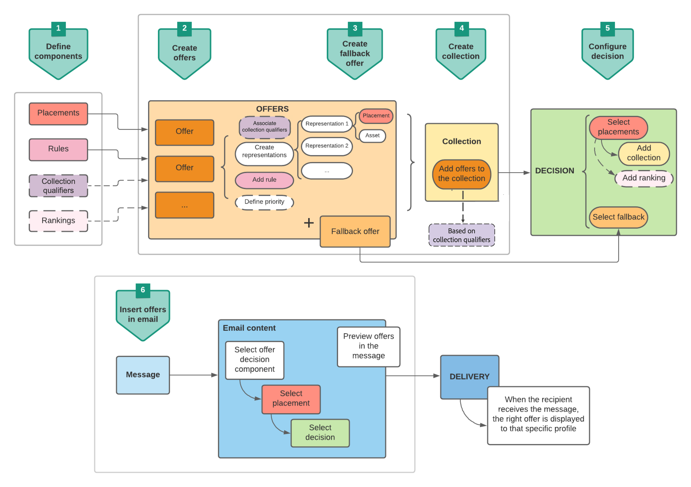
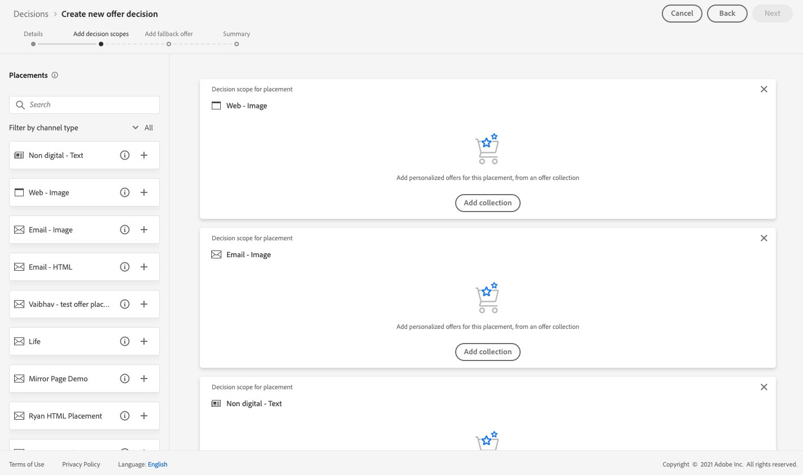

# Caso de uso: configurar ofertas personalizadas para usá-las em um email {#configure-add-personalized-offers-email}

Esta seção apresenta um exemplo completo para mostrar como configurar ofertas e usá-las em um email, com base em uma decisão criada anteriormente.

## Etapas principais {#main-steps}

As principais etapas para configurar ofertas, incluí-las em uma decisão e aproveitar essa decisão em um email estão listadas abaixo:

1. Antes de criar ofertas, [definir seus componentes](#define-components)

   * Criar inserções
   * Criar regras de decisão
   * Criar qualificadores de coleção (anteriormente conhecido como &quot;tags&quot;)
   * Criar classificações (opcional)

1. [Configurar as ofertas](#configure-offers)

   * Criar ofertas
   * Para cada oferta:

      * Crie representações e selecione uma disposição e um ativo para cada representação
      * Adicionar uma regra para cada oferta
      * Definir uma prioridade para cada oferta

1. [Criar uma oferta substituta](#create-fallback)

1. [Criar uma coleção](#create-collection) para incluir as ofertas personalizadas que você criou

1. [Configurar a decisão](#configure-decision)

   * Criar uma decisão
   * Selecione os posicionamentos criados
   * Para cada posicionamento, selecione a coleção
   * Para cada posicionamento, selecione uma classificação (opcional)
   * Selecionar o fallback

1. [Inserir a decisão em um email](#insert-decision-in-email)

   * Selecione uma disposição correspondente às ofertas que deseja exibir
   * Selecionar a decisão dos itens compatíveis com o posicionamento selecionado
   * Visualizar suas ofertas

O processo geral de Gestão de decisões para usar ofertas em um email pode ser descrito da seguinte maneira:

## Definir os componentes {#define-components}

Antes de começar a criar ofertas, você deve definir vários componentes que usará em suas ofertas.

Você os encontrará na **[!UICONTROL Gerenciamento de decisão]** > **[!UICONTROL Menu Componentes]**.

1. Comece criando **disposições** para suas ofertas.

   Você usará esses posicionamentos para definir onde a oferta resultante aparecerá ao definir sua decisão de oferta.

   Neste exemplo, crie três inserções com os seguintes canais e tipos de conteúdo:

   * *Web - Imagem*
   * *Email - Imagem*
   * *Não digital - Texto*

   

   As etapas detalhadas para criar inserções estão descritas em [nesta seção](../../using/offers/offer-library/creating-placements.md).

1. Criar **regras de decisão**.

   As regras de decisão fornecerão a melhor oferta para um perfil no Adobe Experience Platform.

   Configure duas regras simples usando o **[!UICONTROL Perfil individual XDM > Pessoa > Gênero]** atributo:

   * *Clientes do sexo feminino*
   * *Clientes do sexo masculino*

   

   As etapas detalhadas para criar regras estão descritas em [nesta seção](../../using/offers/offer-library/creating-decision-rules.md).

1. Você também pode criar um **qualificador de coleta**.

   Você poderá associá-lo às suas ofertas e usar esse qualificador de coleção para agrupar suas ofertas em uma coleção.

   Neste exemplo, crie a variável *Yoga* qualificador de coleta.

   

   As etapas detalhadas para criar qualificadores de coleta estão descritas em [nesta seção](../../using/offers/offer-library/creating-tags.md).

1. Se quiser definir regras que determinarão qual oferta deve ser apresentada primeiro para uma determinada inserção (em vez de considerar as pontuações de prioridade das ofertas), crie um **fórmula de classificação**.

   As etapas detalhadas para criar fórmulas de classificação estão descritas em [nesta seção](../../using/offers/ranking/create-ranking-formulas.md#create-ranking-formula).

   >[!NOTE]
   >
   >Neste exemplo, usaremos somente as pontuações de prioridade. Saiba mais sobre [regras e restrições de elegibilidade](../../using/offers/offer-library/creating-personalized-offers.md#eligibility).

## Configurar ofertas {#configure-offers}

Agora você pode criar e configurar suas ofertas. Neste exemplo, você criará quatro ofertas que deseja exibir de acordo com cada perfil específico.

1. Criar uma oferta. Saiba mais [nesta seção](../../using/offers/offer-library/creating-personalized-offers.md#create-offer).

1. Nesta oferta, crie três representações. Cada representação deve ser uma combinação de uma disposição criada anteriormente e um ativo:

   * Um correspondente ao *Web - Imagem* inserção
   * Um correspondente ao *Email - Imagem* inserção
   * Um correspondente ao *Não digital - Texto* inserção

   >[!NOTE]
   >
   >Uma oferta pode ser exibida em diferentes locais em uma mensagem para criar mais oportunidades para usar a oferta em diferentes contextos de posicionamento.

   Saiba mais sobre representações em [nesta seção](../../using/offers/offer-library/creating-personalized-offers.md#representations).

1. Selecione uma imagem apropriada para as duas primeiras disposições. Insira o texto personalizado para o *Não digital - Texto* colocação.

   

1. No **[!UICONTROL Elegibilidade da oferta]** , selecione **[!UICONTROL Por regra de decisão definida]** e arraste e solte a regra de sua escolha.

   

1. Preencha o **[!UICONTROL Prioridade]**. Neste exemplo, adicione *25*.

1. Revise sua oferta e clique em **[!UICONTROL Salvar e aprovar]**.

   

1. Neste exemplo, crie mais três ofertas com as mesmas representações, mas com ativos diferentes. Atribua a eles regras e prioridades diferentes, como:

   * Primeira oferta - Regra de decisão: *Clientes do sexo feminino*, Prioridade: *25*
   * Segunda oferta - Regra de decisão: *Clientes do sexo feminino*, Prioridade: *15*
   * Terceira oferta - Regra de decisão: *Clientes do sexo masculino*, Prioridade: *25*
   * Quarta oferta - Regra de decisão: *Clientes do sexo masculino*, Prioridade: *15*

   

As etapas detalhadas para criar e configurar ofertas estão descritas em [nesta seção](../../using/offers/offer-library/creating-personalized-offers.md).

## Criar uma oferta substituta {#create-fallback}

1. Criar uma oferta substituta.

1. Defina as mesmas representações das ofertas, com ativos apropriados (eles devem ser diferentes daqueles usados em suas ofertas).

   Cada representação deve ser uma combinação de uma disposição criada anteriormente e um ativo:

   * Um correspondente ao *Web - Imagem* inserção
   * Um correspondente ao *Email - Imagem* inserção
   * Um correspondente ao *Não digital - Texto* inserção

   

1. Revise sua oferta substituta e clique em **[!UICONTROL Salvar e aprovar]**.

Sua oferta substituta agora está pronta para ser usada em uma decisão.

As etapas detalhadas para criar e configurar uma oferta substituta estão descritas em [nesta seção](../../using/offers/offer-library/creating-fallback-offers.md).

## Criar uma coleção {#create-collection}

Ao configurar a decisão, será necessário adicionar suas ofertas personalizadas como parte de uma coleção.

1. Para acelerar o processo de decisão, crie uma coleção dinâmica.

1. Use o *Yoga* qualificador de coleção para selecionar as quatro ofertas personalizadas criadas anteriormente.

   

As etapas detalhadas para criar uma coleção estão descritas em [nesta seção](../../using/offers/offer-library/creating-collections.md).

## Configurar a decisão {#configure-decision}

Agora você deve criar uma decisão que combinará disposições com as ofertas personalizadas e a oferta substituta que você acabou de criar.

Essa combinação será usada pelo mecanismo de decisão para encontrar a melhor oferta para um perfil específico: neste exemplo, ela será baseada na prioridade e na regra de decisão atribuídas a cada oferta.

Para criar e configurar uma decisão de oferta, siga as etapas principais abaixo:

1. Criar uma decisão. Saiba mais [nesta seção](../../using/offers/offer-activities/create-offer-activities.md#create-activity).

1. Selecione o *Web - Imagem*, *Email - Imagem* e *Não digital - Texto* posicionamentos.

   

1. Para cada posicionamento, adicione a coleção criada.

   

1. Se você definiu uma classificação ao [criação de componentes](#define-components), é possível atribuí-lo a um posicionamento na decisão. Se várias ofertas estiverem qualificadas para serem apresentadas neste posicionamento, a decisão usará essa fórmula para calcular qual oferta deve ser entregue primeiro.

   As etapas detalhadas para atribuir uma fórmula de classificação a uma disposição são descritas em [nesta seção](../../using/offers/offer-activities/configure-offer-selection.md#assign-ranking-formula).

1. Selecione a oferta substituta que você criou. Ele será exibido como uma oferta substituta disponível para os três posicionamentos selecionados.

   

1. Revise sua decisão e clique em **[!UICONTROL Salvar e aprovar]**.

   

Sua decisão agora está pronta para ser usada para fornecer ofertas otimizadas e personalizadas.

As etapas detalhadas para criar e configurar uma decisão estão descritas em [nesta seção](../../using/offers/offer-activities/create-offer-activities.md).

## Inserir a decisão em um email {#insert-decision-in-email}

Agora que sua decisão foi tomada, você pode inseri-la em uma mensagem de email. Para fazer isso, siga as etapas detalhadas em [esta página](../../using/email/add-offers-email.md).

