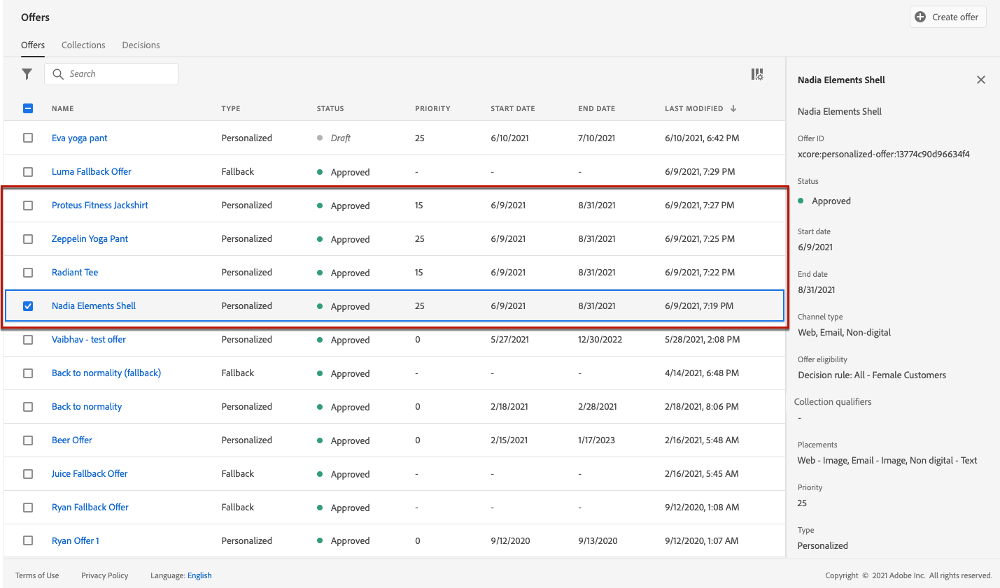

# Caso de uso: configurar ofertas personalizadas para usá-las em um email {#configure-add-personalized-offers-email}

Esta seção apresenta um exemplo completo para mostrar como configurar ofertas e usá-las em um email, com base em uma decisão criada anteriormente.

## Etapas principais {#main-steps}

As principais etapas para configurar ofertas, incluí-las em uma decisão e aproveitar essa decisão em um email estão listadas abaixo:

1. Antes de criar ofertas, [definir seus componentes](#define-components)

   * Criar inserções
   * Criar regras de decisão
   * Criar tags
   * Criar classificações (opcional)

1. [Configurar as ofertas](#configure-offers)

   * Criar ofertas
   * Para cada oferta:

      * Crie representações e selecione uma disposição e um ativo para cada representação
      * Adicionar uma regra para cada oferta
      * Definir uma prioridade para cada oferta

1. [Criar uma oferta substituta](#create-fallback)

1. [Criar uma coleção](#create-collection) para incluir as ofertas personalizadas que você criou

1. [Configure a decisão](#configure-decision)

   * Criar uma decisão
   * Selecione as disposições criadas
   * Para cada disposição, selecione a coleção
   * Para cada disposição, selecione uma classificação (opcional)
   * Selecione o fallback

1. [Inserir a decisão em um email](#insert-decision-in-email)

   * Selecione uma disposição correspondente às ofertas que deseja exibir
   * Selecione a decisão entre os itens compatíveis com a disposição selecionada
   * Visualizar suas ofertas

O processo geral de Gerenciamento de decisões para usar ofertas em um email pode ser descrito da seguinte maneira:

## Definir os componentes {#define-components}

Antes de começar a criar ofertas, você deve definir vários componentes que usará em suas ofertas.

Você os encontrará sob a **[!UICONTROL Decision Management]** > **[!UICONTROL Components menu]**.

1. Comece criando **disposições** para suas ofertas.

   Você usará essas disposições para definir onde a oferta resultante será exibida ao definir sua decisão de oferta.

   Neste exemplo, crie três disposições com os seguintes tipos de canal e conteúdo:

   * *Web - Imagem*
   * *Email - Imagem*
   * *Não digital - Texto*

   

   As etapas detalhadas para criar disposições estão descritas em [esta seção](../../using/offers/offer-library/creating-placements.md).

1. Criar **regras de decisão**.

   As regras de decisão fornecerão a melhor oferta a um perfil no Adobe Experience Platform.

   Configure duas regras simples usando o **[!UICONTROL XDM Individual Profile > Person > Gender]** atributo:

   * *Clientes do sexo feminino*
   * *Clientes masculinos*

   

   As etapas detalhadas para criar regras estão descritas em [esta seção](../../using/offers/offer-library/creating-decision-rules.md).

1. Você também pode criar um **tag**.

   Você poderá associá-lo às suas ofertas e usar essa tag para agrupar suas ofertas em uma coleção.

   Neste exemplo, crie a *Yoga* .

   

   As etapas detalhadas para criar tags são descritas em [esta seção](../../using/offers/offer-library/creating-tags.md).

1. Se você quiser definir regras que determinam qual oferta deve ser apresentada primeiro para uma determinada disposição (em vez de considerar as pontuações de prioridade das ofertas), poderá criar um **fórmula de classificação**.

   As etapas detalhadas para criar fórmulas de classificação são descritas em [esta seção](../../using/offers/ranking/create-ranking-formulas.md#create-ranking-formula).

   >[!NOTE]
   >
   >Neste exemplo, usaremos apenas as pontuações de prioridade. Saiba mais sobre [regras e restrições de qualificação](../../using/offers/offer-library/creating-personalized-offers.md#eligibility).

## Configurar ofertas {#configure-offers}

Agora você pode criar e configurar suas ofertas. Neste exemplo, você criará quatro ofertas que deseja exibir de acordo com cada perfil específico.

1. Criar uma oferta. Saiba mais [nesta seção](../../using/offers/offer-library/creating-personalized-offers.md#create-offer).

1. Nesta oferta, crie três representações. Cada representação deve ser uma combinação de uma disposição criada anteriormente com um ativo:

   * Um correspondente ao *Web - Imagem* placement
   * Um correspondente ao *Email - Imagem* placement
   * Um correspondente ao *Não digital - Texto* placement

   >[!NOTE]
   >
   >Uma oferta pode ser exibida em diferentes lugares em uma mensagem para criar mais oportunidades para usar a oferta em diferentes contextos de posicionamento.

   Saiba mais sobre representações em [esta seção](../../using/offers/offer-library/creating-personalized-offers.md#representations).

1. Selecione uma imagem apropriada para as duas primeiras disposições. Insira texto personalizado para a *Não digital - Texto* posicionamento.

   

1. No **[!UICONTROL Offer eligibility]** seção , selecione **[!UICONTROL By defined decision rule]** e arraste e solte a regra de sua escolha.

   

1. Preencha o **[!UICONTROL Priority]**. Neste exemplo, adicione *25.*.

1. Revise sua oferta e clique em **[!UICONTROL Save and approve]**.

   

1. Neste exemplo, crie mais três ofertas com as mesmas representações, mas com ativos diferentes. Atribua a elas diferentes regras e prioridades, como:

   * Primeira oferta - Regra de decisão: *Clientes do sexo feminino*, Prioridade: *25.*
   * Segunda oferta - Regra de decisão: *Clientes do sexo feminino*, Prioridade: *15.*
   * Terceira oferta - Regra de decisão: *Clientes masculinos*, Prioridade: *25.*
   * Quarta oferta - Regra de decisão: *Clientes masculinos*, Prioridade: *15.*

   

As etapas detalhadas para criar e configurar ofertas são descritas em [esta seção](../../using/offers/offer-library/creating-personalized-offers.md).

## Criar uma oferta substituta {#create-fallback}

1. Criar uma oferta substituta.

1. Defina as mesmas representações que para as ofertas, com os ativos apropriados (eles devem ser diferentes dos usados nas ofertas).

   Cada representação deve ser uma combinação de uma disposição criada anteriormente com um ativo:

   * Um correspondente ao *Web - Imagem* placement
   * Um correspondente ao *Email - Imagem* placement
   * Um correspondente ao *Não digital - Texto* placement

   

1. Revise sua oferta de fallback e clique em **[!UICONTROL Save and approve]**.

Sua oferta de fallback agora está pronta para ser usada em uma decisão.

As etapas detalhadas para criar e configurar uma oferta de fallback estão descritas em [esta seção](../../using/offers/offer-library/creating-fallback-offers.md).

## Criar uma coleção {#create-collection}

Ao configurar a decisão, será necessário adicionar as ofertas personalizadas como parte de uma coleção.

1. Para acelerar o processo de decisão, crie uma coleção dinâmica.

1. Use o *Yoga* para selecionar as quatro ofertas personalizadas que você criou anteriormente.

   

As etapas detalhadas para criar uma coleção são descritas em [esta seção](../../using/offers/offer-library/creating-collections.md).

## Configure a decisão {#configure-decision}

Agora, você deve criar uma decisão que combine disposições com as ofertas personalizadas e a oferta de fallback que acabou de criar.

Essa combinação será usada pelo mecanismo de decisão para encontrar a melhor oferta para um perfil específico: neste exemplo, ele será baseado na prioridade e na regra de decisão atribuídas a cada oferta.

Para criar e configurar uma decisão de oferta, siga as principais etapas abaixo:

1. Criar uma decisão. Saiba mais [nesta seção](../../using/offers/offer-activities/create-offer-activities.md#create-activity).

1. Selecione o *Web - Imagem*, *Email - Imagem* e *Não digital - Texto* disposições.

   

1. Para cada disposição, adicione a coleção que você criou.

   

1. Se você definiu uma classificação ao [criar seus componentes](#define-components), é possível atribuí-lo a uma disposição na decisão. Se várias ofertas estiverem qualificadas para serem apresentadas nesta disposição, a decisão usará essa fórmula para calcular qual oferta entregar primeiro.

   As etapas detalhadas para atribuir uma fórmula de classificação a uma disposição estão descritas em [esta seção](../../using/offers/offer-activities/configure-offer-selection.md#assign-ranking-formula).

1. Selecione a oferta de fallback que você criou. Ele será exibido como uma oferta de fallback disponível para as três disposições selecionadas.

   

1. Revise sua decisão e clique em **[!UICONTROL Save and approve]**.

   

Sua decisão agora está pronta para ser usada para fornecer ofertas otimizadas e personalizadas.

As etapas detalhadas para criar e configurar uma decisão estão descritas em [esta seção](../../using/offers/offer-activities/create-offer-activities.md).

## Inserir a decisão em um email {#insert-decision-in-email}

Agora que sua decisão está em execução, você pode inseri-la em uma mensagem de email. Para fazer isso, siga as etapas detalhadas em [esta página](../../using/design/deliver-personalized-offers.md).

