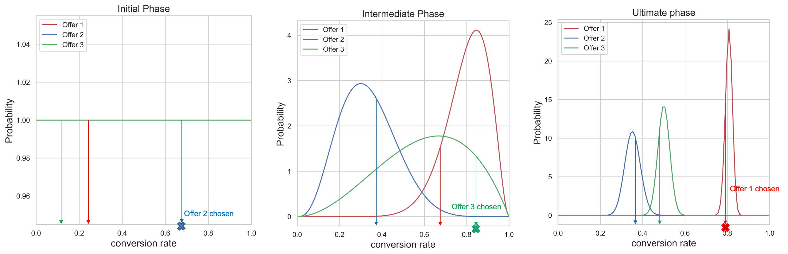

# Modelos de otimização automática {#auto-optimization-model}

Um modelo de otimização automática visa fornecer ofertas que maximizam o retorno (KPIs) definido pelos clientes empresariais. Esses KPIs podem estar na forma de taxas de conversão, receita etc. Nesse ponto, a Otimização automática se concentra na otimização de cliques na oferta com a conversão de oferta como destino. A otimização automática não é personalizada e é otimizada com base no desempenho &quot;global&quot; das ofertas.

## Limitações {#limitations}

O uso de modelos de otimização automática para a gestão de decisões está sujeito às limitações abaixo:

* Os modelos de otimização automática não funcionam com a API de decisão em lote.
* O feedback necessário para criar o modelo deve ser enviado como um evento de experiência. Ele não deve ser enviado automaticamente no [!DNL Journey Optimizer] canais.

## Terminologia {#terminology}

Os termos a seguir são úteis ao discutir a Otimização automática:

* **Multi-armed bandit**: A [multi-armed bandit](https://en.wikipedia.org/wiki/Multi-armed_bandit){target="_blank"} abordagem à otimização equilibra a aprendizagem exploratória e a exploração dessa aprendizagem.

* **Thomson sampling**: a Amostragem de Thompson é um algoritmo para problemas de decisão online em que as ações são tomadas sequencialmente de uma maneira que deve equilibrar entre explorar o que é conhecido por maximizar o desempenho imediato e investir para acumular novas informações que podem melhorar o desempenho futuro. [Saiba mais](#thompson-sampling)

* [**Distribuição beta**](https://en.wikipedia.org/wiki/Beta_distribution){target="_blank"}: Set of continuous [probability distributions](https://en.wikipedia.org/wiki/Probability_distribution){target="_blank"} defined on the interval [0, 1] [parameterized](https://en.wikipedia.org/wiki/Statistical_parameter){target="_blank"} by two positive [shape parameters](https://en.wikipedia.org/wiki/Shape_parameter){target="_blank"}.

## Amostragem de Thompson {#thompson-sampling}

O algoritmo subjacente à Otimização automática é **Amostragem de Thompson**. Nesta seção, discutimos a intuição por trás da Amostragem de Thompson.

[Amostragem de Thompson](https://en.wikipedia.org/wiki/Thompson_sampling){target="_blank"}, ou bandidos Bayesianos, é uma abordagem Bayesiana para o problema do bandido multi-armado.  A ideia básica é tratar a média de recompensa? de cada oferta como uma **variável aleatória** e usar os dados que coletamos até agora, para atualizar nossa &quot;crença&quot; sobre a recompensa média. Esta &quot;crença&quot; é representada matematicamente por um **distribuição de probabilidade posterior** - essencialmente um intervalo de valores para a recompensa média, juntamente com a plausibilidade (ou probabilidade) de que a recompensa tem esse valor para cada oferta. Então, para cada decisão, nós **exemplificar um ponto de cada uma dessas distribuições de recompensa posteriores** e selecione a oferta cuja amostra de recompensa teve o valor mais alto.

Esse processo é ilustrado na figura abaixo, onde temos 3 ofertas diferentes. Inicialmente, não temos nenhuma evidência dos dados e assumimos que todas as ofertas têm uma distribuição de recompensa posterior uniforme. Tiramos uma amostra da distribuição de recompensa posterior de cada oferta. A amostra selecionada na distribuição da Oferta 2 tem o valor mais alto. Este é um exemplo de **exploração**. Depois de mostrar a Oferta 2, coletamos qualquer recompensa potencial (por exemplo, conversão/sem conversão) e atualizamos a distribuição posterior da Oferta 2 usando o Teorema de Bayes como explicado abaixo.  Continuamos esse processo e atualizamos as distribuições posteriores sempre que uma oferta é exibida e a recompensa é coletada. Na segunda figura, a Oferta 3 é selecionada - apesar de a Oferta 1 ter a maior recompensa média (sua distribuição de recompensa posterior é a mais à direita), o processo de amostragem de cada distribuição levou-nos a escolher uma Oferta 3 aparentemente abaixo do ideal. Ao fazer isso, oferecemos a nós mesmos a oportunidade de saber mais sobre a verdadeira distribuição de recompensas da Oferta 3.

À medida que mais amostras são coletadas, a confiança aumenta e uma estimativa mais precisa da possível recompensa é obtida (correspondendo a distribuições de recompensa mais estreitas). Esse processo de atualização de nossas crenças à medida que mais evidências se tornam disponíveis é conhecido como **Inferência bayesiana**.

Eventualmente, se uma oferta (por exemplo, Oferta 1) for um vencedor claro, sua distribuição de recompensa posterior será separada das outras. Neste ponto, para cada decisão, a recompensa amostrada da Oferta 1 provavelmente será a mais alta, e nós a escolheremos com uma probabilidade mais alta. Isso é **exploração** - acreditamos que a Oferta 1 é a melhor e, portanto, está sendo escolhida para maximizar as recompensas.

**Figura 1**: *Para cada decisão, tiramos amostras de um ponto das distribuições posteriores da recompensa. A oferta com o valor de amostra mais alto (taxa de conversão) será escolhida. Na fase inicial, todas as ofertas têm distribuição uniforme, já que não temos nenhuma evidência sobre as taxas de conversão das ofertas com base nos dados. À medida que coletamos mais amostras, as distribuições posteriores ficam mais estreitas e precisas. Por fim, a oferta com a maior taxa de conversão será escolhida sempre.*

<!--

-->

+++**Detalhes técnicos**

Para calcular/atualizar distribuições, usamos **Teorema de Bayes**. Para cada oferta ***i***, queremos calcular os ***P(??i | dados)***, ou seja, para cada oferta ***i***, a probabilidade de um valor de recompensa **??i** é, dados os dados que coletamos até agora para essa oferta.

A partir do Teorema de Bayes:

***Posterior = Probabilidade * Anterior***

A variável **probabilidade anterior** é a estimativa inicial sobre a probabilidade de produzir uma saída. A probabilidade, após a coleta de algumas evidências, é conhecida como a **probabilidade posterior**. 

A otimização automática foi projetada para considerar recompensas binárias (clique/sem clique). Nesse caso, a probabilidade representa o número de sucessos de N tentativas e é modelada por um **Distribuição binomial**. Para algumas funções verossímeis, se você escolher um determinado anterior, o posterior acaba ficando na mesma distribuição que o anterior. Tal prévia então é chamada de **conjugar antes**. Esse tipo de análise prévia torna muito simples o cálculo da distribuição posterior. A variável **Distribuição beta** é um conjugado antes da probabilidade binomial (recompensas binárias), e por isso é uma escolha conveniente e sensata para as distribuições de probabilidade anterior e posterior. A distribuição Beta leva dois parâmetros, ***α*** e ***β***. Esses parâmetros podem ser considerados como a contagem de sucessos e falhas e o valor médio fornecido por:

A função Probabilidade, como explicamos acima, é modelada por uma distribuição binomial, com s sucessos (conversões) e f falhas (sem conversões) e q é um [variável aleatória](https://en.wikipedia.org/wiki/Random_variable){target="_blank"} with a [beta distribution](https://en.wikipedia.org/wiki/Beta_distribution){target="_blank"}.

O anterior é modelado por distribuição beta e a distribuição posterior tem a seguinte forma:

A posterior é calculada simplesmente adicionando o número de sucessos e falhas aos parâmetros existentes ***α***, ***β***.

Para otimização automática, como mostrado no exemplo acima, começamos com uma distribuição anterior ***Beta( 1, 1)*** (distribuição uniforme) para todas as ofertas e depois de obter os sucessos e as falhas para uma determinada oferta, a posterior se torna uma distribuição beta com parâmetros ***(s+α, f+β)*** para essa oferta.
+++

**Tópicos relacionados**:

Para aprofundar a amostragem de Thompson, leia os seguintes artigos de pesquisa:
* [Uma avaliação empírica da Amostragem de Thompson](https://proceedings.neurips.cc/paper/2011/file/e53a0a2978c28872a4505bdb51db06dc-Paper.pdf){target="_blank"}
* [Análise da Amostragem de Thompson para o problema do Multi-armed Bandit](http://proceedings.mlr.press/v23/agrawal12/agrawal12.pdf){target="_blank"}

## Problema de arranque a frio {#cold-start}

O problema de &quot;inicialização imediata&quot; ocorre quando uma nova oferta é adicionada a uma campanha e não há dados disponíveis sobre a taxa de conversão da nova oferta. Durante esse período, temos que criar uma estratégia com relação à frequência com que essa nova oferta é escolhida para que a queda de desempenho seja minimizada, enquanto coletamos informações sobre a taxa de conversão dessa nova oferta. Há várias soluções disponíveis para resolver esse problema. O segredo é encontrar um equilíbrio entre a exploração dessa nova oferta enquanto não sacrificamos muito a exploração. Atualmente, usamos &quot;distribuição uniforme&quot; como nossa suposição inicial sobre a taxa de conversão da nova oferta (distribuição anterior). Basicamente, damos a todos os valores de taxa de conversão probabilidade igual de ocorrência.

**Figura 2**: *Considere uma campanha com 3 ofertas. Enquanto a campanha está ativa, a Oferta 4 é adicionada à campanha. Inicialmente, não temos dados sobre a taxa de conversão da Oferta 4 e temos que lidar com o problema de inicialização a frio. Usamos a distribuição uniforme como nossa estimativa inicial sobre a taxa de conversão da Oferta 4, enquanto coletamos dados para essa nova oferta. Tal como explicado no [Amostragem de Thompson](#thompson-sampling) seção, para escolher qual oferta será exibida a um usuário, coletamos amostras de pontos das distribuições posteriores de recompensas das ofertas e selecionamos a oferta com o maior valor de amostra. No exemplo acima, Offer 4 é escolhida e, posteriormente, com base na recompensa coletada, a distribuição posterior dessa oferta é atualizada, conforme explicado na [Amostragem de Thompson](#thompson-sampling) seção.*

## Medição de aumento {#lift}

&quot;Aumento&quot; é a métrica usada para medir o desempenho de qualquer estratégia implantada no serviço de classificação, em comparação com a estratégia da linha de base (apresentando ofertas apenas aleatoriamente).

Por exemplo, se estivermos interessados em medir o desempenho de uma estratégia de Thompson Sampling (TS) usada no serviço de classificação, e o KPI for taxa de conversão (CVR), o &quot;aumento&quot; da estratégia de TS em relação à estratégia de linha de base é definido como:

