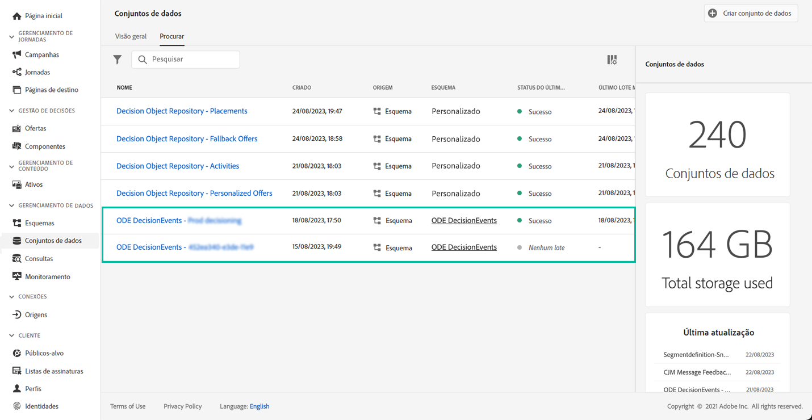

# Introdução aos eventos de Gerenciamento de decisão {#monitor-offer-events}

Sempre que o Gerenciamento de decisões tomar um determinado perfil, as informações relacionadas a esses eventos são automaticamente enviadas para a Adobe Experience Platform.

Isso permite exportar esses dados para analisá-los no seu próprio sistema de relatórios. Você também pode aproveitar o Adobe Experience Platform [Query Service](https://experienceleague.adobe.com/docs/experience-platform/query/home.html?lang=pt-BR) em combinação com outras ferramentas para fins de análise e relatório aprimorados.

Os conjuntos de dados que contêm eventos de Gerenciamento de decisões são acessíveis no Adobe Experience Platform **[!UICONTROL Datasets]** menu. Um conjunto de dados é criado automaticamente no provisionamento para cada uma de suas instâncias.

Esses conjuntos de dados são baseados na variável **[!UICONTROL ODE DecisionEvents]** , que contém todos os campos XDM necessários para enviar informações do Gerenciamento de decisão para a Adobe Experience Platform.

>[!NOTE]
>
>Observe que os conjuntos de dados do ODE DecisionEvents são **conjuntos de dados que não são de perfil**, o que significa que eles não podem ser assimilados no Experience Platform para uso pelo perfil do cliente em tempo real.

**Tópicos relacionados:**

* [Informações-chave sobre eventos do Gerenciamento de decisão](../reports/key-information.md)
* [Acessar campos XDM de eventos](../reports/xdm-fields.md)
