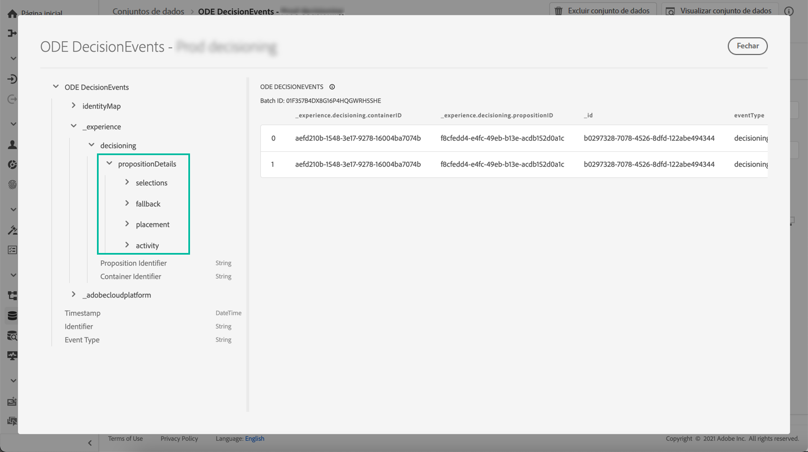

# Introdução aos eventos da Gestão de decisões {#monitor-offer-events}

Sempre que o Gerenciamento de decisões tomar um determinado perfil, as informações relacionadas a esses eventos são automaticamente enviadas para a Adobe Experience Platform.

Isso permite obter insights sobre suas decisões, por exemplo, para saber qual oferta foi apresentada a um determinado perfil. Você pode exportar esses dados para analisá-los em seu próprio sistema de relatórios ou aproveitar o Adobe Experience Platform [Serviço de query](https://experienceleague.adobe.com/docs/experience-platform/query/home.html?lang=pt-BR) em combinação com outras ferramentas para efeitos de análise e de informação melhorados.

## Informações-chave disponíveis em conjuntos de dados {#key-information}

Cada evento enviado quando uma decisão é tomada contém quatro pontos de dados principais que podem ser aproveitados para fins de análise e relatórios:

* **[!UICONTROL Fallback]**: Nome e ID da oferta de fallback, se nenhuma oferta personalizada foi selecionada,
* **[!UICONTROL Posicionamento]**: Nome, ID e canal da disposição usada para entregar a oferta,
* **[!UICONTROL Seleções]**: Nome e ID da oferta selecionada para o perfil,
* **[!UICONTROL Atividade]**: Nome e ID da decisão.

Além disso, você também pode aproveitar a **[!UICONTROL identityMap]** e **[!UICONTROL Carimbo de data e hora]** para recuperar informações sobre o perfil e a hora em que a oferta foi entregue.

Para obter mais informações sobre todos os campos XDM enviados com cada decisão, consulte [esta seção](xdm-fields.md).

## Acessar conjuntos de dados {#access-datasets}

Os conjuntos de dados que contêm eventos de Gerenciamento de decisões são acessíveis no Adobe Experience Platform **[!UICONTROL Conjuntos de dados]** menu. Um conjunto de dados é criado automaticamente no provisionamento para cada uma de suas instâncias.

Esses conjuntos de dados são baseados na variável **[!UICONTROL Eventos de decisão do ODE]** , que contém todos os campos XDM necessários para enviar informações do Gerenciamento de decisão para a Adobe Experience Platform.

>[!NOTE]
>
>Observe que os conjuntos de dados do ODE DecisionEvents são **conjuntos de dados que não são de perfil**, o que significa que eles não podem ser assimilados no Experience Platform para uso pelo perfil do cliente em tempo real.
