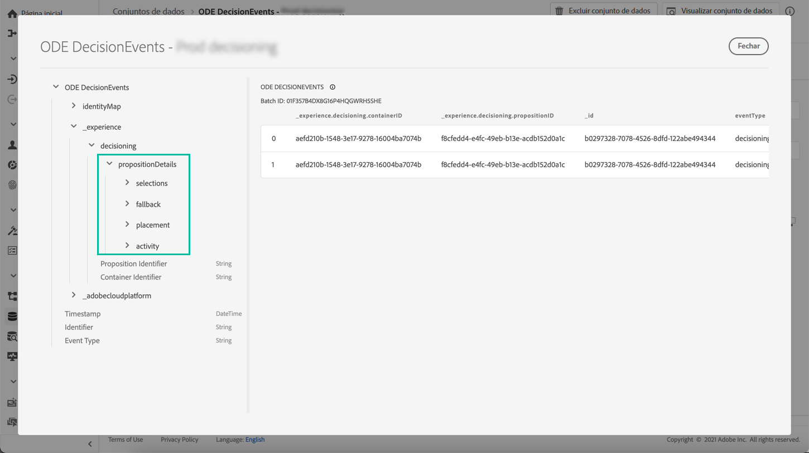
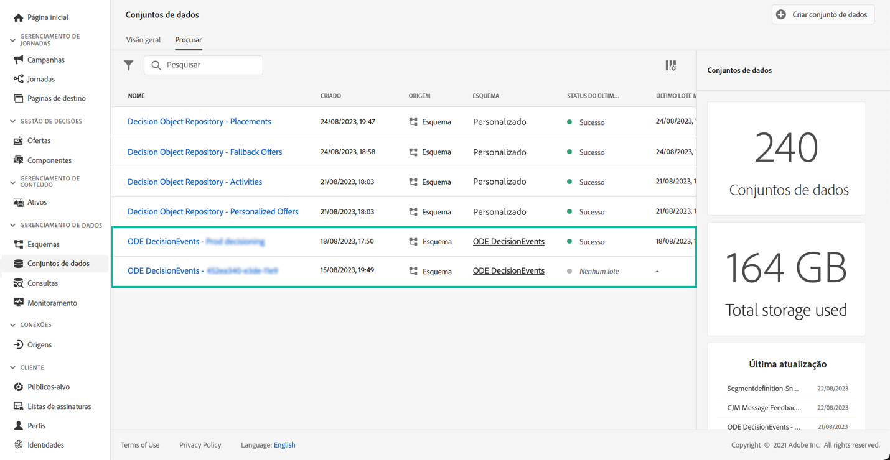

# Introdução aos eventos de Gestão de decisões {#monitor-offer-events}

>[!TIP]
>
>O serviço de Decisão, o novo recurso de tomada de decisão do [!DNL Adobe Journey Optimizer], agora está disponível por meio da experiência baseada em código e dos canais de email. [Saiba mais](../../experience-decisioning/gs-experience-decisioning.md)

Cada vez que a Gestão de decisões toma uma decisão para determinado perfil, as informações relacionadas a esses eventos são automaticamente enviadas para a Adobe Experience Platform.

Isso permite obter insights sobre suas decisões, por exemplo, para saber qual oferta foi apresentada a um determinado perfil. É possível exportar esses dados para analisá-los em seu próprio sistema de relatórios ou aproveitar o [serviço de consultas](https://experienceleague.adobe.com/docs/experience-platform/query/home.html?lang=pt-BR) da Adobe Experience Platform em combinação com outras ferramentas para aprimorar a análise e os relatórios.

## Informações importantes disponíveis em conjuntos de dados {#key-information}

Cada evento enviado quando uma decisão é tomada contém quatro pontos de dados principais que podem ser aproveitados para fins de análise e relatórios:

* **[!UICONTROL Substituta]**: nome e ID da oferta substituta, se nenhuma oferta personalizada foi selecionada,
* **[!UICONTROL Posicionamento]**: nome, ID e canal do posicionamento usado para entregar a oferta,
* **[!UICONTROL Seleções]**: nome e ID da oferta selecionada para o perfil,
* **[!UICONTROL Atividade]**: nome e ID da decisão.

Além disso, também é possível aproveitar os campos **[!UICONTROL identityMap]** e **[!UICONTROL Carimbo de data e hora]** para recuperar informações sobre o perfil e a hora na qual a oferta foi entregue.

Para obter mais informações sobre todos os campos XDM enviados com cada decisão, consulte [esta seção](xdm-fields.md).

## Acessar conjuntos de dados {#access-datasets}

Os conjuntos de dados contendo eventos da Gestão de decisões podem ser acessados no menu **[!UICONTROL Conjuntos de dados]** da Adobe Experience Platform. Um conjunto de dados é criado automaticamente no provisionamento para cada uma de suas instâncias.

Esses conjuntos de dados são baseados no esquema **[!UICONTROL ODE DecisionEvents]** que contém todos os campos XDM necessários para enviar informações da Gestão de decisões para a Adobe Experience Platform.

>[!NOTE]
>
>Observe que os conjuntos de dados do ODE DecisionEvents são **conjuntos de dados que não são de perfil**, o que significa que eles não podem ser assimilados na Experience Platform para serem usados pelo perfil do cliente em tempo real.
