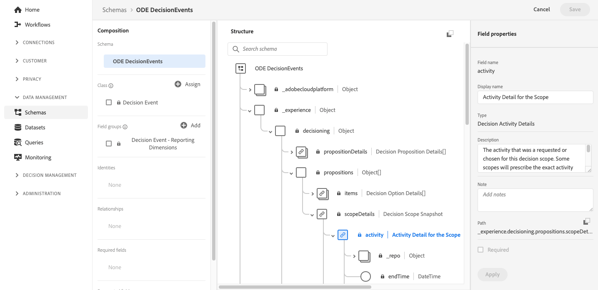

# Acessar campos XDM de eventos {#decisioningevents-xdm-schema}

Você pode acessar o esquema XDM DecisioningEvents diretamente de um conjunto de dados que contém eventos de Gerenciamento de decisão.

O schema contém todos os campos necessários para enviar informações do Gerenciamento de decisões para o Adobe Experience Platform.

Para obter mais informações sobre um campo específico, selecione-o para exibir um painel de informações com as propriedades do campo.

Informações detalhadas sobre como trabalhar com esquemas e campos XDM estão disponíveis na documentação do Experience Data Model:

* [Visão geral do sistema XDM](https://experienceleague.adobe.com/docs/experience-platform/xdm/home.html?lang=pt-BR)
* [Explorar recursos do XDM](https://experienceleague.adobe.com/docs/experience-platform/xdm/ui/explore.html?lang=pt-BR)
