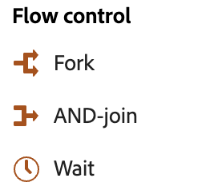

# Sobre atividades de campanha orquestradas {#orchestrated-campaign-activities}

As atividades da campanha orquestrada são agrupadas em três categorias. Dependendo do contexto, as atividades disponíveis podem ser diferentes.

Todas as atividades estão detalhadas nas seções abaixo:

* [Atividades de direcionamento](#targeting)
* [Atividades do canal](#channel)
* [Atividades de controle do fluxo](#flow-control)

{width="80%" align="left"}

>[!NOTE]
>
>Dependendo do modelo de licenciamento, das permissões e da implementação, as atividades disponíveis podem ser diferentes.

## Medidas de proteção e limitações {#activity-guardrails}

* **Limite de atividades do canal** - Uma campanha Orquestrada oferece suporte a no máximo 10 atividades de canal em publicação (Email, SMS, Push ou Correspondência direta). O direcionamento e as atividades de controle de fluxo não contam para esse limite.

* **Limite de atividades da tela** - O número de atividades na tela é limitado a 500. Para manutenção e desempenho, mantenha os workflows abaixo de 100 atividades na prática.

Consulte [Medidas de proteção e limitações](../guardrails.md) para todas as medidas de proteção e limitações de campanhas orquestradas.

## Atividades de direcionamento {#targeting}

Estas atividades são especificamente para direcionamento. Elas permitem criar uma ou mais direções definindo um público-alvo e dividindo ou combinando esses públicos-alvo usando operações de interseção, união ou exclusão.

{width="40%" align="left"}

As atividades de direcionamento disponíveis são:

* [Criar público-alvo](build-audience.md): defina a sua população-alvo. Você pode selecionar um público-alvo existente ou usar o criador de regras para definir sua própria consulta.
* [Alterar dimensão](change-dimension.md): altere a targeting dimension enquanto você estiver criando sua campanha Orquestrada.
* [Combinar](combine.md): aplique uma segmentação à sua população de entrada. Você pode usar uma união, uma interseção ou uma exclusão.
* [Desduplicação](deduplication.md): exclua duplicatas no(s) resultado(s) das atividades de entrada.
* [Enriquecimento](enrichment.md): definir dados adicionais para processar em sua campanha Orquestrada. Com essa atividade, você pode aproveitar a transição de entrada e configurar a atividade para concluir a transição de saída com dados adicionais.
* [Reconciliação](reconciliation.md): defina o vínculo entre os dados do Journey Optimizer e os dados de uma tabela de trabalho, como, por exemplo, dados carregados de um arquivo externo.
* [Divisão](split.md): segmente a população de entrada em vários subconjuntos.

## Atividades do canal {#channel}

O Adobe Journey Optimizer permite automatizar e executar campanhas de marketing em diversos canais. Você pode combinar [atividades de canal](channels.md) na tela para criar uma campanha Orquestrada entre canais que pode acionar ações com base no comportamento do cliente.

Saiba como [criar uma ação de canal em uma campanha orquestrada](channels.md).

## Atividades de controle do fluxo {#flow-control}

>[!CONTEXTUALHELP]
>id="ajo_orchestration_end"
>title="Atividade de término"
>abstract="A atividade **End** marca o fim de uma ramificação na tela. Opcionalmente, use **Sinal externo** para iniciar uma campanha orquestrada downstream e transmitir parâmetros quando a ramificação for concluída. [Saiba mais](../trigger-orchestrated-campaign.md#signal-end)"

>[!CONTEXTUALHELP]
>id="ajo_orchestration_signal"
>title="Sinal externo"
>abstract="Selecione a campanha orquestrada downstream para começar quando esta ramificação terminar e mapeie os nomes e valores dos parâmetros para enviar no sinal. A campanha downstream deve ser definida como **Acionada por um sinal** e publicada antes que esta campanha atinja a atividade End. [Saiba mais](../trigger-orchestrated-campaign.md#signal-end)"

As atividades a seguir são específicas para organizar e executar campanhas orquestradas. Sua principal tarefa é coordenar as outras atividades.

{width="20%" align="left"}

As atividades de controle de fluxo disponíveis são:

* [And-join](and-join.md): sincroniza várias ramificações de execução de uma campanha Orquestrada.
* [Bifurcação](fork.md): crie transições de saída para iniciar várias atividades ao mesmo tempo.
* [Aguardar](wait.md): pausar momentaneamente a execução de uma parte de uma campanha Orquestrada.
  <!--* [Test](test.md): Enable transitions based on specified conditions.-->

* **[!UICONTROL Fim]**: marca o fim de uma ramificação na tela. Opcionalmente, é possível usá-lo para enviar um sinal para outra campanha Orquestrada que começa em um sinal. [Saiba mais](../trigger-orchestrated-campaign.md#signal-end)
