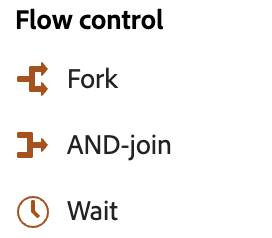

# Sobre atividades da campanha orquestrada {#orchestrated-campaign-activities}

+++ Sumário

| Bem-vindo às campanhas orquestradas | Lançar a primeira campanha orquestrada | Consultar o banco de dados | Atividades de campanhas orquestradas |
|---|---|---|---|
| [Introdução a campanhas orquestradas](../gs-orchestrated-campaigns.md)  [Etapas de configuração](../configuration-steps.md)  [Acessar e gerenciar campanhas orquestradas](../access-manage-orchestrated-campaigns.md) | [Etapas principais para a criação de campanha orquestrada](../gs-campaign-creation.md)  [Criar e agendar a campanha](../create-orchestrated-campaign.md)  [Orquestrar atividades](../orchestrate-activities.md)  [Iniciar e monitorar a campanha](../start-monitor-campaigns.md)  [Relatórios](../reporting-campaigns.md) | [Trabalhar com o construtor de regras](../orchestrated-rule-builder.md)  [Criar a primeira consulta](../build-query.md)  [Editar expressões](../edit-expressions.md)  [Redirecionamento](../retarget.md) | <b>[Introdução às atividades](about-activities.md)</b>  Atividades: [And-join](and-join.md) - [Criar público](build-audience.md) - [Alterar dimensão](change-dimension.md) - [Atividades de canal](channels.md) - [Combinar](combine.md) - [Desduplicação](deduplication.md) - [Enriquecimento](enrichment.md) - [Bifurcação](fork.md) - [Reconciliação](reconciliation.md) - [Salvar público](save-audience.md) - [Divisão](split.md) - [Espera](wait.md) |

{style="table-layout:fixed"}

+++

 

As atividades de campanha orquestradas são agrupadas em três categorias. Dependendo do contexto, as atividades disponíveis podem ser diferentes.

Todas as atividades estão detalhadas nas seções abaixo:

* [Atividades de direcionamento](#targeting)
* [Atividades do canal](#channel)
* [Atividades de controle de fluxo](#flow-control)

{width="80%" align="left"}

## Atividades de direcionamento {#targeting}

Essas atividades são específicas para direcionamento. Elas permitem criar uma ou mais direções definindo um público-alvo e dividindo ou combinando esses públicos-alvo usando operações de interseção, união ou exclusão.

{width="40%" align="left"}

* [Criar público-alvo](build-audience.md): defina sua população de destino. Você pode selecionar um público existente ou usar o modelador de consultas para definir sua própria consulta.
* [Alterar dimensão](change-dimension.md): altere a targeting dimension enquanto você estiver criando sua campanha orquestrada.
* [Combinar](combine.md): executar segmentação na população de entrada. Você pode usar uma união, uma interseção ou uma exclusão.
* [Desduplicação](deduplication.md): excluir duplicados no(s) resultado(s) das atividades de entrada.
* [Enriquecimento](enrichment.md): defina dados adicionais para processar em sua campanha orquestrada. Com essa atividade, você pode aproveitar a transição de entrada e configurar a atividade para concluir a transição de saída com dados adicionais.
* [Reconciliação](reconciliation.md): defina o vínculo entre os dados nos dados do Journey Optimizer e os dados em uma tabela de trabalho, por exemplo, dados carregados de um arquivo externo.
* [Split](split.md): segmente a população de entrada em vários subconjuntos.

## Atividades do canal {#channel}

O Adobe Journey Optimizer permite automatizar e executar campanhas de marketing em vários canais. Você pode combinar atividades de canal na tela para criar uma campanha orquestrada entre canais que pode acionar ações com base no comportamento do cliente. As seguintes atividades do **Canal** estão disponíveis: Email e SMS. [Saiba como criar uma ação de canal no contexto de uma campanha orquestrada](channels.md).

## Atividades de controle de fluxo {#flow-control}

>[!CONTEXTUALHELP]
>id="ajo_orchestration_end"
>title="Atividade de término"
>abstract="A Atividade de **término** permite marcar graficamente o fim de uma campanha orquestrada. Essa atividade não tem impacto funcional e, portanto, é opcional."

{width="30%" align="left"}

As atividades a seguir são específicas para organizar e executar campanhas orquestradas. Sua principal tarefa é coordenar as outras atividades:

* [And-join](and-join.md): sincroniza várias ramificações de execução de uma campanha orquestrada.
* [Bifurcação](fork.md): crie transições de saída para iniciar várias atividades ao mesmo tempo.
* [Aguardar](wait.md): pausar momentaneamente a execução de uma parte de uma campanha orquestrada.
  <!--* [Test](test.md): Enable transitions based on specified conditions.-->

>[!NOTE]
>A atividade **End** marca graficamente o fim de uma campanha orquestrada. Esta atividade não tem impacto funcional e, portanto, é opcional
