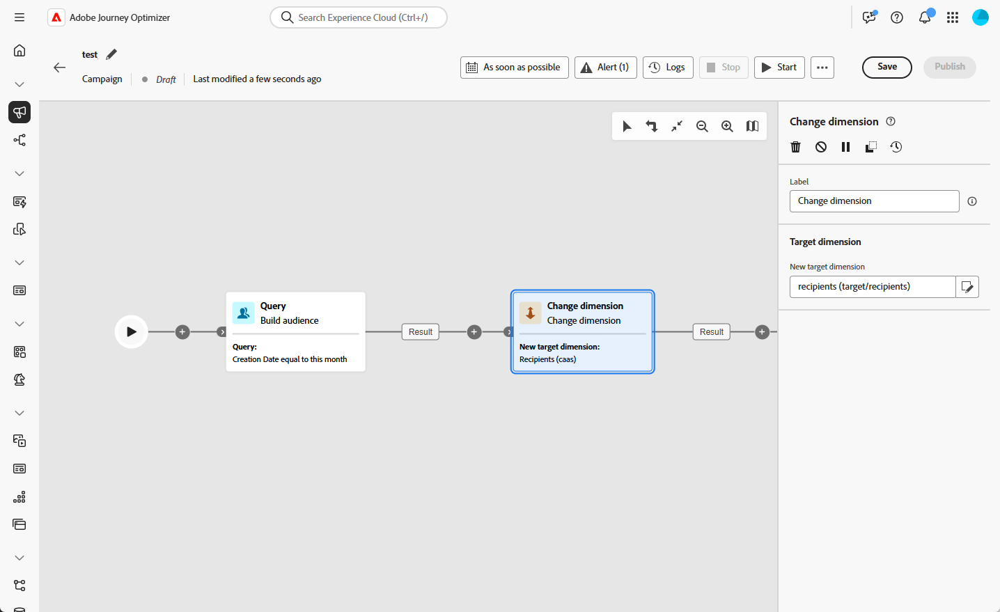

# Mudar dimensão {#change-dimension}

>[!CONTEXTUALHELP]
>id="ajo_orchestration_dimension_complement"
>title="Gerar um complemento"
>abstract="É possível gerar uma transição de saída adicional com a população restante, que foi excluída como uma duplicata. Para fazer isso, ative a opção **Gerar complemento**"

>[!CONTEXTUALHELP]
>id="ajo_orchestration_change_dimension"
>title="Atividade Mudar dimensão"
>abstract="Essa atividade permite alterar a dimensão de direcionamento à medida que você constrói um público-alvo. Ela desloca o eixo dependendo do modelo de dados e da dimensão de entrada. Por exemplo, você pode mudar da dimensão “contratos” para a dimensão “clientes”."

Como profissional de marketing, você pode aprimorar a segmentação de público mudando de uma entidade de dados para uma relacionada em uma campanha orquestrada. Isso permite ir além dos perfis de usuários e concentrar-se em comportamentos específicos, como compras, reservas ou outras interações.

Para isso, use a atividade **[!UICONTROL Mudar dimensão]**. Ele permite ajustar o targeting dimension durante a campanha Orquestrada.

<!--
>[!IMPORTANT]
>
>Please note that the **[!UICONTROL Change Dimension]** and **[!UICONTROL Change Data source]** activities should not be added in one row. If you need to use both activities consecutively, make sure you include an **[!UICONTROL Enrichement]** activity in between them. This ensures proper execution and prevents potential conflicts or errors.-->

## Configurar a atividade Mudar dimensão {#configure}

Siga estas etapas para configurar a atividade **[!UICONTROL Mudar dimensão]**:

1. Adicione uma atividade **[!UICONTROL Change dimension]** à sua campanha Orquestrada.

   

1. Defina a **[!UICONTROL Nova dimensão de público-alvo]**. Durante a mudança da dimensão, todos os registros são mantidos.

## Exemplo {#example}

Este caso de uso foca-se no envio de um SMS a perfis que criaram uma lista de desejos no mês passado.

Comece com uma atividade **[!UICONTROL Criar público-alvo]**, usando a dimensão de direcionamento **[!UICONTROL Lista de desejos]** para identificar todas as listas de desejos relevantes.

Em seguida, adicione uma atividade **[!UICONTROL Mudar dimensão]** para alternar a dimensão de direcionamento da **[!UICONTROL Lista de desejos]** para **[!UICONTROL Destinatário].** Essa etapa garante que a campanha Orquestrada segmente os perfis corretos vinculados a essas listas de desejos, permitindo que o SMS seja enviado aos perfis pretendidos.

