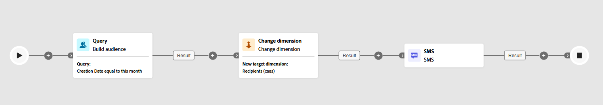

# Mudar dimensão {#change-dimension}

>[!CONTEXTUALHELP]
>id="ajo_orchestration_dimension_complement"
>title="Gerar um complemento"
>abstract="É possível gerar uma transição de saída adicional com a população restante, que foi excluída como uma duplicata. Para fazer isso, ative a opção **Gerar complemento**"

>[!CONTEXTUALHELP]
>id="ajo_orchestration_change_dimension"
>title="Atividade Mudar dimensão"
>abstract="Essa atividade permite alterar a dimensão de direcionamento à medida que você constrói um público-alvo. Ela desloca o eixo dependendo do modelo de dados e da dimensão de entrada. Por exemplo, você pode mudar da dimensão “contratos” para a dimensão “clientes”."

+++ Índice 

| Bem-vindo(a) às campanhas orquestradas | Lançar a sua primeira campanha orquestrada | Consultar o banco de dados | Atividades de campanhas orquestradas |
|---|---|---|---|
| [Introdução a campanhas orquestradas](../gs-orchestrated-campaigns.md)  Criar e gerenciar Esquemas e Conjuntos de Dados relacionais:  <ul><li>[Introdução a Esquemas e Conjuntos de Dados](../gs-schemas.md)</li><li>[Esquema manual](../manual-schema.md)</li><li>[Esquema de carregamento de arquivo](../file-upload-schema.md)</li><li>[Assimilar dados](../ingest-data.md)</li></ul>[Acessar e gerenciar campanhas orquestradas](../access-manage-orchestrated-campaigns.md) | [Etapas principais para criar uma campanha orquestrada](../gs-campaign-creation.md)  [Criar e programar a campanha](../create-orchestrated-campaign.md)  [Orquestrar atividades](../orchestrate-activities.md)  [Iniciar e monitorar a campanha](../start-monitor-campaigns.md)  [Geração de relatórios](../reporting-campaigns.md) | [Trabalhar com o construtor de regras](../orchestrated-rule-builder.md)  [Criar a sua primeira consulta](../build-query.md)  [Editar expressões](../edit-expressions.md)  [Redirecionamento](../retarget.md) | [Introdução às atividades](about-activities.md)  Atividades: [Associação](and-join.md) - [Criar público-alvo](build-audience.md) - <b>[Mudar dimensão](change-dimension.md)</b> - [Atividades de canal](channels.md) - [Combinar](combine.md) - [Desduplicação](deduplication.md) - [Enriquecimento](enrichment.md) - [Bifurcação](fork.md) - [Reconciliação](reconciliation.md) - [Salvar público-alvo](save-audience.md) - [Divisão](split.md) - [Aguardar](wait.md) |

{style="table-layout:fixed"}

+++

 

>[!BEGINSHADEBOX]

 

O conteúdo desta página não é final e pode estar sujeito a alterações.

>[!ENDSHADEBOX]

Como profissional de marketing, você pode aprimorar a segmentação de públicos-alvo, mudando de uma entidade de dados para uma entidade relacionada em uma campanha orquestrada. Isso permite ir além dos perfis de usuários e concentrar-se em comportamentos específicos, como compras, reservas ou outras interações.

Para isso, use a atividade **[!UICONTROL Mudar dimensão]**. Ela permite ajustar a dimensão de direcionamento durante a campanha orquestrada.

<!--
>[!IMPORTANT]
>
>Please note that the **[!UICONTROL Change Dimension]** and **[!UICONTROL Change Data source]** activities should not be added in one row. If you need to use both activities consecutively, make sure you include an **[!UICONTROL Enrichement]** activity in between them. This ensures proper execution and prevents potential conflicts or errors.-->

## Configurar a atividade Mudar dimensão {#configure}

Siga estas etapas para configurar a atividade **[!UICONTROL Mudar dimensão]**:

1. Adicione uma atividade **[!UICONTROL Mudar dimensão]** à sua campanha orquestrada.

   

1. Defina a **[!UICONTROL Nova dimensão de público-alvo]**. Durante a mudança da dimensão, todos os registros são mantidos.

## Exemplo {#example}

Este caso de uso foca-se no envio de um SMS a perfis que criaram uma lista de desejos no mês passado.

Comece com uma atividade **[!UICONTROL Criar público-alvo]**, usando a dimensão de direcionamento **[!UICONTROL Lista de desejos]** para identificar todas as listas de desejos relevantes.

Em seguida, adicione uma atividade **[!UICONTROL Mudar dimensão]** para alternar a dimensão de direcionamento da **[!UICONTROL Lista de desejos]** para **[!UICONTROL Destinatário].** Esta etapa garante que a campanha orquestrada segmente os perfis corretos vinculados a essas listas de desejos, permitindo que o SMS seja enviado aos perfis pretendidos.

