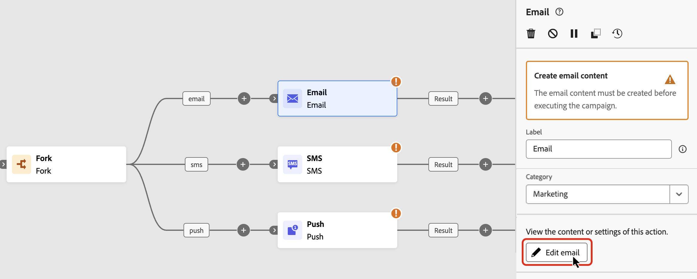
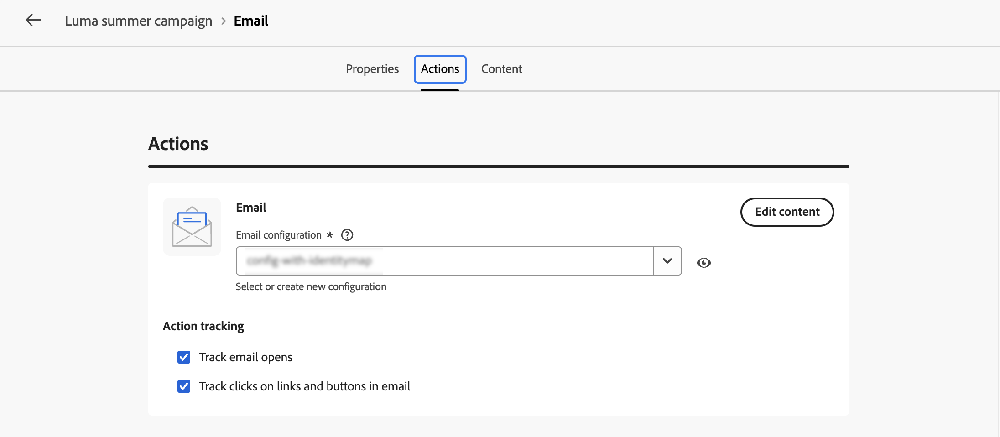
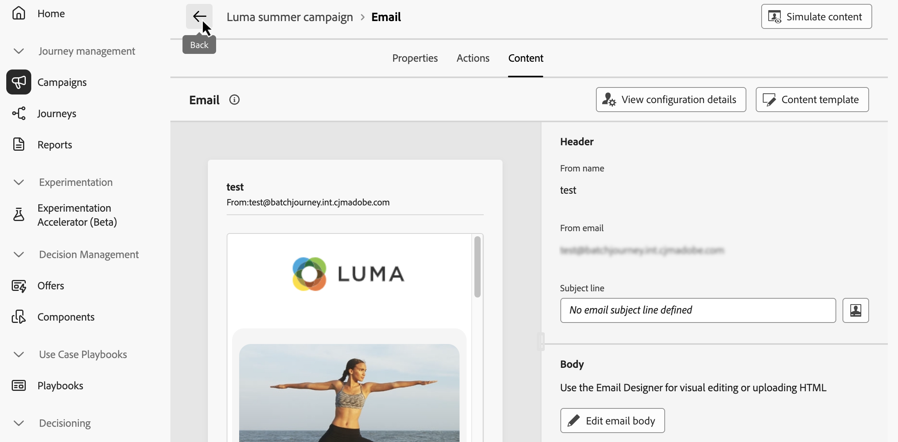

# Atividades do canal {#channel}

>[!BEGINSHADEBOX]

**Nesta página:** saiba como adicionar e configurar atividades de canal de email, SMS, push e correspondência direta para enviar mensagens de marketing ou transacionais em uma campanha Orquestrada.

>[!ENDSHADEBOX]

>[!CONTEXTUALHELP]
>id="ajo_orchestration_email"
>title="Atividade de email"
>abstract="A atividade Email permite enviar emails dentro de campanha orquestrada, tanto para mensagens únicas quanto recorrentes. Ela serve para automatizar o processo de envio de emails a um público-alvo calculado na mesma campanha orquestrada. É possível combinar atividades canal em uma tela da campanha em várias etapas para criar campanhas entre canais que podem acionar ações com base no comportamento e nos dados do cliente."

>[!CONTEXTUALHELP]
>id="ajo_orchestration_sms"
>title="Atividade de SMS"
>abstract="A atividade SMS permite enviar SMS dentro da campanha orquestrada, tanto para mensagens únicas quanto recorrentes. Ela serve para automatizar o processo de envio de SMS a um público-alvo calculado na mesma campanha orquestrada. É possível combinar atividades de canal na tela da campanha em várias etapas para criar campanhas entre canais que possam acionar ações com base no comportamento e nos dados do cliente."

>[!CONTEXTUALHELP]
>id="ajo_orchestration_push"
>title="Atividade de push"
>abstract="A atividade Push permite enviar notificações por push como parte da campanha orquestrada. Ela permite a entrega de campanhas orquestradas únicas e recorrentes, automatizando o envio de notificações por push para um público-alvo predefinido dentro da mesma campanha orquestrada. É possível combinar atividades de canal na tela da campanha para criar campanhas entre canais que podem acionar ações com base no comportamento e nos dados do cliente."

>[!CONTEXTUALHELP]
>id="ajo_orchestration_target"
>title="Target"
>abstract="A seção **[!UICONTROL Target]** define o destino da entrega para esta atividade de canal. Use **[!UICONTROL Dimensão de destino]** para selecionar qual dimensão de destino se aplica a este envio. Em seguida, escolha **[!UICONTROL Uma mensagem por perfil]** para enviar uma única mensagem por pessoa ou **[!UICONTROL Uma mensagem por dimensão secundária]** para enviar uma mensagem por dimensão secundária qualificada — por exemplo, um email por voo quando a mesma viajante tem vários voos correspondentes."

<!--
UNUSED IDs in BJ

>[!CONTEXTUALHELP]
>id="ajo_orchestration_push_ios"
>title="Push iOS activity"
>abstract="The Push iOS activity lets you send iOS Push notifications as part of your Orchestrated campaign. It enables the delivery of both one-time and recurring Orchestrated campaigns, automating the sending of iOS Push notifications to a predefined target within the same workflow. You can combine channel activities into the campaign canvas to create cross-channel campaigns that can trigger actions based on customer behavior and data."

>[!CONTEXTUALHELP]
>id="ajo_orchestration_push_android"
>title="Push Android activity"
>abstract="The Push Android activity lets you send Android Push notifications as part of your Orchestrated campaign. It enables the delivery of both one-time and recurring messages, automating the sending of Android Push notifications to a predefined target within the same Orchestrated campaign. You can combine channel activities into the Orchestrated campaign canvas to create cross-channel campaigns that can trigger actions based on customer behavior and data."
-->

>[!CONTEXTUALHELP]
>id="ajo_orchestration_directmail"
>title="Atividade de correspondência direta"
>abstract="A Atividade correspondência direta facilita o envio de correspondência direta na campanha orquestrada, tanto para mensagens únicas quanto recorrentes. Ela serve para automatizar o processo de geração do arquivo de extração exigido pelos provedores de correspondência direta. É possível combinar atividades de canal na tela da campanha orquestrada para criar campanhas entre canais que podem acionar ações com base no comportamento e nos dados do cliente."

>[!CONTEXTUALHELP]
>id="ajo_orchestration_custom"
>title="Atividade de canal personalizada"
>abstract="A atividade Canal personalizado permite enviar mensagens por meio de sistemas de terceiros ou integrações personalizadas dentro da sua campanha orquestrada. Ele permite acionar processos de delivery externos — como plataformas de parceiros ou ferramentas de mensagens proprietárias — exportando dados do público-alvo para um sistema externo. Você pode combinar atividades de canal personalizadas com outras atividades de canal na tela de campanha para criar campanhas entre canais que envolvem clientes em pontos de contato nativos e personalizados."

O [!DNL Adobe Journey Optimizer] permite automatizar e executar campanhas em canais (email, SMS, notificações por push, correspondência direta e personalizado) para mensagens de marketing e transacionais. Você pode combinar essas atividades de canal na tela da campanha para criar campanhas orquestradas entre canais. Essas campanhas podem acionar ações com base no comportamento e nos dados do cliente.

Por exemplo:

* Envie uma série de boas-vindas por email, SMS, push e correspondência direta.
* Envie um email de acompanhamento pós-compra.
* Envie saudações de aniversário personalizadas por SMS.
* Acione uma mensagem por meio de um canal personalizado quando um cliente abandonar o carrinho de compras.

Usando atividades do canal, você pode criar campanhas abrangentes e personalizadas que envolvem clientes em vários pontos de contato e impulsionam conversões.

## Medidas de proteção e limitações {#channel-guardrails}

* **Canais com suporte** - Somente os canais de SMS, Push, Email e Correspondência direta têm suporte em campanhas orquestradas.

* **Limite de atividades do canal** - Uma campanha Orquestrada dá suporte a no máximo 10 atividades de canal (Email, SMS, Push ou Correspondência direta). Somente as atividades de canal contam para esse limite, não as atividades de direcionamento e controle de fluxo.

  Se você exceder o limite ao salvar ou publicar, a operação falhará. Para ficar dentro do limite, reduza o número de atividades do canal ou divida a entrega de mensagens em várias campanhas orquestradas.

Consulte [Medidas de proteção e limitações](../guardrails.md) para todas as medidas de proteção e limitações de campanhas orquestradas.

## Adicionar uma atividade de canal e definir suas propriedades {#add}

>[!CONTEXTUALHELP]
>id="ajo_orchestration_category"
>title="Categoria"
>abstract="Escolha Marketing ou Transacional para esta atividade de canal. As mensagens de marketing usam as configurações do canal de marketing e seguem as regras de negócios padrão. As mensagens transacionais são para comunicações operacionais. Geralmente elas são acionadas pela ação de um indivíduo (por exemplo, uma redefinição de senha ou confirmação de compra) ou para avisos sensíveis ao tempo, como interrupções ou cancelamentos. Elas usam configurações de canal transacionais, ignoram as regras de negócios e não exigem aceitação."

>[!PREREQUISITES]
>
>Antes de adicionar uma atividade de canal, defina o público-alvo usando uma atividade [Criar público-alvo](build-audience.md) ou [Ler público](read-audience.md).

1. Adicione uma atividade de canal à tela. As atividades de canal disponíveis são **[!UICONTROL Email]**, **[!UICONTROL SMS]**, **[!UICONTROL Push]** e **[!UICONTROL Correspondência direta]**.

   

1. No painel direito, use o campo **[!UICONTROL Categoria]** para escolher **[!UICONTROL Marketing]** ou **[!UICONTROL Transacional]** para esta mensagem. As mensagens transacionais não exigem aceitação e são adequadas para comunicações urgentes, como interrupções, emergências ou cancelamentos.

1. Selecione a atividade e clique em **[!UICONTROL Editar email]**, **[!UICONTROL Editar SMS]**, **[!UICONTROL Editar push]** ou **[!UICONTROL Editar correspondência direta]**, dependendo do canal escolhido.

   

1. Na guia **[!UICONTROL Propriedades]**, insira uma descrição e alterne para a guia **[!UICONTROL Ações]** para configurar a atividade.

## Mensagens de marketing vs. transacionais {#marketing-vs-transactional}

Escolher a categoria correta determina como as mensagens são entregues e quais regras se aplicam:

| | Marketing | Transacional |
| --- | --- | --- |
| **Aceitação necessária** | Sim | Não |
| **Regras de negócios** | Aplicado (limite de frequência, regras de fadiga) | Ignorado |
| **Tipo de configuração de canal** | Configuração do canal de marketing | Configuração de canal transacional |
| **Casos de uso típicos** | Promoções, boletins informativos, campanhas sazonais | Confirmações de pedidos, redefinições de senha, alertas de interrupção |
| **Público-alvo** | Somente assinantes que aceitaram | Qualquer perfil, independentemente do status de aceitação |

>[!NOTE]
>
>Use Transacional somente para comunicações operacionais ou sensíveis ao tempo. Classificar incorretamente uma mensagem promocional como Transacional ignora o consentimento e as regras de negócios, o que pode violar os requisitos regulatórios.

## Definir a configuração e as configurações do canal {#configuration}

Use a guia **[!UICONTROL Ações]** para selecionar uma configuração de canal para a sua mensagem e definir configurações adicionais, como rastreamento, experimento de conteúdo ou conteúdo multilíngue.

1. **Selecionar uma configuração de canal**

   Uma configuração é definida por um [Administrador do sistema](../../start/path/administrator.md). Ela contém todos os parâmetros técnicos para enviar a mensagem, como parâmetros de cabeçalho, subdomínio, aplicativos móveis etc. [Saiba como definir configurações de canal](../../configuration/channel-surfaces.md)

   

1. **Aplicar regras de limitação**

   Na lista suspensa **[!UICONTROL Conjunto de regras]**, selecione um conjunto de regras de canal para aplicar regras de limitação à sua campanha. O uso de conjuntos de regras de canal permite definir o limite de frequência por tipo de comunicação para evitar sobrecarga de clientes com mensagens semelhantes. [Saiba como trabalhar com conjuntos de regras](../../conflict-prioritization/rule-sets.md).

1. **Criar um experimento de conteúdo**

   Use a seção de **[!UICONTROL Experimento de conteúdo]** para definir vários tratamentos de entrega a fim de medir qual apresenta o melhor desempenho para o seu público-alvo. Clique no botão **[!UICONTROL Criar experimento]** e siga as etapas detalhadas nesta seção: [Criar um experimento de conteúdo](../../content-management/content-experiment.md).

1. **Adicionar conteúdo multilíngue**

   Use a seção **[!UICONTROL Idiomas]** para criar conteúdo em vários idiomas dentro da sua campanha. Para isso, clique no botão **[!UICONTROL Adicionar idiomas]** e selecione as **[!UICONTROL Configurações de idioma]** desejadas. Informações detalhadas sobre como configurar e usar recursos multilíngues estão disponíveis nesta seção: [Introdução ao conteúdo multilíngue](../../content-management/multilingual-gs.md).

   

Configurações adicionais estão disponíveis, dependendo do canal de comunicação selecionado. Expanda as seções abaixo para obter mais informações.

+++**Rastrear envolvimento** (Email e SMS).

Use a seção de **[!UICONTROL Rastreamento de ações]** para acompanhar como os seus destinatários reagem às suas entregas de email ou SMS. Os resultados do rastreamento podem ser acessados no relatório da campanha após a execução da campanha. [Saiba mais sobre os relatórios da campanha](../../reports/campaign-global-report-cja.md)

+++

+++**Habilitar o modo de entrega rápida** (Push).

O modo de entrega rápida é um complemento do [!DNL Journey Optimizer] que permite o envio muito rápido de mensagens por push em grandes volumes por meio de campanhas. A entrega rápida é usada quando o atraso na entrega da mensagem é essencial para os negócios. Por exemplo, você deseja enviar um alerta de push urgente em telefones celulares, como notícias de última hora para usuários que instalaram seu aplicativo de canal de notícias. Saiba como habilitar o modo de entrega rápida para notificações por push [nesta página](../../push/create-push.md#rapid-delivery).

Para obter mais informações sobre o desempenho ao usar o modo de entrega rápida, consulte a [descrição do produto Adobe Journey Optimizer](https://helpx.adobe.com/legal/product-descriptions/adobe-journey-optimizer.html){target="_blank"}.

+++

Quando a atividade do seu canal for configurada, selecione a guia **[!UICONTROL Conteúdo]** para definir seu conteúdo.

## Definição do conteúdo {#content}

### Criar o conteúdo da mensagem

Alterne para a guia **[!UICONTROL Conteúdo]** para criar a sua mensagem. As etapas do processo variam de acordo com o canal selecionado. Confira as etapas detalhadas para criar o conteúdo da sua mensagem nas páginas a seguir.

<table style="table-layout:fixed"><tr style="border: 0; text-align: center;" >
<td> <a href="../../email/create-email.md"><strong>Criar um email</strong></a></td>
<td> <a href="../../mobile/create-mobile-message.md"><strong>Criar um SMS</strong></a></td>
<td><a href="../../push/create-push.md"><strong>Criar uma notificação por push</strong></a></td><td><a href="../../direct-mail/create-direct-mail.md"><strong>Criação de uma correspondência direta</strong></a></td><td> <a href="../../custom-channel/create-custom-experience.md"><strong>Criar uma ação personalizada</strong></a></td>
</tr></table>

### Adicionar personalização {#add-personalization}

No editor de mensagens em uma atividade de canal, insira **[!UICONTROL Atributos do perfil]** e **[!UICONTROL Atributos do público-alvo]** da tabela de trabalho da campanha (targeting dimension e dados de enriquecimento).

➡️ [Saiba como adicionar personalização em campanhas orquestradas](../add-personalization.md), incluindo matrizes de coleção de enriquecimento, funções de matriz e iteração `{{#each}}`.

### Verificar e testar o conteúdo {#simulate-content-test-profiles}

Depois que o conteúdo for criado, você poderá pré-visualizá-lo e testá-lo usando qualquer método de simulação:

* Clique em **[!UICONTROL Simular conteúdo]** para testar as variações de conteúdo com dados de entrada de exemplo ou geração automática de IA. [Saiba como simular variações de conteúdo](../../test-approve/simulate-sample-input.md)
* Clique em **[!UICONTROL Simular conteúdo]** e selecione **[!UICONTROL Simular conteúdo (perfis do AEP)]** na lista suspensa para visualizar e testar seu conteúdo com perfis de teste. [Saiba mais](../../content-management/preview-test.md)

Quando você simula conteúdo com **perfis de teste** em uma campanha Orquestrada, duas restrições importantes se aplicam:

* **A execução deve ter atingido a atividade do canal em teste** - Execute a campanha em teste usando o botão **[!UICONTROL Iniciar]** para que o fluxo de trabalho atinja a atividade do canal que você deseja simular. No modo de teste, o workflow pausa na atividade de canal, de modo que uma atividade de canal que vem após outra atividade de canal nunca é atingida. Você não pode usar **[!UICONTROL Simular Conteúdo]** para essas atividades de canal downstream. Consulte [Testar sua campanha antes de publicá-la](../start-monitor-campaigns.md#test).

* **O perfil de teste deve corresponder ao público alvo da atividade de canal** - Use um perfil de teste que pertença ao público alvo direcionado por essa atividade de canal. Se o perfil não estiver nesse público-alvo, selecioná-lo não renderizará uma pré-visualização do seu conteúdo. Consulte [Selecionar perfis de teste](../../content-management/test-profiles.md).

## Confirmar envio de mensagem

Por padrão, para campanhas orquestradas não recorrentes, a entrega de mensagens é pausada até que você aprove explicitamente o envio. Depois de publicar a campanha, confirme a solicitação de envio no painel de propriedades da atividade de canal.

O envio de confirmação pode ser desativado antes da publicação da campanha orquestrada. Para fazer isso, selecione a atividade do canal na tela para exibir suas propriedades e ative **[!UICONTROL Enviar sem confirmação]**.

## Definir controle de taxa {#rate-control}

[!DNL Journey Optimizer] permite que você habilite o controle de taxa para ações de saída em campanhas orquestradas.

Esse recurso é particularmente útil para evitar sobrecarga em sistemas downstream, como páginas de destino ou plataformas de atendimento ao cliente. Por exemplo, você pode definir um limite de taxa de 165 mensagens por segundo para garantir uma entrega estável sem sobrecarregar os sistemas de downstream.

Para definir o controle de taxa, siga estas etapas:

1. Selecione uma atividade de canal de saída na tela e clique em **[!UICONTROL Editar email]**, **[!UICONTROL Editar SMS]** ou **[!UICONTROL Editar push]**, dependendo do canal escolhido.

   

1. Navegue até a guia **[!UICONTROL Agenda]** e habilite a opção **[!UICONTROL Entrega acelerada]** na seção **[!UICONTROL Configurações de entrega]**.

   

1. Especifique a **[!UICONTROL Taxa de entrega]** desejada por segundo.

   * Taxa de entrega mínima com suporte: 1 por segundo.
   * Taxa de delivery máxima com suporte: 2000 por segundo quando a opção &quot;Throttle delivery&quot; está habilitada.

>[!IMPORTANT]
>
>Ao definir uma taxa de delivery, o período máximo para o qual um público-alvo da campanha pode ser executado é de 12 horas. Se a taxa de delivery for definida com um valor que não permita que todo o público-alvo receba a mensagem no período de 12 horas, os perfis restantes serão excluídos da campanha. Você pode ver a contagem desses perfis excluídos no relatório da campanha.

<!--
## Example: cross-channel campaign with a custom channel {#example-custom}

The following example shows an Orchestrated campaign that combines native and custom channels to re-engage lapsed customers.

The campaign targets customers who have not made a purchase in the last 90 days:

1. A **Build audience** activity filters profiles with no purchase in the last 90 days.
1. A **Split** activity divides the audience into two groups:
   * **Group A** — customers with a known email address receive a re-engagement email with a personalized discount offer.
   * **Group B** — customers without an email address, or those who did not open the email after 3 days, are routed to a **Custom channel** activity that triggers a message through a third-party messaging platform (for example, a WhatsApp Business provider or an in-house notification system).
1. Both branches converge on a **Wait** activity, then a follow-up **SMS** is sent to all profiles who still have not converted.

This pattern lets you extend your campaign reach beyond native channels and engage customers on the platforms they are most active on, without requiring a separate campaign workflow.
-->

## Próximas etapas {#next}

Quando o conteúdo da mensagem estiver pronto, navegue de volta para a campanha Orquestrada usando a seta **[!UICONTROL Voltar]**. Em seguida, você pode concluir a orquestração de atividades na tela e publicar a campanha para começar a enviar mensagens. [Saiba como iniciar e monitorar campanhas orquestradas](../start-monitor-campaigns.md)

<!--
## Examples {#cross-channel-workflow-sample}

Here is a cross-channel Orchestrated campaign example with a segmentation and two deliveries. The Orchestrated campaign targets all customers who live in Paris and who are interested in coffee machines. Among this population, an email is sent to the regular customers and an SMS is sent to the VIP clients.

<!--
description, which use case you can perform (common other activities that you can link before of after the activity)

how to add and configure the activity

example of a configured activity within a workflow
The Email delivery activity allows you to configure the sending an email in a workflow. 
-->

<!--
You can also create a recurring Orchestrated campaign to send a personalized SMS every first day of the month at 8 PM to all customers living in Paris.

-->

<!--
 Scheduled emails available?

This can be a single send email and sent just once, or it can be a recurring email.
* Single send emails are standard emails, sent once.
* Recurring emails allow you to send the same email multiple times to different targets over a defined period. You can aggregate the deliveries per period in order to get reports that correspond to your needs.

When linked to a scheduler, you can define recurring emails.
Email recipients are defined upstream of the activity in the same workflow, via an Audience targeting activity.
-->

<!--The message preparation is triggered according to the workflow execution parameters. From the message dashboard, you can select whether to request or not a manual confirmation to send the message (required by default). You can start the workflow manually or place a scheduler activity in the workflow to automate execution.-->

