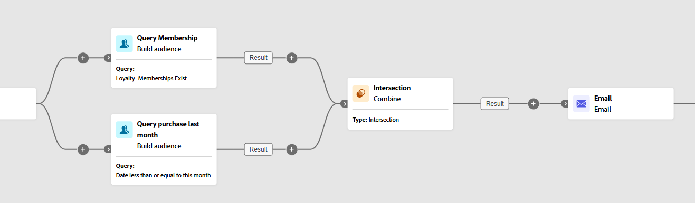

# Combinar {#combine}

>[!CONTEXTUALHELP]
>id="ajo_orchestration_combine"
>title="Atividade de combinar"
>abstract="A atividade **Combinar** permite executar a segmentação na população de entrada. Dessa forma, é possível combinar várias populações, excluir uma parte delas ou manter apenas dados comuns a vários públicos-alvo."

+++ Sumário

| Bem-vindo às campanhas orquestradas | Lançar a primeira campanha orquestrada | Consultar o banco de dados | Atividades de campanhas orquestradas |
|---|---|---|---|
| [Introdução a campanhas orquestradas](../gs-orchestrated-campaigns.md)  Criar e gerenciar Esquemas e Conjuntos de Dados relacionais:  <ul><li>[Esquema manual](../manual-schema.md)</li><li>[Esquema de carregamento de arquivo](../file-upload-schema.md)</li><li>[Assimilar dados](../ingest-data.md)</li></ul>[Acessar e gerenciar campanhas orquestradas](../access-manage-orchestrated-campaigns.md) | [Etapas principais para criar uma campanha orquestrada](../gs-campaign-creation.md)  [Criar e agendar a campanha](../create-orchestrated-campaign.md)  [Orquestrar atividades](../orchestrate-activities.md)  [Iniciar e monitorar a campanha](../start-monitor-campaigns.md)  [Relatórios](../reporting-campaigns.md) | [Trabalhar com o construtor de regras](../orchestrated-rule-builder.md)  [Criar a primeira consulta](../build-query.md)  [Editar expressões](../edit-expressions.md)  [Redirecionamento](../retarget.md) | [Introdução às atividades](about-activities.md)  Atividades: [And-join](and-join.md) - [Criar público](build-audience.md) - [Alterar dimensão](change-dimension.md) - [Atividades de canal](channels.md) - <b>[Combinar](combine.md)</b> - [Desduplicação](deduplication.md) - [Enriquecimento](enrichment.md) - [Bifurcação](fork.md) - [Reconciliação](reconciliation.md) - [Salvar público](save-audience.md) - [Divisão](split.md) - [Espera](wait.md) |

{style="table-layout:fixed"}

+++

 

>[!BEGINSHADEBOX]

O conteúdo desta página não é final e pode estar sujeito a alterações.

>[!ENDSHADEBOX]

A atividade **[!UICONTROL Combinar]** é um tipo de atividade de **[!UICONTROL Direcionamento]** que permite segmentar efetivamente a população de entrada. Ele permite mesclar várias populações, excluir segmentos específicos ou reter apenas os dados compartilhados em vários targets.

As seguintes opções de segmentação estão disponíveis:

* **[!UICONTROL União]**: mescla os resultados de várias atividades em um único destino unificado.

* **[!UICONTROL Interseção]**: retém apenas os elementos comuns em todas as populações de entrada.

* **[!UICONTROL Exclusão]**: remove elementos de uma população com base em critérios especificados.

## Configurar a atividade Combinar {#combine-configuration}

>[!CONTEXTUALHELP]
>id="ajo_orchestration_intersection_merging_options"
>title="Opções de mesclagem de interseção"
>abstract="A interseção permite manter somente os elementos comuns às diferentes populações de entrada na atividade. Na seção Conjuntos para unir, marque todas as atividades anteriores que deseja unir."

>[!CONTEXTUALHELP]
>id="ajo_orchestration_exclusion_merging_options"
>title="Opções de mesclagem de exclusão"
>abstract="A exclusão permite excluir elementos de uma população de acordo com determinados critérios. Na seção Conjuntos para unir, marque todas as atividades anteriores que deseja unir."

>[!CONTEXTUALHELP]
>id="ajo_orchestration_combine_options"
>title="Selecione o tipo de segmentação"
>abstract="Selecione como combinar os públicos-alvo. A **união** permite reagrupar o resultado de várias atividades em um único público-alvo. A **intersecção** permite manter somente os elementos comuns às diferentes populações de entrada na atividade. A **Exclusão** permite excluir elementos de uma população de acordo com determinados critérios. "

Siga estas etapas comuns para começar a configurar a atividade **[!UICONTROL Combinar]**:

1. Adicione várias atividades, por exemplo, **[!UICONTROL Criar público-alvo]**, para formar pelo menos duas ramificações de execução diferentes.
1. Adicione uma atividade **[!UICONTROL Combinar]** a qualquer uma das ramificações anteriores.
1. Selecione o tipo de segmentação: [união](#union), [interseção](#intersection) ou [exclusão](#exclusion).
1. Clique em **[!UICONTROL Continuar]**.
1. Na seção **[!UICONTROL Conjuntos para unir]**, marque todas as atividades anteriores que deseja unir.

## União {#combine-union}

>[!CONTEXTUALHELP]
>id="ajo_orchestration_combine_reconciliation"
>title="Opções de reconciliação"
>abstract="Selecione o **Tipo de reconciliação** para definir como lidar com duplicatas. A opção **Chaves** está ativada por padrão, o que significa que a atividade só mantém um elemento quando elementos de transições de entrada diferentes têm a mesma chave. Use a opção **Uma seleção de colunas** para definir a lista de colunas nas quais a reconciliação de dados será aplicada."

Na atividade **[!UICONTROL Combinar]**, é possível configurar uma **[!UICONTROL União]** selecionando um **[!UICONTROL Tipo de reconciliação]** para determinar como os registros duplicados são gerenciados:

* **[!UICONTROL Somente chaves]** (padrão): retém um único registro quando várias transições de entrada compartilham a mesma chave. Essa opção só é aplicável quando as populações de entrada são homogêneas.

* **[!UICONTROL Uma seleção de colunas]**: permite especificar quais colunas são usadas para reconciliação de dados. Selecione **[!UICONTROL Adicionar atributo]**.

No exemplo a seguir, uma atividade **[!UICONTROL Combinar]** é usada com uma **[!UICONTROL União]** para mesclar os resultados de duas consultas, **Membros de Fidelidade** e **Compradores**, em um público-alvo único e maior que inclui todos os perfis de ambos os segmentos.

## Interseção {#combine-intersection}

>[!CONTEXTUALHELP]
>id="ajo_orchestration_intersection_reconciliation_options"
>title="Opções de reconciliação de interseção"
>abstract="Selecione o **Tipo de reconciliação** para definir como lidar com duplicatas. A opção **Chaves** está ativada por padrão, o que significa que a atividade só mantém um elemento quando elementos de transições de entrada diferentes têm a mesma chave. Use a opção **Uma seleção de colunas** para definir a lista de colunas nas quais a reconciliação de dados será aplicada."

Na atividade **[!UICONTROL Combinar]**, você pode configurar uma **[!UICONTROL Interseção]**. Para isso, você precisa seguir as etapas adicionais abaixo:

1. Selecione o **[!UICONTROL Tipo de reconciliação]** para definir como as duplicatas são tratadas:

   * **[!UICONTROL Somente chaves]** (padrão): retém um único registro quando várias transições de entrada compartilham a mesma chave. Essa opção só é aplicável quando as populações de entrada são homogêneas.

   * **[!UICONTROL Uma seleção de colunas]**: permite especificar quais colunas são usadas para reconciliação de dados. Selecione **[!UICONTROL Adicionar atributo]**.

1. Habilite **[!UICONTROL Gerar conclusão]** se desejar processar a população restante. O complemento contém a união de todos os resultados da atividade de entrada, excluindo a interseção. Uma transição de saída adicional é adicionada à atividade.

O exemplo a seguir ilustra o uso da **[!UICONTROL Interseção]** entre duas atividades de consulta. É usado para identificar perfis que são **Membros do programa de fidelidade** e que fizeram uma compra no mês passado.

## Exclusão {#combine-exclusion}

>[!CONTEXTUALHELP]
>id="ajo_orchestration_exclusion_options"
>title="Regras de exclusão"
>abstract="Quando necessário, é possível manipular tabelas de entrada. De fato, para excluir um público-alvo de outra dimensão, esse público-alvo deve ser devolvido à mesma dimensão de direcionamento como público-alvo principal. Para fazer isso, clique em Adicionar uma regra na seção Regras de exclusão e especifique as condições de alteração da dimensão. A reconciliação de dados é realizada por meio de um atributo ou de uma união."

>[!CONTEXTUALHELP]
>id="ajo_orchestration_combine_sets"
>title="Selecionar conjuntos a serem combinados"
>abstract="Na seção **Conjuntos para unir**, selecione o **Conjunto principal** das transições de entrada. Esse é o conjunto a partir do qual os elementos são excluídos. Os outros conjuntos correspondem a elementos antes de serem excluídos do conjunto principal."

>[!CONTEXTUALHELP]
>id="ajo_orchestration_combine_exclusion"
>title="Regras de exclusão"
>abstract="Quando necessário, é possível manipular tabelas de entrada. De fato, para excluir um público-alvo de outra dimensão, esse público-alvo deve ser devolvido à mesma dimensão de direcionamento como público-alvo principal. Para fazer isso, clique em Adicionar uma regra na seção Regras de exclusão e especifique as condições de alteração da dimensão. A reconciliação de dados é realizada por meio de um atributo ou de uma união."

>[!CONTEXTUALHELP]
>id="ajo_orchestration_combine_complement"
>title="Combinar e gerar complemento"
>abstract="Ative a opção Gerar complemento para processar a população restante em uma transição adicional."

Na atividade **[!UICONTROL Combinar]**, é possível configurar uma **[!UICONTROL Exclusão]**. Para isso, você precisa seguir as etapas adicionais abaixo:

1. Na seção **[!UICONTROL Conjuntos para ingressar]**, escolha o **[!UICONTROL Conjunto principal]**, que representa a população principal. Os registros encontrados nos outros conjuntos são excluídos deste conjunto principal.

1. Quando necessário, você pode ajustar tabelas de entrada para alinhar destinos de diferentes dimensões. Para excluir um target de outra dimensão, ele deve primeiro ser trazido para o mesmo targeting dimension como a população principal. Para fazer isso, clique em **[!UICONTROL Adicionar uma regra]** e defina as condições para alterar a dimensão. A reconciliação é feita usando um atributo ou uma junção.

1. Habilite **[!UICONTROL Gerar conclusão]** se desejar processar a população restante. O complemento contém a união de todos os resultados da atividade de entrada, excluindo a interseção. Uma transição de saída adicional é adicionada à atividade.

O exemplo **[!UICONTROL Exclusão]** a seguir mostra duas consultas configuradas para filtrar perfis que compraram um produto. Os perfis que não têm uma associação de fidelidade são excluídos do primeiro conjunto.

