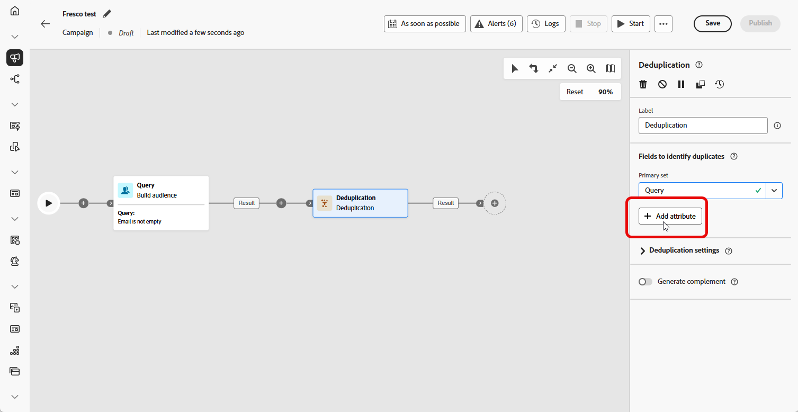

# Desduplicação {#deduplication}

>[!CONTEXTUALHELP]
>id="ajo_orchestration_deduplication_fields"
>title="Campos para identificar duplicatas"
>abstract="Na seção **Campos para identificar duplicatas**, clique no botão **Adicionar atributo** para especificar os campos nos quais os valores idênticos permitem a identificação de duplicatas, como: endereço de email, nome, sobrenome, etc. A ordem dos campos permite especificar os que devem ser processados primeiro."

>[!CONTEXTUALHELP]
>id="ajo_orchestration_deduplication"
>title="Atividade de desduplicação"
>abstract="A atividade **Desduplicação** permite excluir duplicatas nos resultados das atividades de entrada. Ela é usada principalmente após atividades de direcionamento e antes de atividades que permitem o uso de dados direcionados."

>[!CONTEXTUALHELP]
>id="ajo_orchestration_deduplication_complement"
>title="Gerar um complemento"
>abstract="É possível gerar uma transição de saída adicional com a população restante, que foi excluída como uma duplicata. Para fazer isso, ative a opção **Gerar complemento**"

>[!CONTEXTUALHELP]
>id="ajo_orchestration_deduplication_settings"
>title="Configurações de desduplicação"
>abstract="Para excluir duplicatas nos dados recebidos, defina o método de desduplicação nos campos abaixo. Por padrão, somente um registro é mantido. Também é necessário selecionar o modo de desduplicação com base em uma expressão ou um atributo. Por padrão, o registro a ser mantido fora das duplicatas é selecionado aleatoriamente."

+++ Sumário

| Bem-vindo às campanhas orquestradas | Lançar a primeira campanha orquestrada | Consultar o banco de dados | Atividades de campanhas orquestradas |
|---|---|---|---|
| [Introdução a campanhas orquestradas](gs-orchestrated-campaigns.md)  Criar e gerenciar Esquemas e Conjuntos de Dados relacionais:  <ul><li>[Esquema manual](manual-schema.md)</li><li>[Esquema de carregamento de arquivo](file-upload-schema.md)</li><li>[Assimilar dados](ingest-data.md)</li></ul>  [Acessar e gerenciar campanhas orquestradas](../access-manage-orchestrated-campaigns.md) | [Etapas principais para criar uma campanha orquestrada](../gs-campaign-creation.md)  [Criar e agendar a campanha](../create-orchestrated-campaign.md)  [Orquestrar atividades](../orchestrate-activities.md)  [Iniciar e monitorar a campanha](../start-monitor-campaigns.md)  [Relatórios](../reporting-campaigns.md) | [Trabalhar com o construtor de regras](../orchestrated-rule-builder.md)  [Criar a primeira consulta](../build-query.md)  [Editar expressões](../edit-expressions.md)  [Redirecionamento](../retarget.md) | [Introdução às atividades](about-activities.md)  Atividades: [And-join](and-join.md) - [Criar público](build-audience.md) - [Alterar dimensão](change-dimension.md) - [Atividades de canal](channels.md) - [Combinar](combine.md) - <b>[Desduplicação](deduplication.md)</b> - [Enriquecimento](enrichment.md) - [Bifurcação](fork.md) - [Reconciliação](reconciliation.md) - [Salvar público](save-audience.md) - [Divisão](split.md) - [Espera](wait.md) |

{style="table-layout:fixed"}

+++

 

>[!BEGINSHADEBOX]

O conteúdo desta página não é final e pode estar sujeito a alterações.

>[!ENDSHADEBOX]

A atividade **[!UICONTROL Deduplication]** é uma atividade **[!UICONTROL Targeting]**. Essa atividade permite excluir duplicados no(s) resultado(s) das atividades de entrada, por exemplo, perfis duplicados na lista de recipients. A atividade **[!UICONTROL Deduplication]** geralmente é usada após as atividades de direcionamento e antes das atividades que permitem o uso de dados direcionados.

## Configurar a atividade de desduplicação{#deduplication-configuration}

Siga estas etapas para configurar a atividade **[!UICONTROL Desduplicação]**:

1. Adicione uma atividade **[!UICONTROL Deduplication]** à sua campanha orquestrada.

1. Na seção **[!UICONTROL Campos para identificar duplicatas]**, clique no botão **[!UICONTROL Adicionar atributo]** para especificar os campos nos quais os valores idênticos permitem a identificação de duplicatas, como: endereço de email, nome, sobrenome, etc. A ordem dos campos permite especificar os que devem ser processados primeiro.

   

1. Na seção **[!UICONTROL Configurações de desduplicação]**, escolha quantos registros exclusivos devem ser mantidos usando o campo Duplicatas a serem mantidas. O padrão é 1, que mantém um registro por grupo duplicado. Defina como 0 para manter todas as duplicatas.

   Por exemplo, se os registros A e B forem duplicatas de Y e o registro C for uma duplicata de Z:

   * **Se o valor do campo for 1**: somente os registros Y e Z serão mantidos.
   * **Se o valor do campo for 0**: todos os registros (A, B, C, Y, Z) serão mantidos.
   * **Se o valor do campo for 2**: C e Z serão mantidos, além de dois valores de A, B e Y, aleatoriamente ou com base no método de desduplicação.

1. Escolha um **[!UICONTROL Método de Desduplicação]**, isso define como o sistema decide quais registros manter de cada grupo de duplicatas:

   * **[!UICONTROL Seleção aleatória]**: seleciona aleatoriamente o registro a ser mantido fora das duplicatas.
   * **[!UICONTROL Usando uma expressão]**: mantém registros com o valor mais alto ou mais baixo com base em uma expressão que você define.
   * **[!UICONTROL Valores não vazios]**: mantém registros em que o campo selecionado não está vazio, por exemplo, manter apenas perfis com um número de telefone.
   * **[!UICONTROL Seguindo uma lista de valores]**: permite priorizar valores específicos para um ou mais campos, por exemplo, você pode dar prioridade a registros com &quot;País&quot; definido como França. Clique em **[!UICONTROL Atributo]** para escolher um campo ou criar uma expressão personalizada. Use o **[!UICONTROL Botão Adicionar]** para inserir valores preferenciais na ordem de prioridade.

   

1. Marque a opção **[!UICONTROL Gerar complemento]** se desejar explorar a população restante. O complemento consiste de todas as duplicatas. Uma transição adicional será adicionada à atividade.

## Exemplo{#deduplication-example}

No exemplo a seguir, uma atividade **[!UICONTROL Deduplication]** é usada para remover registros duplicados do público-alvo antes de enviar uma entrega. O público é filtrado pela primeira vez para incluir apenas perfis com um campo Email não vazio. Em seguida, a atividade **[!UICONTROL Deduplication]** usa o endereço de email para identificar e excluir duplicatas.

