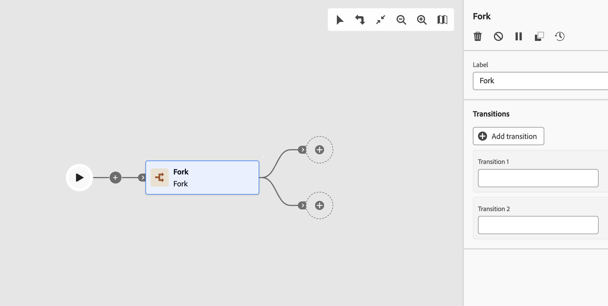

# Bifurcação {#fork}

>[!CONTEXTUALHELP]
>id="ajo_orchestration_fork"
>title="Atividade Bifurcação"
>abstract="A atividade **Bifurcação** permite criar transições de saída para iniciar várias atividades ao mesmo tempo."

>[!CONTEXTUALHELP]
>id="ajo_orchestration_fork_transitions"
>title="Transições da atividade bifurcação"
>abstract="Por padrão, duas transições são criadas com uma atividade **Bifurcação**. Clique em **Adicionar transição** para definir uma transição de saída adicional e insira seu rótulo."

A atividade **[!UICONTROL Bifurcação]** é um componente de **[!UICONTROL Controle do fluxo]** que permite criar várias transições de saída, permitindo que várias atividades sejam executadas em paralelo.

## Configuração da atividade de bifurcação{#fork-configuration}

Siga estas etapas para configurar a atividade **[!UICONTROL Bifurcação]**:

1. Adicione uma atividade **[!UICONTROL Fork]** à sua campanha Orquestrada.

1. Defina um **[!UICONTROL Rótulo]**.

1. Atribua um rótulo a cada transição de saída. Por padrão, duas transições são fornecidas.

1. Para remover uma transição, clique no ícone .

1. Se necessário, clique em **[!UICONTROL Adicionar transição]** para adicionar outra transição de saída.

## Exemplos {#fork-examples}

Este é um uso típico da atividade **[!UICONTROL Fork]**: direcionar o mesmo público-alvo com dois canais de email diferentes, um de marketing e outro transacional, para comparar o comportamento de entrega.

Depois que uma atividade **[!UICONTROL Criar público-alvo]** seleciona a população do público-alvo, uma **[!UICONTROL Bifurcação]** cria duas ramificações paralelas:

* A **Ramificação 1** se conecta a uma atividade de canal de email de Marketing. As mensagens seguem as regras de negócios padrão e são enviadas apenas para perfis de aceitação.
* **A ramificação 2** se conecta a uma atividade de canal de email Transacional. As mensagens ignoram as regras de negócios e são entregues a todos os perfis, independentemente do status de aceitação.

Esse padrão é útil para entender como as configurações de categoria do canal afetam o comportamento do delivery e para enviar diferentes tipos de mensagem para o mesmo público-alvo em uma única execução de campanha.
