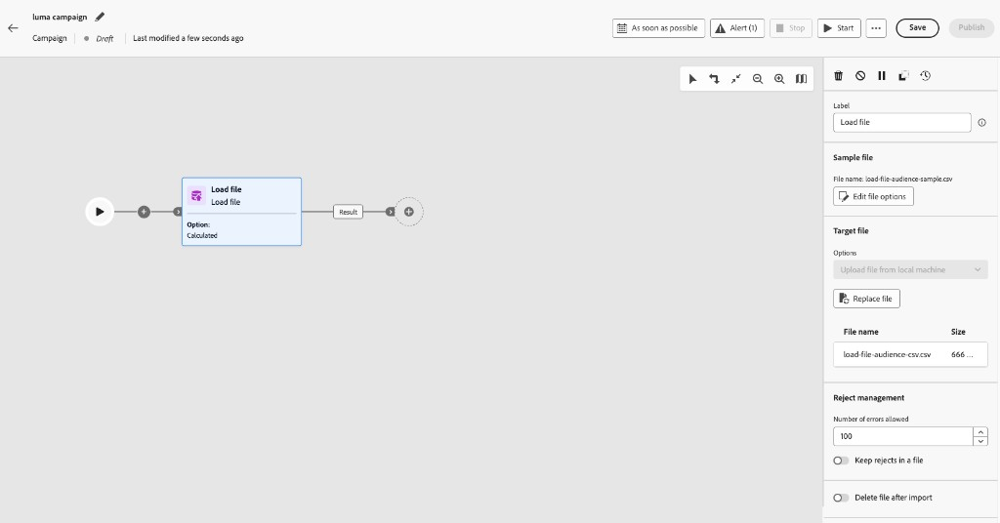

# Carregar arquivo {#load-file}

>[!CONTEXTUALHELP]
>id="ajo_orchestration_load_file"
>title="Atividade Carregar arquivo"
>abstract="A atividade **Carregar arquivo** é uma atividade de **Gerenciamento de Dados**. Use-o para trabalhar com perfis e dados armazenados em um arquivo externo na tela de campanha Orquestrada e definir o público-alvo da campanha. Os dados do arquivo são consumidos no tempo de execução e não são mantidos como um conjunto de dados do Adobe Experience Platform."

A atividade **[!UICONTROL Carregar arquivo]** é uma atividade de **[!UICONTROL Gerenciamento de Dados]**. Use-a para trabalhar com perfis e dados armazenados em um arquivo externo. Ele oferece suporte ao **direcionamento baseado em arquivos** em campanhas orquestradas quando a lista de destinatários vem de um sistema externo (por exemplo, uma exportação de CRM ou um arquivo de parceiro) e você deseja executar uma campanha sem criar um pipeline de assimilação completo do Adobe Experience Platform primeiro.

>[!AVAILABILITY]
>
>A atividade **Carregar arquivo** está disponível em **Disponibilidade Limitada** para um conjunto de organizações. Para solicitar acesso, entre em contato com o representante da Adobe. Para ver as fases de disponibilidade, consulte [ciclo de lançamento do Journey Optimizer](../../rn/releases.md).
>
>A atividade não está disponível para uso com o **Healthcare Shield**.

## Medidas de proteção e limitações {#limitations}

As seguintes limitações se aplicam à atividade Load file:

* É possível carregar até 50 MB por arquivo.
* Somente arquivos CSV e TXT de estrutura simples são suportados.
* Os dados carregados são usados quando a campanha é executada e não são armazenados como um conjunto de dados do Adobe Experience Platform.
* Cada linha deve corresponder a um recipient existente para o targeting dimension selecionado. A atividade Carregar arquivo não cria novos perfis do arquivo.

Para obter limites sobre as atividades de canal e tela, consulte [Medidas de proteção e limitações](../guardrails.md#activities-limitations).

## Configurar a atividade de carregamento de arquivo {#load-file-configuration}

Configure a atividade em duas partes: defina a estrutura de arquivo esperada com um arquivo de amostra e especifique o arquivo a ser carregado quando a campanha for executada.

1. Adicione uma atividade **[!UICONTROL Carregar arquivo]** à tela de campanha Orquestrada.

   

1. Insira um **[!UICONTROL Rótulo]** para a atividade.

### Definir o arquivo de amostra {#sample-file}

Use um arquivo de exemplo para configurar **[!UICONTROL Colunas]** e **[!UICONTROL Formatação]**. Os dados de amostra não são importados como o público-alvo da campanha.

1. Na seção **[!UICONTROL Arquivo de exemplo]**, selecione o arquivo local que define a estrutura esperada.

   >[!NOTE]
   >
   > O arquivo de amostra é usado para configurar apenas colunas e formatação. Os dados não são importados como público-alvo da campanha. O formato deve corresponder aos arquivos que você carregará quando a campanha for executada.

1. No menu suspenso **[!UICONTROL Tipo de arquivo]**, especifique se o arquivo usa **colunas delimitadas** ou **colunas de largura fixa**.

   

1. Na seção **[!UICONTROL Colunas]**, expanda cada coluna e configure suas propriedades.

   

   Depois de selecionar um **[!UICONTROL Tipo de dados]**, opções adicionais serão exibidas para esse tipo. Expanda as seções abaixo para obter os parâmetros comuns a todas as colunas e para opções específicas de tipo.

   +++Parâmetros de coluna comuns

   * **[!UICONTROL Ignorar coluna]** — Exclua a coluna da importação quando selecionada.
   * **[!UICONTROL Rótulo]** — Nome de exibição da coluna (por exemplo, `email`).
   * **[!UICONTROL Nome interno]** — Nome do sistema para a coluna, derivado do cabeçalho do arquivo (somente leitura).
   * **[!UICONTROL Tipo de dados]** — Tipo de dados na coluna.
   * **[!UICONTROL Permitir NULLs]** — Especifica como gerenciar valores vazios na coluna:

      * **[!UICONTROL Padrão do Adobe Campaign]** — Gera um erro somente para campos numéricos. Caso contrário, insere um valor NULL.
      * **[!UICONTROL Valor vazio permitido]** — Autoriza valores vazios. O valor NULL é então inserido.
      * **[!UICONTROL Sempre preenchido]** — Gera um erro se um valor estiver vazio.

   * **[!UICONTROL Processamento de erros]** — Define o comportamento se um erro for encontrado na coluna:

      * **[!UICONTROL Ignorar o valor]** — O valor é ignorado.
      * **[!UICONTROL Rejeitar a linha]** — A linha inteira não é processada.
      * **[!UICONTROL Usar um valor padrão em caso de erro]** — Substitui o valor que causa o erro por um valor padrão, definido no campo **[!UICONTROL Valor padrão]**.
      * **[!UICONTROL Use um valor padrão caso o valor não seja remapeado]** — Substitui o valor que causa o erro por um valor padrão, definido no campo **[!UICONTROL Valor padrão]**, a menos que um mapeamento tenha sido definido para o valor incorreto.
      * **[!UICONTROL Rejeitar a linha quando não houver um valor de remapeamento]** — A linha inteira só será processada se um mapeamento tiver sido definido para o valor incorreto.

   * **[!UICONTROL Valor padrão]** — Valor padrão a ser usado quando **[!UICONTROL Processamento de erros]** estiver definido para usar um valor padrão.
   * **[!UICONTROL Remapeamento de valores]** — Mapeie valores específicos para novos valores. Clique em **[!UICONTROL Adicionar mapeamento]** para definir cada mapeamento (por exemplo, substituir `True`/`False` por `1`/`0`).

   +++

   +++Parâmetros de colunas de string

   * **[!UICONTROL Largura]** — Número máximo de caracteres.
   * **[!UICONTROL Transformação de dados]** — Transformação de maiúsculas e minúsculas aplicada a valores de cadeia de caracteres (por exemplo, nenhuma ou maiúsculas/minúsculas).
   * **[!UICONTROL Gerenciamento de espaço em branco]** — Como lidar com espaços à esquerda ou à direita em valores de cadeias de caracteres.

   +++

   +++Parâmetros de colunas de número inteiro e flutuante

   * **[!UICONTROL Formato]** — Define como os valores numéricos do arquivo são lidos:

      * **[!UICONTROL Outros]** — Defina o **[!UICONTROL Separador de milhar]** e o **[!UICONTROL Separador decimal]** na seção **[!UICONTROL Separadores]**.
      * **[!UICONTROL 1.000.00]** — Vírgula como separador de milhares e ponto como separador decimal.
      * **[!UICONTROL 1 000,00]** — Espaço como separador de milhares e vírgula como separador decimal.

   * **[!UICONTROL Separadores]** (quando **[!UICONTROL Formato]** for **[!UICONTROL Outros]**):

      * **[!UICONTROL Separador de milhares]** — Caractere que agrupa milhares em valores numéricos (deixe vazio se não for usado).
      * **[!UICONTROL Separador decimal]** — Caractere usado para a parte decimal de valores numéricos (por exemplo, `,` ou `.`).

   +++

   +++Parâmetros de colunas de data e hora

   As opções dependem se o **[!UICONTROL Tipo de dados]** é **Data**, **Hora** ou **Data e hora**.

   **Data**

   * **[!UICONTROL Formato de data]** — Padrão que corresponde à forma como as datas aparecem no arquivo (por exemplo, `yyyy/mm/dd`).
   * **[!UICONTROL Separadores]**:

      * **[!UICONTROL Ano, mês, dia]** — Caractere entre os componentes ano, mês e dia (por exemplo, `/`).

   **Hora**

   * **[!UICONTROL Formato de hora]** — Padrão que corresponde a como as horas aparecem no arquivo (por exemplo, `13:30` para horas e minutos de 24 horas).
   * **[!UICONTROL Separadores]**:

      * **[!UICONTROL Hour, minute, second]** — Caractere entre a hora, o minuto e o segundo componente (por exemplo, `:`).

   **Data e hora**

   * **[!UICONTROL Formato de data]** — Padrão que corresponde a como a parte da data aparece no arquivo.
   * **[!UICONTROL Formato de hora]** — Padrão que corresponde à forma como a parte de tempo aparece no arquivo.
   * **[!UICONTROL Separadores]** — Caracteres entre componentes de data e hora.

   +++

1. Na seção **[!UICONTROL Formatting]**, especifique como o arquivo está estruturado para que as linhas e colunas sejam lidas corretamente quando a campanha for executada. O arquivo de destino deve usar a mesma formatação do arquivo de amostra.

   

   * **[!UICONTROL Usar primeira linha como cabeçalho de coluna]** — Quando selecionada, a primeira linha do arquivo é tratada como nomes de coluna. Normalmente, essa opção é ativada quando você configura a amostra de um arquivo que inclui uma linha de cabeçalho.
   * **[!UICONTROL Usar um número de linha como identificador]** — Quando selecionada, cada linha é identificada pelo seu número de linha no arquivo.
   * **[!UICONTROL Os registros incluem várias linhas]** — Quando selecionado, um único registro pode incluir várias linhas no arquivo (por exemplo, quando os campos contêm quebras de linha).
   * **[!UICONTROL Linhas a serem ignoradas]** — Número de linhas a serem ignoradas no início do arquivo antes da leitura dos dados (por exemplo, comentários ou linhas de metadados).
   * **[!UICONTROL Fuso horário]** — Fuso horário aplicado quando os valores de data e hora são importados.
   * **[!UICONTROL Codificação]** — Codificação de caracteres do arquivo. Selecione a codificação que corresponde ao arquivo de origem.
   * **[!UICONTROL Delimitador de cadeia de caracteres]** — Caractere usado para delimitar valores de cadeia de caracteres no arquivo.
   * **[!UICONTROL Separador de coluna]** — Caractere que separa colunas em um arquivo delimitado.

1. Clique em **[!UICONTROL Confirmar]** para validar a configuração do arquivo de exemplo.

### Definir o arquivo de destino {#target-file}

Especifique o arquivo a ser carregado na execução da campanha e como cada linha corresponde aos destinatários existentes.

1. Na seção **[!UICONTROL Arquivo de destino]**, selecione o arquivo CSV ou TXT que contém como destino.

   

   >[!CAUTION]
   >
   > Certifique-se de que o arquivo de destino siga o mesmo formato, estrutura de coluna e número de colunas que o arquivo de amostra.

1. Na seção **[!UICONTROL Reject management]**, defina como a atividade se comporta quando ocorrem erros durante o processamento do arquivo:

   * **[!UICONTROL Número de erros permitidos]** — Número máximo de erros permitidos antes da falha da atividade.
   * **[!UICONTROL Manter rejeições em um arquivo]** — Quando habilitado, as linhas que não puderam ser carregadas são gravadas em um arquivo rejeitado no servidor para revisão após a execução.

1. Opcionalmente, habilite **[!UICONTROL Excluir arquivo após a importação]** para remover o arquivo carregado do servidor após a execução da campanha.

Depois que **[!UICONTROL Carregar arquivo]** resolver o público-alvo, conecte a transição de saída às atividades downstream. [Saiba como orquestrar as atividades da campanha](../orchestrate-activities.md)
