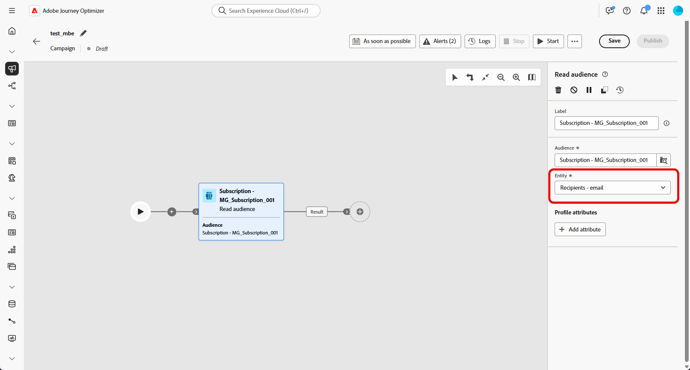

# Público-alvo de leitura {#read-audience}

>[!CONTEXTUALHELP]
>id="ajo_orchestration_read_audience"
>title="Atividade Criar público-alvo"
>abstract="A atividade **Público-alvo de leitura** permite selecionar o público-alvo que entrará na campanha orquestrada. Esse público-alvo pode ser um público-alvo existente da Adobe Experience Platform ou um público-alvo extraído de um arquivo CSV. Ao enviar mensagens no contexto de uma campanha orquestrada, o público-alvo da mensagem não é definido na atividade do canal, mas em uma atividade **Público-alvo de leitura** ou **Criar público-alvo**."

+++ Índice 

| Bem-vindo(a) às campanhas orquestradas | Lançar a sua primeira campanha orquestrada | Consultar o banco de dados | Atividades de campanhas orquestradas |
|---|---|---|---|
| [Introdução a campanhas orquestradas](../gs-orchestrated-campaigns.md)  Criar e gerenciar Esquemas e Conjuntos de Dados relacionais:  <ul><li>[Introdução a Esquemas e Conjuntos de Dados](../gs-schemas.md)</li><li>[Esquema manual](../manual-schema.md)</li><li>[Esquema de carregamento de arquivo](../file-upload-schema.md)</li><li>[Assimilar dados](../ingest-data.md)</li></ul>[Acessar e gerenciar campanhas orquestradas](../access-manage-orchestrated-campaigns.md) | [Etapas principais para criar uma campanha orquestrada](../gs-campaign-creation.md)  [Criar e programar a campanha](../create-orchestrated-campaign.md)  [Orquestrar atividades](../orchestrate-activities.md)  [Iniciar e monitorar a campanha](../start-monitor-campaigns.md)  [Geração de relatórios](../reporting-campaigns.md) | [Trabalhar com o construtor de regras](../orchestrated-rule-builder.md)  [Criar a sua primeira consulta](../build-query.md)  [Editar expressões](../edit-expressions.md)  [Redirecionamento](../retarget.md) | [Introdução às atividades](about-activities.md)  Atividades: [Associação](and-join.md) - [Criar público-alvo](build-audience.md) - [Mudar dimensão](change-dimension.md) - [Atividades de canal](channels.md) - [Combinar](combine.md) - [Desduplicação](deduplication.md) - [Enriquecimento](enrichment.md) - [Bifurcação](fork.md) - [Reconciliação](reconciliation.md) - [Salvar público-alvo](save-audience.md) - [Divisão](split.md) - [Aguardar](wait.md) |

{style="table-layout:fixed"}

+++

 

>[!BEGINSHADEBOX]

 

O conteúdo desta página não é final e pode estar sujeito a alterações.

>[!ENDSHADEBOX]

A atividade **[!UICONTROL Ler público-alvo]** permite recuperar um público-alvo existente, salvo ou importado anteriormente, e reutilizá-lo em uma campanha orquestrada. Essa atividade é especialmente útil para direcionar um conjunto predefinido de perfis sem a necessidade de executar um novo processo de segmentação.

Depois que o público-alvo é carregado, você pode refiná-lo selecionando um campo de identidade exclusivo e enriquecendo o público-alvo com atributos de perfil adicionais para fins de direcionamento, personalização ou relatórios.

## Configurar a atividade Ler público {#read-audience-configuration}

Siga estas etapas para configurar a atividade **[!UICONTROL Ler público-alvo]**:

1. Adicione uma atividade **[!UICONTROL Read audience]** à sua campanha orquestrada.

   

1. Insira um **[!UICONTROL Rótulo]** para sua atividade.

1. Clique em  para selecionar o público-alvo que deseja direcionar para sua campanha orquestrada.

   

1. Selecione a **[!UICONTROL Entidade]** usada para identificar de forma exclusiva os perfis do seu público-alvo.

   

1. Selecione **[!UICONTROL Adicionar atributo de perfil]** para enriquecer o público-alvo selecionado com dados adicionais. O público-alvo resultante conterá uma lista de recipients, cada um enriquecido com os atributos de perfil selecionados.

1. Escolha os **[!UICONTROL Atributos]** que você deseja adicionar ao seu público-alvo.

   

## Exemplo

No exemplo abaixo, a atividade **[!UICONTROL Ler público-alvo]** é usada para recuperar um público-alvo criado e salvo anteriormente de perfis que assinaram o boletim informativo. O público-alvo é então enriquecido com o atributo **Loyalty subscription** para habilitar o direcionamento de usuários que são membros registrados do programa de fidelidade.

