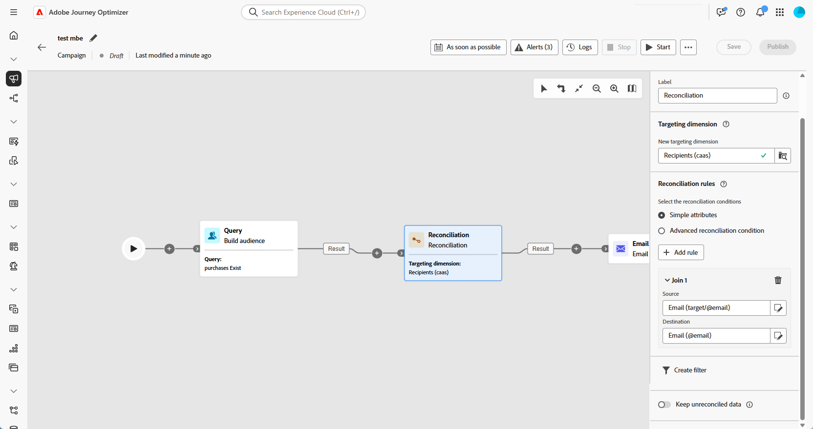

# Reconciliação {#reconciliation}

>[!CONTEXTUALHELP]
>id="ajo_orchestration_reconciliation"
>title="Atividade de reconciliação"
>abstract="A Atividade **reconciliação** é uma atividade de **direcionamento** que permite definir o vínculo entre o Adobe Journey Optimizer e os dados em uma tabela de trabalho."

>[!CONTEXTUALHELP]
>id="ajo_orchestration_reconciliation_field"
>title="Campo de seleção de reconciliação"
>abstract="Campo de seleção de reconciliação"

>[!CONTEXTUALHELP]
>id="ajo_orchestration_reconciliation_condition"
>title="Condição de criação de reconciliação"
>abstract="Condição de criação de reconciliação"

>[!CONTEXTUALHELP]
>id="ajo_orchestration_reconciliation_complement"
>title="Complemento de geração de reconciliação"
>abstract="Complemento de geração de reconciliação"

+++ Índice 

| Bem-vindo às campanhas orquestradas | Iniciar sua primeira campanha orquestrada | Consultar o banco de dados | Atividades de campanhas orquestradas |
|---|---|---|---|
| [Introdução às campanhas orquestradas](../gs-orchestrated-campaigns.md)  Criar e gerenciar esquemas e conjuntos de dados relacionais:  <ul><li>[Introdução a Esquemas e Conjuntos de Dados](../gs-schemas.md)</li><li>[Esquema manual](../manual-schema.md)</li><li>[Esquema de carregamento de arquivo](../file-upload-schema.md)</li><li>[Assimilar dados](../ingest-data.md)</li></ul>[Acessar e gerenciar campanhas orquestradas](../access-manage-orchestrated-campaigns.md) | [Etapas principais para criar uma campanha Orquestrada](../gs-campaign-creation.md)  [Criar e agendar a campanha](../create-orchestrated-campaign.md)  [Orquestrar atividades](../orchestrate-activities.md)  [Iniciar e monitorar a campanha](../start-monitor-campaigns.md)  [Relatórios](../reporting-campaigns.md) | [Trabalhar com o construtor de regras](../orchestrated-rule-builder.md)  [Criar a sua primeira consulta](../build-query.md)  [Editar expressões](../edit-expressions.md)  [Redirecionamento](../retarget.md) | [Introdução às atividades](about-activities.md)  Atividades: [Associação](and-join.md) - [Criar público-alvo](build-audience.md) - [Mudar dimensão](change-dimension.md) - [Atividades de canal](channels.md) - [Combinar](combine.md) - [Desduplicação](deduplication.md) - [Enriquecimento](enrichment.md) - [Bifurcação](fork.md) - <b>[Reconciliação](reconciliation.md)</b> - [Salvar público-alvo](save-audience.md) - [Divisão](split.md) - [Aguardar](wait.md) |

{style="table-layout:fixed"}

+++

 

>[!BEGINSHADEBOX]

 

O conteúdo desta página não é final e pode estar sujeito a alterações.

>[!ENDSHADEBOX]

A atividade **[!UICONTROL Reconciliação]** é uma atividade de **[!UICONTROL Direcionamento]** que permite definir o vínculo entre os dados do banco de dados do Adobe Journey Optimizer e os dados de uma tabela de trabalho, como, por exemplo, dados carregados de um arquivo externo. 

A atividade **[!UICONTROL Enrichment]** permite adicionar dados adicionais à campanha orquestrada, por exemplo, combinando dados de várias fontes ou vinculando a um recurso temporário. Em contraste, a atividade **[!UICONTROL Reconciliação]** é usada para corresponder dados não identificados ou externos a recursos existentes no banco de dados.

A **[!UICONTROL Reconciliação]** exige que os registros relacionados já existam no sistema. Por exemplo, se você importar um arquivo de compra listando produtos, carimbos de data/hora e informações dos clientes, os produtos e os clientes já precisam estar presentes no banco de dados para estabelecer o vínculo.

## Configurar a atividade de reconciliação {#reconciliation-configuration}

>[!CONTEXTUALHELP]
>id="ajo_orchestration_reconciliation_targeting"
>title="Dimensão de direcionamento"
>abstract="Selecione a nova dimensão de direcionamento. Uma dimensão permite definir a população direcionada: destinatários, assinantes de aplicativos, operadores, assinantes etc. Por padrão, a dimensão de direcionamento atual é selecionada."

>[!CONTEXTUALHELP]
>id="ajo_orchestration_reconciliation_rules"
>title="Regras de reconciliação"
>abstract="Selecione as regras de reconciliação a serem usadas para a desduplicação. Para usar atributos, selecione a opção **Atributos simples** e escolha os campos origem e destino. Para criar sua própria condição de reconciliação usando o modelador de consultas, selecione a opção **Condições de reconciliação avançadas**."
>additional-url="https://experienceleague.adobe.com/pt-br/docs/campaign-web/v8/query-database/query-modeler-overview" text="Trabalhar com o modelador de consultas"

>[!CONTEXTUALHELP]
>id="ajo_orchestration_reconciliation_targeting_selection"
>title="Selecione a dimensão de direcionamento"
>abstract="Selecione a dimensão de direcionamento com a qual seus dados de entrada devem se reconciliar."
>additional-url="https://experienceleague.adobe.com/docs/campaign-web/v8/audiences/gs-audiences-recipients.html?lang=pt-BR#targeting-dimensions" text="Dimensões de direcionamento"

>[!CONTEXTUALHELP]
>id="ajo_orchestration_keep_unreconciled_data"
>title="Manter dados não reconciliados"
>abstract="Por padrão, os dados não reconciliados são mantidos na transição de saída e disponibilizados na tabela de trabalho para uso futuro. Para remover dados não reconciliados, desative a opção **Manter dados não reconciliados**."

>[!CONTEXTUALHELP]
>id="ajo_orchestration_reconciliation_attribute"
>title="Atributo de reconciliação"
>abstract="Selecione o atributo a ser usado para reconciliar dados e clique em Confirmar."

Siga estas etapas para configurar a atividade **[!UICONTROL Reconciliação]**:

1. Adicione uma atividade **[!UICONTROL Reconciliação]** ao seu fluxo de trabalho.

1. Escolha uma nova dimensão de direcionamento para definir a quem você está direcionando, como destinatários ou assinantes.

1. Defina os campos a serem usados para corresponder os seus dados de entrada a perfis existentes.

1. Para corresponder os dados por meio de campos básicos, selecione **[!UICONTROL Atributos simples]**.

1. Defina os campos de correspondência:

   * **[!UICONTROL Origem]**: lista os campos dos dados de entrada.

   * **[!UICONTROL Destino]**: refere-se aos campos na dimensão de direcionamento selecionada.

   Uma correspondência ocorre quando ambos os valores são iguais, como, por exemplo, quando o **[!UICONTROL Email]** corresponde ao identificar perfis.

   

1. Para adicionar mais regras de correspondência, clique em **[!UICONTROL Adicionar regra]**. Para que uma correspondência ocorra, todas as condições precisam ser satisfeitas.

1. Para condições mais complexas, escolha **[!UICONTROL Condições de reconciliação avançadas]**. Use o [modelador de consultas](../orchestrated-rule-builder.md) para definir uma lógica personalizada.

1. Para filtrar quais dados reconciliar, clique em **[!UICONTROL Criar filtro]** e defina a condição no modelador de consultas.

1. Por padrão, registros sem correspondência são mantidos na transição de saída e armazenados na tabela de trabalho. Para removê-los, habilite a opção **[!UICONTROL Manter dados não reconciliados]**.

## Exemplo {#example-reconciliation}

Este exemplo usa a atividade **[!UICONTROL Reconciliação]** no Adobe Journey Optimizer para garantir que os emails sejam enviados somente a clientes reconhecidos. Os dados fluem por meio de uma atividade **[!UICONTROL Público-alvo de leitura]** direcionada a usuários com pedidos anteriores. Então, a atividade **[!UICONTROL Reconciliação]** corresponde esses dados de entrada aos perfis existentes no banco de dados, usando o campo de email.

