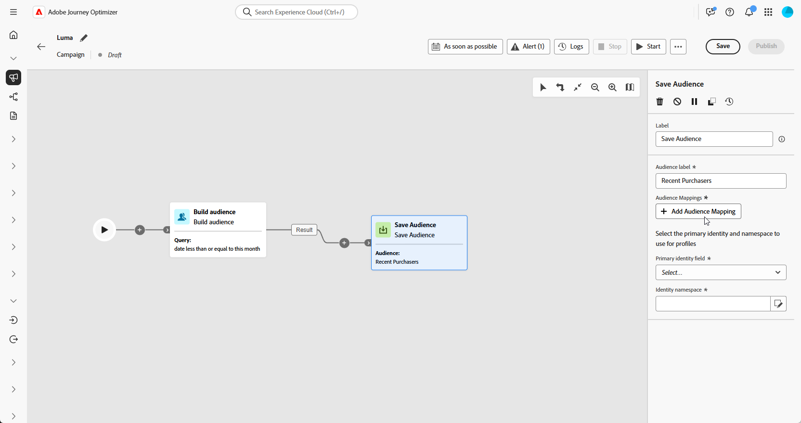

# Salvar público-alvo {#save-audience}

>[!CONTEXTUALHELP]
>id="ajo_orchestration_save_audience"
>title="Salvar atividade de público-alvo"
>abstract="A Atividade **Salvar público-alvo** é uma atividade de **Direcionamento** que permite atualizar um público-alvo existente ou criar um novo a partir da população gerada anteriormente na campanha orquestrada. Após criados, esses públicos-alvo são adicionados à lista de públicos-alvo do aplicativo e podem ser acessados pelo menu **Públicos-alvo**."

A atividade **[!UICONTROL Salvar público-alvo]** é uma atividade de **[!UICONTROL Direcionamento]** usada para criar um novo público-alvo ou atualizar um já existente com base na população gerada anteriormente na campanha Orquestrada. Depois de salvo, o público é adicionado à lista de públicos-alvo do aplicativo e torna-se acessível pelo menu **[!UICONTROL Públicos-alvo]**.

Normalmente, é usado para capturar segmentos de público-alvo criados no mesmo fluxo de trabalho de campanha, disponibilizando-os para reutilização em campanhas futuras. Normalmente, ela está conectada a outras atividades de direcionamento, como **[!UICONTROL Criar público-alvo]** ou **[!UICONTROL Combinar]**, para salvar a população direcionada final.
Observe que com a atividade **[!UICONTROL Salvar público-alvo]**, não é possível atualizar um público-alvo existente. Você só pode criar um novo público ou substituir um existente por uma nova definição.

## Configurar a atividade Salvar público-alvo {#save-audience-configuration}

Siga estas etapas para configurar a atividade **[!UICONTROL Salvar público-alvo]**:

1. Adicione uma atividade **[!UICONTROL Save audience]** à sua campanha Orquestrada.

1. Insira um **[!UICONTROL Rótulo do público-alvo]** que identificará o público-alvo salvo.

   >[!NOTE]
   >
   >O público-alvo **[!UICONTROL Label]** deve ser exclusivo em todas as campanhas. Não é possível reutilizar um nome de público-alvo que já tenha sido usado na atividade **[!UICONTROL Salvar público-alvo]** de outra campanha.

1. Escolha um **[!UICONTROL Campo de mapeamento de perfil&#x200B;]** na Targeting dimension do Campaign. Este mapeamento define como os perfis no **Público-alvo salvo** são vinculados ao target dimension da campanha durante a execução.

   Somente os mapeamentos compatíveis com o target dimension atual, ou seja, aquele da transição recebida, estarão disponíveis na lista suspensa para garantir a reconciliação adequada entre o público-alvo e o contexto da campanha.

   ➡️ [Siga as etapas detalhadas nesta página para criar sua dimensão de Direcionamento de Campanha](../target-dimension.md)

   

1. Clique em **[!UICONTROL Adicionar mapeamentos de público-alvo]** para incluir dados adicionais de atributos da **[!UICONTROL Dimensão de destino]** ou de **[!UICONTROL Atributos de perfil]** enriquecidos.

   Isso permite associar mais informações à atividade **[!UICONTROL Público-alvo salvo]** além do mapeamento do perfil principal, aprimorando o direcionamento e as opções de personalização.

   

1. Finalize a configuração salvando e publicando a campanha Orquestrada. Isso gerará e armazenará o seu público-alvo.

1. Publique a campanha para o público que será criado ou substituído, pois a atividade **[!UICONTROL Salvar público]** não será executada enquanto a campanha estiver no **[!UICONTROL modo Rascunho]**.

>[!NOTE]
>
>No momento da publicação, as atividades **[!UICONTROL Salvar público-alvo]** sempre são executadas antes de qualquer atividade de mensagem no fluxo de trabalho. O shell de público-alvo é criado e os perfis começam a assimilar no Portal de público-alvo antes que qualquer atividade de canal inicie o processamento. [Saiba mais sobre a sequência de execução em tempo de publicação](../start-monitor-campaigns.md#publication-sequence)

O conteúdo do público-alvo salvo ficará disponível na exibição detalhada do público-alvo, que pode ser acessada no menu **[!UICONTROL Públicos-alvo]** ou pode ser selecionado ao direcionar um público-alvo, por exemplo, com uma atividade **[!UICONTROL Ler público-alvo]**.

>[!NOTE]
>
>Se a definição de público-alvo usar atributos de esquema do Experience Platform rotulados com o uso de dados (DULE), esses rótulos serão herdados automaticamente pelo público-alvo salvo. Não é necessário reaplicá-los. [Saiba mais sobre Governança de dados](../../action/action-privacy.md)

## Exemplo {#save-audience-example}

O exemplo a seguir demonstra como criar um público-alvo simples com o direcionamento. Um query identifica todos os recipients que reservaram uma viagem nos últimos 30 dias filtrando essa população na campanha Orquestrada. Ao escolher **Recipients - CRMID** como a **Targeting dimension**, o público-alvo será direcionado a cada evento de reserva individual, em vez de somente ao destinatário como um todo. A atividade **[!UICONTROL Salvar público-alvo]** capta esses perfis para criar um público-alvo reutilizável de compradores recentes.

