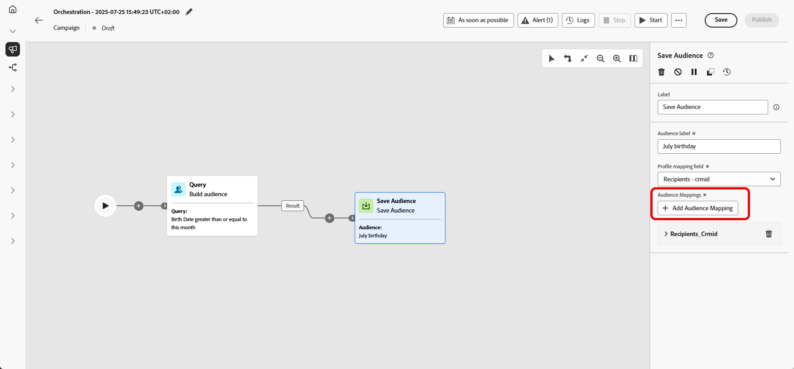

# Salvar público-alvo {#save-audience}

>[!CONTEXTUALHELP]
>id="ajo_orchestration_save_audience"
>title="Salvar atividade do público"
>abstract="A atividade **Salvar público-alvo** é uma atividade **de Direcionamento** que permite atualizar um público-alvo existente ou criar um novo público a partir da população gerada anteriormente na campanha orquestrada. Após criado, esses públicos são adicionados à lista de públicos-alvo do aplicativo e podem ser acessados no menu **Públicos-alvo**."

+++ Sumário

| Bem-vindo às campanhas orquestradas | Lançar a primeira campanha orquestrada | Consultar o banco de dados | Atividades de campanhas orquestradas |
|---|---|---|---|
| [Introdução a campanhas orquestradas](../gs-orchestrated-campaigns.md)  Criar e gerenciar Esquemas e Conjuntos de Dados relacionais:  <ul><li>[Introdução a Esquemas e Conjuntos de Dados](../gs-schemas.md)</li><li>[Esquema manual](../manual-schema.md)</li><li>[Esquema de carregamento de arquivo](../file-upload-schema.md)</li><li>[Assimilar dados](../ingest-data.md)</li></ul>[Acessar e gerenciar campanhas orquestradas](../access-manage-orchestrated-campaigns.md) | [Etapas principais para criar uma campanha orquestrada](../gs-campaign-creation.md)  [Criar e agendar a campanha](../create-orchestrated-campaign.md)  [Orquestrar atividades](../orchestrate-activities.md)  [Iniciar e monitorar a campanha](../start-monitor-campaigns.md)  [Relatórios](../reporting-campaigns.md) | [Trabalhar com o construtor de regras](../orchestrated-rule-builder.md)  [Criar a primeira consulta](../build-query.md)  [Editar expressões](../edit-expressions.md)  [Redirecionamento](../retarget.md) | [Introdução às atividades](about-activities.md)  Atividades: [And-join](and-join.md) - [Criar público](build-audience.md) - [Alterar dimensão](change-dimension.md) - [Atividades de canal](channels.md) - [Combinar](combine.md) - [Desduplicação](deduplication.md) - [Enriquecimento](enrichment.md) - [Bifurcação](fork.md) - [Reconciliação](reconciliation.md) - <b>[Salvar público](save-audience.md)</b> - [Divisão](split.md) - [Espera](wait.md) |

{style="table-layout:fixed"}

+++

 

>[!BEGINSHADEBOX]

 

O conteúdo desta página não é final e pode estar sujeito a alterações.

>[!ENDSHADEBOX]

A atividade **[!UICONTROL Salvar público-alvo]** é uma atividade **[!UICONTROL de Direcionamento]** que permite atualizar um público-alvo existente ou criar um novo público a partir da população gerada anteriormente na campanha orquestrada. Após criado, esses públicos são adicionados à lista de públicos-alvo do aplicativo e podem ser acessados no menu **[!UICONTROL Públicos-alvo]**.

Essa atividade é particularmente útil para preservar segmentos de público calculados na mesma campanha orquestrada, disponibilizando-os para reutilização em campanhas futuras. Normalmente está conectado a outras atividades de direcionamento, como **[!UICONTROL Criar público-alvo]** ou **[!UICONTROL Combinar]**, para capturar e salvar a população resultante.

## Configurar a atividade Save audience {#save-audience-configuration}

Siga estas etapas para configurar a atividade **[!UICONTROL Salvar público-alvo]**:

1. Adicione uma atividade **[!UICONTROL Save audience]** à sua campanha orquestrada.

1. Insira um **[!UICONTROL Rótulo de público-alvo]** que identificará o público-alvo salvo.

1. Clique em **[!UICONTROL Adicionar atributo de público-alvo]** para definir como os dados de público-alvo são estruturados e armazenados para futura reutilização.

   

1. Em seguida, selecione o **[!UICONTROL Campo de identidade principal]** &#x200B;e o **[!UICONTROL Namespace de identidade]** apropriados para garantir a resolução precisa do perfil.

   

1. Finalize sua configuração salvando e publicando a campanha orquestrada. Isso gerará e armazenará seu público.

O conteúdo do público-alvo salvo ficará disponível na exibição detalhada do público-alvo, que pode ser acessada no menu **[!UICONTROL Públicos-alvo]**.

## Exemplo {#save-audience-example}

O exemplo a seguir demonstra como criar um público-alvo simples usando o direcionamento. Uma consulta identifica todos os perfis que fizeram uma compra nos últimos 30 dias. A atividade **[!UICONTROL Salvar público-alvo]** captura esses perfis para criar um público-alvo reutilizável de compradores recentes.

