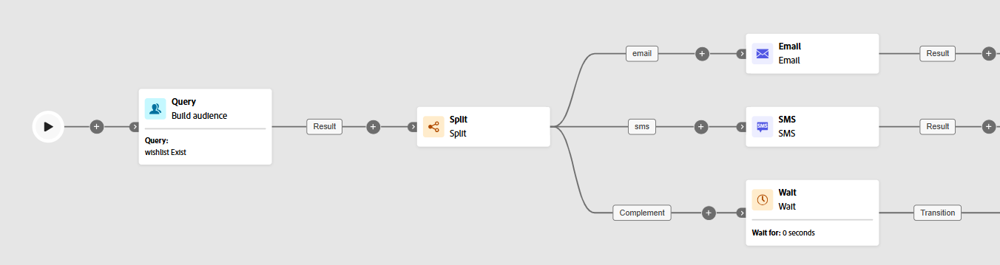

# Divisão {#split}

>[!CONTEXTUALHELP]
>id="ajo_orchestration_split"
>title="Atividade Divisão"
>abstract="A atividade **Divisão** permite segmentar as populações recebidas em vários subconjuntos com base em diferentes critérios de seleção, como regras de filtragem ou tamanho da população."

+++ Sumário

| Bem-vindo às campanhas orquestradas | Lançar a primeira campanha orquestrada | Consultar o banco de dados | Atividades de campanhas orquestradas |
|---|---|---|---|
| [Introdução a campanhas orquestradas](../gs-orchestrated-campaigns.md)  Criar e gerenciar Esquemas e Conjuntos de Dados relacionais:  <ul><li>[Esquema manual](../manual-schema.md)</li><li>[Esquema de carregamento de arquivo](../file-upload-schema.md)</li><li>[Assimilar dados](../ingest-data.md)</li></ul>  [Acessar e gerenciar campanhas orquestradas](../access-manage-orchestrated-campaigns.md) | [Etapas principais para criar uma campanha orquestrada](../gs-campaign-creation.md)  [Criar e agendar a campanha](../create-orchestrated-campaign.md)  [Orquestrar atividades](../orchestrate-activities.md)  [Iniciar e monitorar a campanha](../start-monitor-campaigns.md)  [Relatórios](../reporting-campaigns.md) | [Trabalhar com o construtor de regras](../orchestrated-rule-builder.md)  [Criar a primeira consulta](../build-query.md)  [Editar expressões](../edit-expressions.md)  [Redirecionamento](../retarget.md) | [Introdução às atividades](about-activities.md)  Atividades: [And-join](and-join.md) - [Criar público](build-audience.md) - [Alterar dimensão](change-dimension.md) - [Atividades de canal](channels.md) - [Combinar](combine.md) - [Desduplicação](deduplication.md) - [Enriquecimento](enrichment.md) - [Bifurcação](fork.md) - [Reconciliação](reconciliation.md) - [Salvar público](save-audience.md) - <b>[Divisão](split.md)</b> - [Espera](wait.md) |

{style="table-layout:fixed"}

+++

 

>[!BEGINSHADEBOX]

O conteúdo desta página não é final e pode estar sujeito a alterações.

>[!ENDSHADEBOX]

A atividade **[!UICONTROL Split]** é uma atividade **[!UICONTROL Targeting]** que segmenta a população recebida em vários subconjuntos com base em critérios de seleção definidos, como regras de filtragem ou tamanho de população.

## Configurar a atividade de divisão {#split-configuration}

>[!CONTEXTUALHELP]
>id="ajo_orchestration_split_segments"
>title="Segmentos para atividade de divisão"
>abstract="Adicione quantos subconjuntos desejar para segmentar a população recebida.  Quando a atividade **Divisão** é executada, a população é segmentada nos diferentes subconjuntos na ordem em que são adicionados à atividade. Antes de iniciar a campanha orquestrada, certifique-se de organizar os subconjuntos em uma ordem que atenda às suas necessidades usando os botões de seta."

>[!CONTEXTUALHELP]
>id="ajo_orchestration_split_filter"
>title="Filtro da atividade de divisão"
>abstract="Para aplicar uma condição de filtragem ao subconjunto, clique em **[!UICONTROL Criar filtro]** e configure a regra de filtragem desejada usando o modelador de consultas. Por exemplo, inclua perfis da população recebida cujo endereço de email já exista no banco de dados."

>[!CONTEXTUALHELP]
>id="ajo_orchestration_split_limit"
>title="Limite da atividade de divisão"
>abstract="Para limitar o número de perfis selecionados pelo subconjunto, ative a opção **[!UICONTROL Habilitar limite]**, e especifique o número ou as porcentagens da população a serem incluídas."

>[!CONTEXTUALHELP]
>id="ajo_orchestration_split_sorting"
>title="Classificação da atividade de divisão"
>abstract="Ao definir um limite de população para um subconjunto, é possível classificar os perfis selecionados com base em um atributo de perfil específico, em ordem crescente ou decrescente. Para fazer isso, ative a opção **Habilitar classificação**. Por exemplo, é possível restringir um subconjunto para incluir apenas os 50 perfis com o valor de compra mais alto."

>[!CONTEXTUALHELP]
>id="ajo_orchestration_split_complement"
>title="Divisão e geração de complemento"
>abstract="Após configurar todos os subconjuntos, é possível selecionar a população restante que não correspondeu a nenhum dos subconjuntos e incluí-la em uma transição de saída adicional. Para isso, ative a opção **Gerar complemento.**"

>[!CONTEXTUALHELP]
>id="ajo_orchestration_split_generatesubsets"
>title="Gerar todos os subconjuntos na mesma tabela"
>abstract="Ative essa opção para agrupar todos os subconjuntos em uma única transição de saída."

>[!CONTEXTUALHELP]
>id="ajo_orchestration_split_emptytransition"
>title="Ignorar transição vazia"
>abstract="Ative a opção **[!UICONTROL Ignorar transição vazia]** para desabilitar a transição de saída para este subconjunto se a população de entrada estiver vazia."

>[!CONTEXTUALHELP]
>id="ajo_orchestration_split_enable_overlapping"
>title="Habilitar sobreposição de populações de saída"
>abstract=" A opção **[!UICONTROL Habilitar sobreposição de populações de saída]** permite gerenciar populações pertencentes a vários subconjuntos. Quando a caixa não está marcada, a atividade Divisão garante que um destinatário não possa estar presente em diversas transições de saída, mesmo que atenda aos critérios de vários subconjuntos. Eles estarão no público-alvo da primeira guia com critérios correspondentes. Quando a caixa for marcada, os destinatários poderão ser encontrados em vários subconjuntos se atenderem aos critérios de filtro. "

Siga estas etapas para configurar a atividade de **[!UICONTROL Divisão]**:

1. Adicione uma atividade **[!UICONTROL Split]** à sua campanha orquestrada.

1. O painel de configuração da atividade é aberto com um subconjunto padrão. Clique em **[!UICONTROL Adicionar segmento]** para adicionar quantos subconjuntos desejar e segmentar a população recebida.

   

   >[!IMPORTANT]
   >
   >A atividade **Split** processa subconjuntos na ordem em que são adicionados. Por exemplo, se o primeiro subconjunto capturar 70% da população, o próximo aplica seus critérios aos 30% restantes.
   >
   >Antes de executar a campanha orquestrada, verifique se os subconjuntos estão ordenados conforme pretendido. Use os botões de seta para ajustar a posição.

1. Após a adição dos subconjuntos, a atividade mostrará tantas transições de saída quanto houver subconjuntos. Recomendamos alterar o rótulo de cada subconjunto para identificá-los facilmente na tela de campanha orquestrada.

1. Configure filtros para cada subconjunto:

   1. Clique em um subconjunto para abrir suas configurações.

   1. Clique em **[!UICONTROL Criar filtro]** para definir regras de filtragem usando o modelador de consultas, por exemplo, selecione perfis com um endereço de email válido.

      

   1. Para limitar o número de perfis selecionados, habilite **[!UICONTROL Habilitar limite]** e especifique um número ou porcentagem.

   1. Para ignorar uma transição quando o subconjunto estiver vazio, habilite **[!UICONTROL Ignorar transição vazia].**

1. Para incluir perfis não correspondentes a nenhum subconjunto, habilite **[!UICONTROL Gerar complemento]**. Isso cria uma transição de saída adicional para a população restante.

   >[!NOTE]
   >
   >Habilite **[!UICONTROL Gerar todos os subconjuntos na mesma tabela]** para agrupar todos os subconjuntos em uma única transição.

1. Use **[!UICONTROL Habilitar sobreposição de populações de saída]** para permitir que os perfis apareçam em vários subconjuntos:

   * **Se desmarcado**, cada perfil será atribuído a apenas um subconjunto, o primeiro cujos critérios ele corresponda mesmo que se qualifique para outros subconjuntos.

   * **Se marcado**, os perfis poderão ser incluídos em vários subconjuntos se atenderem aos critérios de cada um.

A atividade agora está configurada. Na execução orquestrada da campanha, a população será segmentada em diferentes subconjuntos, na ordem em que foram adicionados à atividade.

## Exemplo{#split-example}

No exemplo a seguir, a atividade de **[!UICONTROL Divisão]** é usada para segmentar um público-alvo em subconjuntos distintos com base no canal de comunicação que queremos usar:

* **Subconjunto 1 &quot;email&quot;**: inclui perfis que forneceram um número de telefone.

* **Subconjunto 2 &quot;sms&quot;**: segmenta os perfis com um número de celular armazenado no banco de dados.

* **Transição de complemento**: captura todos os perfis restantes que não atendem aos critérios de nenhum subconjunto.

